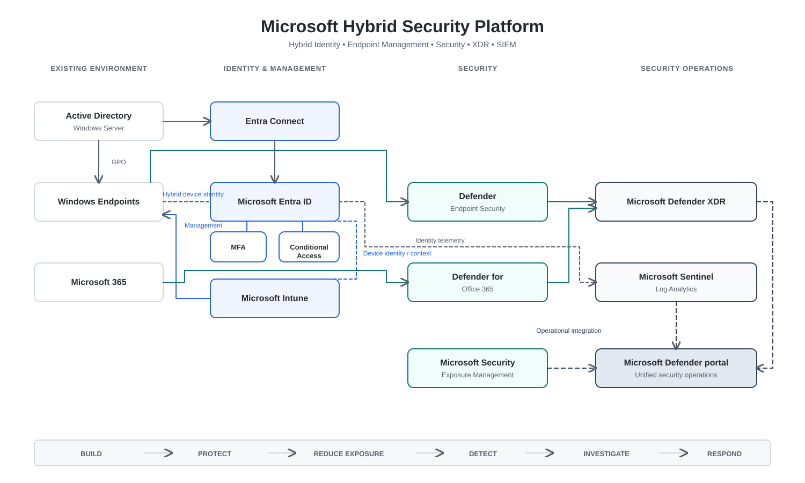
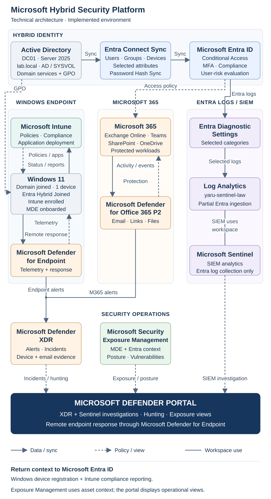

# Microsoft Hybrid Security Platform

A hands-on portfolio implementation of a hybrid Microsoft security architecture integrating on-premises Active Directory with Microsoft Entra ID, Microsoft Intune, Microsoft Defender, Microsoft Sentinel, and Microsoft 365 security services.

The project demonstrates how an organization can modernize identity, endpoint management, threat protection, exposure management, and security operations without immediately replacing its existing on-premises Windows infrastructure.

> **Security lifecycle:** Build → Protect → Reduce Exposure → Detect → Investigate → Respond



*Executive architecture of the Microsoft Hybrid Security Platform, showing hybrid identity, endpoint management, Microsoft security workloads, XDR, SIEM, and unified security operations.*

---

## What This Project Solves

The architecture addresses a realistic hybrid environment where:

- Active Directory and Group Policy are still required
- identities need to extend into Microsoft cloud services
- endpoints need centralized cloud management
- authentication needs stronger controls than passwords alone
- endpoint and Microsoft 365 threats need centralized detection and response
- vulnerabilities and security exposure need proactive management
- identity and security telemetry needs SIEM-level visibility
- security analysts need a coordinated XDR + SIEM investigation workflow

The goal is not to deploy isolated Microsoft products.

The goal is to connect them into one operational security architecture.

---

## Technical Architecture



[Executive Architecture](docs/architecture/executive-architecture.md)

---

## Core Security Capabilities

### Hybrid Identity & Access

The existing Active Directory environment is extended into Microsoft Entra ID using Microsoft Entra Connect and Password Hash Synchronization.

The identity architecture includes:

- Active Directory Domain Services
- Microsoft Entra Connect
- synchronized identities
- hybrid device identity
- Microsoft Authenticator
- multifactor authentication
- Conditional Access
- Microsoft Entra ID Protection P2

This allows the organization to retain required on-premises identity dependencies while introducing modern cloud identity and risk-based security capabilities.

[View Hybrid Identity & Access →](docs/identity/hybrid-identity-and-access.md)

---

### Centralized Endpoint Management

Traditional Group Policy and modern cloud management coexist within the architecture.

The endpoint-management model includes:

- Active Directory
- Organizational Units
- Group Policy
- Microsoft Entra device identity
- Microsoft Intune
- centralized endpoint security configuration
- Microsoft Defender for Endpoint Security Settings Management

This provides a practical modernization path instead of assuming that existing Windows management must be removed immediately.

[View Endpoint Management Architecture →](docs/endpoint/endpoint-management.md)

---

### Endpoint Protection & Response

Windows endpoints are integrated with Microsoft Defender endpoint security and Microsoft Defender XDR.

Validated capabilities include:

- Microsoft Defender Antivirus
- real-time protection
- behavior monitoring
- tamper protection
- EDR telemetry
- centralized device inventory
- incident investigation
- process-tree analysis
- remote Quick Scan
- device isolation
- Live Response
- Action Center
- recovery and incident closure

[View Endpoint Security & Incident Response →](docs/endpoint/endpoint-security.md)

---

### Exposure & Vulnerability Management

The project includes a preventive-security layer designed to reduce risk before an incident occurs.


Capabilities include:

- Microsoft Security Exposure Management
- Defender Vulnerability Management
- asset visibility
- vulnerabilities
- security recommendations
- Exposure Score
- Secure Score
- asset criticality
- Critical Asset Management
- attack-surface visibility
- remediation prioritization

The focus is not simply on finding the largest number of vulnerabilities, but on understanding **which weaknesses matter most and why**.

[View Exposure & Vulnerability Management →](docs/exposure/exposure-and-vulnerability-management.md)

---

### Microsoft 365 Security

Microsoft Defender for Office 365 Plan 2 extends the security architecture into email and collaboration workloads.

The implementation includes work with:

- SPF, DKIM, and DMARC
- anti-phishing
- anti-malware
- Safe Links
- Safe Attachments
- Threat Explorer
- quarantine
- Zero-hour Auto Purge
- Automated Investigation and Response
- Campaigns
- Threat Tracker
- Microsoft Teams protection
- Microsoft Defender XDR integration

[View Microsoft 365 Security →](docs/microsoft-365-security/defender-for-office-365.md)

---

### SIEM & Security Analytics

Microsoft Entra ID identity and activity telemetry is collected into Log Analytics and Microsoft Sentinel.

The implemented path includes:

**Microsoft Entra ID → Data Connector → Collection Configuration / DCRs → Log Analytics → Microsoft Sentinel → KQL / Investigation → Unified Security Operations**

The Sentinel environment includes:

- Log Analytics workspace
- Microsoft Entra ID telemetry
- interactive sign-ins
- audit activity
- non-interactive sign-ins
- Data Collection Rules as part of the implemented collection configuration
- KQL-capable telemetry
- Microsoft Defender portal integration

Microsoft Sentinel and Microsoft Defender XDR remain technically distinct platforms with complementary SIEM and XDR responsibilities.

[View Microsoft Sentinel & SIEM Integration →](docs/security-operations/microsoft-sentinel.md)

---

## Unified Security Operations

The platform connects preventive and reactive security operations.

```text
PRE-BREACH                         POST-DETECTION

Identity controls                  Detection
Endpoint controls                  Alerts
Microsoft 365 protection           Incidents
Exposure management               Investigation
Vulnerability reduction           Containment
        │                          Response
        │                              │
        └──────────────┬───────────────┘
                       ↓
              Unified Security Operations
```

The operational workflow is:

**Prevent → Monitor → Detect → Correlate → Triage → Investigate → Scope → Contain → Remediate → Validate → Recover → Improve**

Microsoft Defender XDR provides cross-domain Microsoft security correlation, evidence, incidents, hunting, and response.

Microsoft Sentinel provides broader SIEM telemetry, Log Analytics, KQL, and analytical flexibility.

Microsoft Security Exposure Management contributes preventive risk, vulnerability, and asset-criticality context.

[View Unified Security Operations →](docs/security-operations/unified-security-operations.md)

---

## Proof of Work

### 1. Endpoint Incident Investigation & Response

A controlled EICAR security event was used to validate the complete endpoint incident lifecycle.


The workflow included:

**Detection → Prevention → Alert → XDR Incident → Attack Story → Process Analysis → Isolation → Quick Scan → Live Response → Validation → Recovery → Closure**

The investigation identified PowerShell activity associated with creation of the detected artifact and used Defender evidence to reconstruct the event.

The endpoint was remotely isolated, connectivity restriction was verified, Live Response was used, a remote Quick Scan was completed, and the device was later released from isolation.

[Read the case study →](docs/case-studies/endpoint-incident-response.md)

---

### 2. Entra ID → Sentinel Security Telemetry Pipeline

A complete identity telemetry path was configured and validated.

The implementation included:

**Microsoft Entra ID → Data Connector → Collection Configuration / DCRs → Log Analytics → Microsoft Sentinel → KQL → Unified Microsoft Defender Security Operations**

The integration was validated using actual Entra telemetry rather than relying only on connector status.

Observed data included:

- interactive sign-in activity
- non-interactive user sign-in activity
- audit activity

[Read the case study →](docs/case-studies/entra-sentinel-integration.md)

---

### 3. Hybrid Identity & Endpoint Integration

The project started with an existing Windows Server / Active Directory environment and extended it into Microsoft cloud management and security.

The validated integration path includes:

**Active Directory → Group Policy → Entra Connect → Password Hash Synchronization → Microsoft Entra ID → Hybrid Device Identity → Microsoft Intune → Microsoft Defender**

The implementation also included troubleshooting Group Policy Results when RPC/WMI communication initially prevented remote policy reporting.

[Read the case study →](docs/case-studies/hybrid-identity-endpoint-integration.md)

---

## Business Risk to Security Control Mapping

| Business Risk | Security Architecture |
|---|---|
| Compromised identities | Entra ID, MFA, Conditional Access, Entra ID Protection P2 |
| Unmanaged or inconsistent endpoints | Active Directory, GPO, Entra device identity, Intune |
| Endpoint compromise | Defender endpoint security, EDR, Defender XDR, isolation, Live Response |
| Vulnerabilities and configuration exposure | Security Exposure Management, Defender Vulnerability Management, recommendations |
| Phishing and malicious email | Defender for Office 365 P2, Safe Links, Safe Attachments, ZAP, AIR |
| Fragmented security visibility | Defender XDR, Sentinel, Log Analytics, KQL, unified security operations |

---

## Engineering Principles

### Preserve Required Hybrid Dependencies

Existing Active Directory infrastructure is retained where it still has a business or technical purpose.

### Centralize Management Without Confusing Responsibilities

Group Policy, Intune, Microsoft Defender, Defender XDR, and Microsoft Sentinel each have distinct responsibilities.

Integration does not make them interchangeable.

### Validate Data and Controls

A configuration is not considered complete simply because a portal reports that it is enabled.

Identity synchronization, Group Policy processing, endpoint onboarding, telemetry ingestion, response actions, and incident workflows are validated through the working environment.

### Reduce Exposure Before Responding to Incidents

Security operations includes vulnerability and configuration-risk reduction, not only alert handling.

### Use Evidence Before Disruptive Response

Containment and remediation decisions should be based on evidence, asset importance, scope, and business impact.

### Combine XDR Depth with SIEM Breadth

Microsoft Defender XDR provides native Microsoft security correlation and response.

Microsoft Sentinel adds broader telemetry, SIEM analytics, and KQL-based investigation.

---

## Technology Stack

### Identity

- Windows Server 2025
- Active Directory Domain Services
- Microsoft Entra Connect
- Microsoft Entra ID
- Microsoft Entra ID P2
- Microsoft Entra ID Protection P2
- Microsoft Authenticator
- Conditional Access

### Endpoint Management

- Group Policy
- Microsoft Intune
- Microsoft Defender for Endpoint Security Settings Management

### Endpoint & Exposure Security

- Microsoft Defender endpoint security
- Microsoft Defender XDR
- Microsoft Security Exposure Management
- Defender Vulnerability Management

### Microsoft 365 Security

- Exchange Online Protection
- Microsoft Defender for Office 365 Plan 2
- Threat Explorer
- Safe Links
- Safe Attachments
- Zero-hour Auto Purge
- Automated Investigation and Response

### SIEM & Security Analytics

- Microsoft Sentinel
- Log Analytics
- Microsoft Entra ID Data Connector
- Data Collection Rules
- KQL
- Advanced Hunting

---

## Architecture & Documentation

- [Business Scenario & Security Requirements](docs/business-scenario.md)
- [Executive Architecture](docs/architecture/executive-architecture.md)
- [Technical Architecture](docs/architecture/technical-architecture.md)
- [Hybrid Identity & Access](docs/identity/hybrid-identity-and-access.md)
- [Endpoint Management](docs/endpoint/endpoint-management.md)
- [Endpoint Security & Incident Response](docs/endpoint/endpoint-security.md)
- [Exposure & Vulnerability Management](docs/exposure/exposure-and-vulnerability-management.md)
- [Microsoft 365 Security](docs/microsoft-365-security/defender-for-office-365.md)
- [Microsoft Sentinel & SIEM](docs/security-operations/microsoft-sentinel.md)
- [Unified Security Operations](docs/security-operations/unified-security-operations.md)

### Case Studies

- [Endpoint Detection, Investigation & Response](docs/case-studies/endpoint-incident-response.md)
- [Entra ID Security Telemetry Pipeline](docs/case-studies/entra-sentinel-integration.md)
- [Hybrid Identity & Endpoint Security Foundation](docs/case-studies/hybrid-identity-endpoint-integration.md)

---

## Implementation Scope

This is a hands-on portfolio implementation created in a controlled environment to reproduce realistic hybrid Microsoft security and security-operations workflows.

The project demonstrates:

- architecture
- configuration
- integration
- validation
- troubleshooting
- investigation
- containment
- response
- recovery

It is not presented as an external customer production deployment.

Only capabilities actually implemented, configured, observed, or validated are represented as such.

---

## Security Lifecycle

```text
BUILD
  ↓
Hybrid identity and endpoint integration

PROTECT
  ↓
Identity, endpoint and Microsoft 365 security

REDUCE EXPOSURE
  ↓
Vulnerability and configuration risk reduction

DETECT
  ↓
Defender signals and Sentinel telemetry

INVESTIGATE
  ↓
Incidents, evidence, hunting and correlation

RESPOND
  ↓
Containment, remediation, recovery and improvement
```

The value of the Microsoft Hybrid Security Platform is not the number of Microsoft products connected to it.

**The value is the integration of identity, endpoint management, preventive security, threat detection, SIEM telemetry, investigation, and response into one coherent hybrid security architecture.**

============================================================
