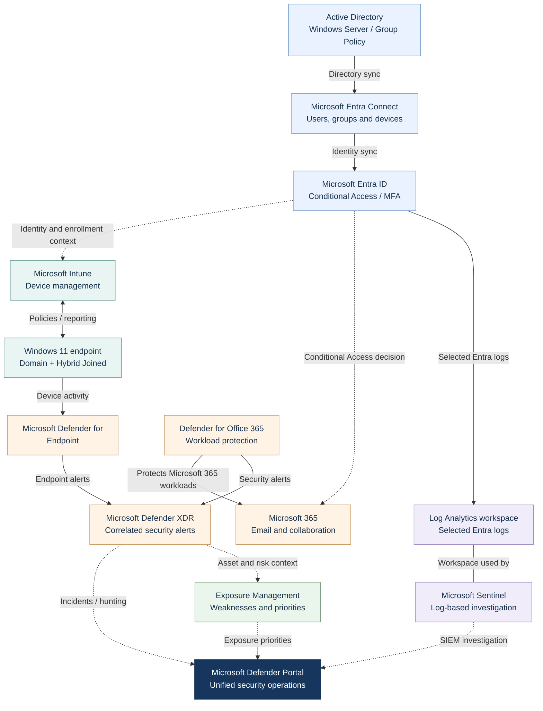
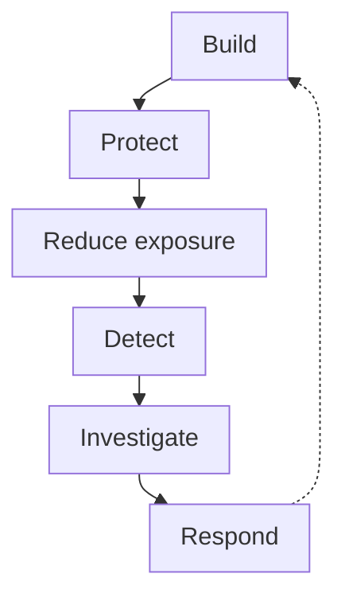

# Executive Architecture

## Microsoft Hybrid Security Platform

The Microsoft Hybrid Security Platform extends an existing Windows Server and Active Directory environment with cloud identity, centralized endpoint management, Microsoft 365 protection, exposure management, XDR, and SIEM capabilities.

The design preserves required on-premises dependencies while adding modern security controls and a unified operational experience across identity, endpoints, Microsoft 365, exposure, detection, investigation, and response.

## Architecture Overview

Solid arrows show primary implemented relationships. Dashed arrows show contextual or interface relationships. The line without an arrow indicates that Sentinel uses the Log Analytics workspace.

## Preserve and Extend the Existing Environment

Active Directory remains responsible for domain identities, domain membership, DNS, Kerberos and LDAP dependencies. Group Policy is a domain policy mechanism stored in AD and SYSVOL.

Microsoft Entra Connect Sync synchronizes selected users, groups, device objects and identity attributes to Microsoft Entra ID. Password Hash Synchronization supports cloud authentication without transferring plaintext passwords. The Windows 11 endpoint remains domain joined and completes automatic registration with Entra ID, forming its Hybrid Joined identity.

This supports hybrid modernization without requiring an immediate replacement of existing Windows infrastructure.

## Identity and Endpoint Management

Microsoft Entra ID provides the cloud identity and access layer. Microsoft Authenticator is a registered MFA method; Entra ID Protection P2 supplies identity-risk information. Conditional Access evaluates identity, device, risk and authentication requirements to control access to Microsoft 365.

Microsoft Intune sends endpoint policies, configuration and applications, and receives inventory, status and compliance reporting. Compliance can inform Conditional Access decisions. Group Policy remains available for required domain-based configuration.

The responsibilities remain separate:

- Group Policy provides domain-based configuration.
- Intune provides cloud-based device management and configuration.
- Microsoft Defender for Endpoint provides endpoint security, detection, investigation and response.
- MFA, Conditional Access, and Entra ID Protection provide different identity-security controls.

This allows cloud management and identity protection to be introduced without treating the different control planes as one system.

## Security Protection and Exposure Reduction

Microsoft Defender for Endpoint provides prevention, endpoint telemetry, detection, investigation, isolation, Live Response and containment.

Microsoft Defender for Office 365 Plan 2 protects Exchange Online, Teams, SharePoint and OneDrive workloads and contributes security alerts to Microsoft Defender XDR investigations.

Microsoft Security Exposure Management and Defender Vulnerability Management can provide preventive visibility into vulnerabilities, security configuration weaknesses, critical assets, attack surface, security recommendations, and remediation priorities.

Exposure information is broader than endpoint alerts alone and can include context from devices, identities, and other connected security assets.

Microsoft Secure Score provides an additional posture view and should not be interpreted as the same metric as Exposure Score.

## SIEM and Unified Security Operations

Selected Microsoft Entra identity and activity logs are collected in a Log Analytics workspace and analyzed in Microsoft Sentinel. Collection is currently partial; this project uses Sentinel for Entra logs.

Microsoft Sentinel provides SIEM analytics, KQL-based investigation, hunting, and extensibility to additional data sources.

Microsoft Sentinel complements Microsoft Defender XDR rather than replacing it.

Microsoft Defender XDR, Microsoft Sentinel, and Microsoft Security Exposure Management retain distinct technical responsibilities. The Microsoft Defender portal provides the unified operational experience through which these capabilities can be used together for posture management, detection, investigation, hunting, exposure reduction, and response.

The Defender portal is therefore the operational layer and should not be interpreted as evidence that Defender XDR, Sentinel, and Exposure Management share one common backend or datastore.

Detailed data paths and integration boundaries are documented in the [Technical Architecture](technical-architecture.md).

## Security Lifecycle

The lifecycle is continuous and overlapping: prevention, detection, investigation and response can operate in parallel. The return arrow represents ongoing review and improvement, not a requirement to finish one activity before starting another.

## Business Outcomes

The architecture is designed to provide:

- preservation and modernization of required hybrid infrastructure
- stronger identity, authentication, and access controls
- centralized endpoint management, protection, and response
- Microsoft 365 threat protection
- proactive vulnerability and exposure reduction
- centralized detection, investigation, hunting, and response across security domains

The resulting model is designed to reduce the likelihood and potential impact of compromise while improving an organization's ability to detect, investigate, contain, and respond to security events.
