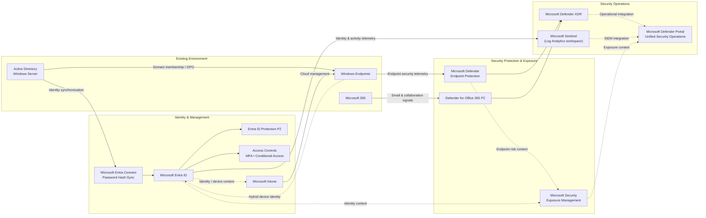
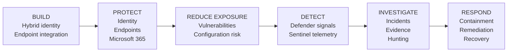

# Executive Architecture

## Microsoft Hybrid Security Platform

The Microsoft Hybrid Security Platform extends an existing Windows Server and Active Directory environment with cloud identity, centralized endpoint management, Microsoft 365 protection, exposure management, XDR, and SIEM capabilities.

The design preserves required on-premises dependencies while adding modern security controls and a unified operational experience across identity, endpoints, Microsoft 365, exposure, detection, investigation, and response.

## Architecture Overview

The arrows represent different architectural relationships. Identity synchronization, device identity, management, security telemetry, exposure context, and security-operations integration are separate flows and should not be interpreted as one common data path.

## Preserve and Extend the Existing Environment

Active Directory remains responsible for domain identities, domain-joined Windows devices, Group Policy, and other traditional Windows dependencies.

Microsoft Entra Connect extends selected on-premises identities into Microsoft Entra ID using Password Hash Synchronization. Windows endpoints can remain domain joined while also participating in Microsoft Entra device identity and cloud-based management.

This supports hybrid modernization without requiring an immediate replacement of existing Windows infrastructure.

## Identity and Endpoint Management

Microsoft Entra ID provides the cloud identity and access layer. Microsoft Authenticator, multifactor authentication, Conditional Access, device context, and Entra ID Protection add stronger authentication, contextual access control, and identity-risk visibility.

Microsoft Intune adds centralized cloud-based endpoint management while Group Policy remains available for required domain-based configuration.

The responsibilities remain separate:

- Group Policy provides domain-based configuration.
- Intune provides cloud-based device management and configuration.
- Microsoft Defender provides endpoint security, detection, investigation, and response.
- MFA, Conditional Access, and Entra ID Protection provide different identity-security controls.

This allows cloud management and identity protection to be introduced without treating the different control planes as one system.

## Security Protection and Exposure Reduction

Microsoft Defender endpoint protection provides prevention, endpoint telemetry, EDR, investigation, and remote response capabilities.

Microsoft Defender for Office 365 Plan 2 protects email and collaboration workloads and contributes relevant security signals to broader Microsoft Defender XDR investigations.

Microsoft Security Exposure Management and Defender Vulnerability Management provide preventive visibility into vulnerabilities, security configuration weaknesses, critical assets, attack surface, security recommendations, and remediation priorities.

Exposure information is broader than endpoint alerts alone and can include context from devices, identities, and other connected security assets.

Microsoft Secure Score provides an additional posture view and should not be interpreted as the same metric as Exposure Score.

## SIEM and Unified Security Operations

Microsoft Entra identity and activity telemetry is ingested into a Log Analytics workspace and analyzed with Microsoft Sentinel.

Microsoft Sentinel provides SIEM analytics, KQL-based investigation, hunting, and extensibility to additional data sources.

Microsoft Sentinel complements Microsoft Defender XDR rather than replacing it.

Microsoft Defender XDR, Microsoft Sentinel, and Microsoft Security Exposure Management retain distinct technical responsibilities. The Microsoft Defender portal provides the unified operational experience through which these capabilities can be used together for posture management, detection, investigation, hunting, exposure reduction, and response.

The Defender portal is therefore the operational layer and should not be interpreted as evidence that Defender XDR, Sentinel, and Exposure Management share one common backend or datastore.

Detailed data paths and integration boundaries are documented in the [Technical Architecture](technical-architecture.md).

## Security Lifecycle

The platform is organized around the operating lifecycle:

**Build → Protect → Reduce Exposure → Detect → Investigate → Respond**

This represents an operational security model rather than a linear telemetry or data flow. These activities can operate continuously and in parallel.

## Business Outcomes

The architecture is designed to provide:

- preservation and modernization of required hybrid infrastructure
- stronger identity, authentication, and access controls
- centralized endpoint management, protection, and response
- Microsoft 365 threat protection
- proactive vulnerability and exposure reduction
- centralized detection, investigation, hunting, and response across security domains

The resulting model is designed to reduce the likelihood and potential impact of compromise while improving an organization's ability to detect, investigate, contain, and respond to security events.

