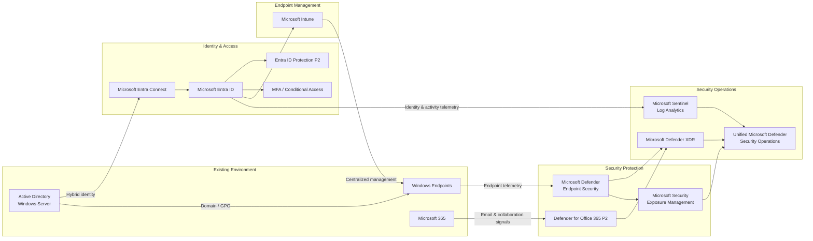
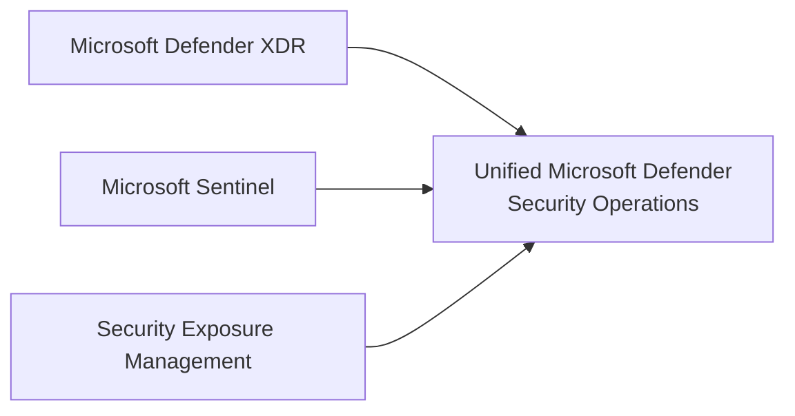
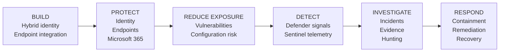

# Executive Architecture

## Microsoft Hybrid Security Platform

The Microsoft Hybrid Security Platform extends an existing Windows and Active Directory environment with cloud-based identity protection, endpoint management, threat protection, exposure management, XDR, and SIEM capabilities.

The architecture preserves required on-premises dependencies while introducing centralized security management and a unified security operations workflow.

---

## Architecture Overview

The arrows represent different architectural relationships. Identity synchronization, management, security telemetry, and security-operations integration are separate flows and should not be interpreted as one common data path.

---

## Preserve Existing Infrastructure

Active Directory remains in place for domain identities, Windows devices, Group Policy, and other dependencies that still require traditional Windows infrastructure.

Microsoft Entra Connect extends existing identities into Microsoft Entra ID instead of requiring an immediate cloud-only migration.

---

## Strengthen Identity & Access

Microsoft Entra ID provides the cloud identity and access layer.

The architecture combines:

- synchronized identities
- Microsoft Authenticator
- multifactor authentication
- Conditional Access
- device identity
- Microsoft Entra ID Protection P2

This adds stronger authentication, contextual access control, and identity-risk capabilities around the existing identity model.

---

## Centralize Endpoint Management

Microsoft Intune introduces centralized cloud-based endpoint management while Group Policy remains available for required domain-based configuration.

The architecture therefore supports gradual modernization rather than requiring an immediate replacement of the existing management model.

---

## Protect Endpoints

Microsoft Defender endpoint security provides:

- malware prevention
- endpoint telemetry
- EDR
- centralized security visibility
- incident investigation
- remote scanning
- device isolation
- Live Response
- response-action tracking

Endpoints therefore become centrally manageable security assets instead of locally protected standalone systems.

---

## Protect Microsoft 365

Microsoft Defender for Office 365 Plan 2 extends protection into email and collaboration workloads.

The security model includes protection and investigation capabilities around:

- phishing
- malware
- attachments
- URLs
- quarantine
- post-delivery threats
- automated investigation
- Microsoft Teams

Email and collaboration signals can contribute to wider Microsoft Defender XDR investigations.

---

## Reduce Exposure Before Incidents

Microsoft Security Exposure Management and Defender Vulnerability Management provide visibility into:

- vulnerabilities
- security configuration weaknesses
- security recommendations
- Exposure Score
- Secure Score
- critical assets
- attack surface
- remediation priorities

This adds a preventive layer designed to reduce security risk before weaknesses become part of an active incident.

---

## Extend Visibility with SIEM

Microsoft Entra identity and activity telemetry is collected into Log Analytics and Microsoft Sentinel.

Sentinel adds:

- SIEM telemetry
- Log Analytics
- KQL
- security analytics
- deeper identity investigation context
- extensibility to additional data sources

Microsoft Sentinel complements Microsoft Defender XDR rather than replacing it.

---

## Unified Security Operations

Microsoft Defender XDR, Microsoft Sentinel, and Microsoft Security Exposure Management retain distinct technical responsibilities.

They are used together through the Microsoft Defender security operations experience.

This provides a coordinated working model for prevention, detection, investigation, exposure reduction, and response.

---

## Security Lifecycle

The platform is designed around a complete lifecycle:

**Build → Protect → Reduce Exposure → Detect → Investigate → Respond**

---

## Business Outcomes

The architecture provides:

- preservation of necessary on-premises infrastructure
- hybrid identity modernization
- stronger authentication and access controls
- identity-risk visibility
- centralized endpoint management
- centralized endpoint protection
- Microsoft 365 threat protection
- proactive vulnerability and exposure management
- SIEM-based telemetry collection
- KQL-based investigation
- cross-domain XDR investigation
- remote endpoint containment and response
- unified security operations

The resulting model improves both sides of security operations:

**reducing the likelihood and potential impact of compromise while improving the organization's ability to detect, investigate, contain, and respond when security events occur.**
