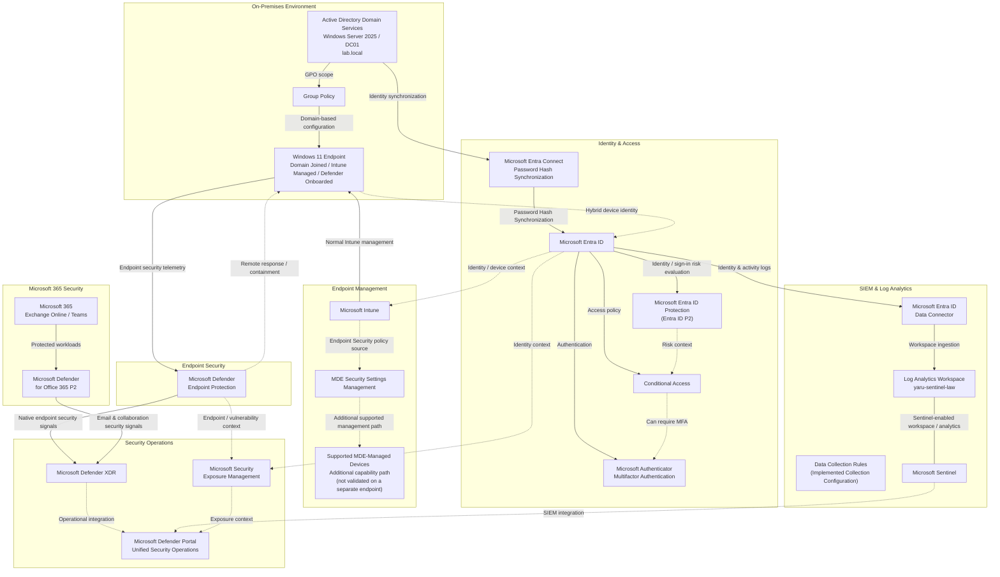

# Technical Architecture

## Architecture Purpose

The Microsoft Hybrid Security Platform is a hands-on portfolio implementation of a hybrid Microsoft security environment.

It demonstrates how an organization with existing on-premises Active Directory and Windows infrastructure can extend that environment with cloud identity, endpoint management, identity protection, endpoint security, Microsoft 365 security, exposure management, XDR, and SIEM capabilities.

The architecture intentionally preserves necessary on-premises dependencies while introducing modern Microsoft security services around them.


## Implementation Scope

| Status | Meaning |
|---|---|
| Implemented & validated | Configured and technically verified in this project |
| Configured / evaluated | Configured or explored, but not necessarily validated end-to-end |
| Not deployed / not validated | Explicitly outside the validated implementation scope |

Key boundaries:

- The controlled endpoint incident path was end-to-end validated with the EICAR test file.
- Microsoft Defender for Identity sensors were not deployed on the domain controller.
- A separate non-Intune-enrolled endpoint using MDE Security Settings Management was not validated.
- The configured MDE Security Settings Management operating-system scope was not independently tested for every listed operating system.
- Not every Microsoft Entra ID Protection scenario or Exposure Management recommendation was artificially triggered, remediated, or validated end-to-end.

---

## Core Architecture



The diagram represents several different architectural relationships. The arrows must not all be interpreted as the same type of data flow.

The architecture distinguishes five relationship types:

1. **Identity and device identity** — Active Directory synchronization, Microsoft Entra identity, and hybrid device identity.
2. **Management and control** — Group Policy, Microsoft Intune, supported MDE Security Settings Management, and endpoint response actions.
3. **Security telemetry** — endpoint and Microsoft 365 security signals contributing to Microsoft Defender XDR.
4. **SIEM data ingestion and analysis** — Microsoft Entra telemetry ingested into Log Analytics and analyzed with Microsoft Sentinel.
5. **Context and operational integration** — Exposure Management and the unified Microsoft Defender security-operations experience.

Solid arrows represent primary implemented flows where appropriate. Dotted arrows represent contextual, control, additional-management, or operational relationships and must not be interpreted as universal telemetry pipelines. The undirected Sentinel relationship indicates that Microsoft Sentinel is enabled on and operates with the Log Analytics workspace rather than acting as a second sequential log store.

The `Supported MDE-Managed Devices` node represents the additional Security Settings Management capability path and does not represent a second validated Windows workstation in this project.

---

# 1. On-Premises Foundation

The on-premises environment is based on:

- Windows Server 2025
- Active Directory Domain Services
- domain `lab.local`
- domain controller `DC01`
- Organizational Units
- users
- security groups
- computer identities
- domain-joined Windows workstation
- Group Policy

The Active Directory structure includes:

```text
Company
├── Users
│   ├── Finance
│   ├── HR
│   ├── IT
│   └── Sales
├── Groups
├── Servers
└── Workstations
```

A Windows 11 endpoint is joined to the Active Directory domain.

A workstation security Group Policy was configured, linked to the Workstations OU, and validated on the endpoint.

Group Policy Results troubleshooting was also performed when RPC/WMI communication initially prevented remote policy reporting.

The required WMI firewall access was enabled and Group Policy Results subsequently worked successfully.

### Architectural purpose

The on-premises layer represents infrastructure that continues to require traditional Windows domain services while modernization takes place around it.

---

# 2. Hybrid Identity

Microsoft Entra Connect integrates Active Directory with Microsoft Entra ID.

The implemented synchronization method is Password Hash Synchronization.

```text
Active Directory
      ↓
Microsoft Entra Connect
      ↓
Password Hash Synchronization
      ↓
Microsoft Entra ID
```

A synchronized on-premises user was successfully represented in Microsoft Entra ID.

The architecture also includes hybrid Windows device identity.

Microsoft Entra Connect was also used to configure the hybrid device identity relationship. The domain-joined endpoint performs device registration with Microsoft Entra ID; Password Hash Synchronization is the user credential synchronization method and is not the device-registration mechanism.

### Architectural purpose

Existing identities can participate in Microsoft 365, Intune, Entra security, Microsoft Defender, and other cloud services without creating an independent cloud-only identity population.

---

# 3. Microsoft Entra ID

Microsoft Entra ID provides the cloud identity and access layer.

The implemented environment includes:

- synchronized identities
- Microsoft Authenticator
- multifactor authentication capabilities
- Conditional Access
- Microsoft Entra device identity
- Microsoft Entra ID P2
- Microsoft Entra ID Protection (Entra ID P2)

These are separate controls with different responsibilities:

```text
Microsoft Authenticator / MFA
        ↓
Authentication assurance


Conditional Access
        ↓
Access-policy evaluation and enforcement


Microsoft Entra ID Protection (Entra ID P2)
        ↓
Identity-risk and sign-in-risk detection/context
```

Entra ID Protection risk context can inform Conditional Access decisions. Conditional Access policies can require MFA.

The project does not claim that every Microsoft Entra ID Protection risk scenario was artificially triggered or validated.

---

# 4. Endpoint Management

Microsoft Intune provides the cloud endpoint-management and policy-delivery plane.

The normal implemented management path is:

```text
Microsoft Entra device identity / context
        ↓
Microsoft Intune
        ↓
Intune-managed Windows endpoint
```

Microsoft Entra ID provides identity and device context; it is not presented as the transport layer through which Intune policies are delivered.

Group Policy remains available for required on-premises Windows configuration:

```text
Active Directory
        ↓
Group Policy
        ↓
Domain-based Windows configuration
```

Group Policy and Intune can coexist, but ownership of overlapping settings must be considered to avoid policy conflicts.

---

# 5. MDE Security Settings Management

Microsoft Defender for Endpoint Security Settings Management is enabled.

The configured enforcement scope includes:

- Windows Client
- Windows Server
- Linux
- macOS

Windows Server Domain Controllers are excluded from this enforcement scope.

Normal Intune-enrolled device:

```text
Microsoft Intune
        ↓
Intune-managed endpoint
```

Additional supported security-management path:

```text
Intune Endpoint Security
        ↓
MDE Security Settings Management
        ↓
Supported MDE-managed devices
```

Security Settings Management is an additional supported management path. It is not the normal management path for the validated Intune-enrolled Windows workstation, does not mean that all Intune policies pass through Microsoft Defender, and is limited to supported security settings and supported MDE-managed devices.

The generic supported MDE-managed-device path represents platform capability/configuration, not proof that a second non-Intune-enrolled endpoint was validated in this project. The project does not claim that every operating system included in the configured scope was independently tested.

---

# 6. Endpoint Security

The Windows endpoint was successfully onboarded to Microsoft Defender endpoint security.

Validated security state included:

- Microsoft Defender Antivirus running in Normal mode
- real-time protection enabled
- behavior monitoring enabled
- IOAV protection enabled
- tamper protection enabled
- Defender endpoint sensor operational
- device visible in Microsoft Defender inventory

Endpoint security capabilities demonstrated include:

- malware prevention
- endpoint telemetry
- EDR
- investigation
- remote Quick Scan
- device isolation
- Live Response
- Action Center
- recovery and incident closure

Endpoint protection is provided through Microsoft Defender for Business included with Microsoft 365 Business Premium. Microsoft Defender for Endpoint Plan 2 trial capabilities were additionally activated and evaluated.

These are not represented as two independent endpoint protection engines.

---

# 7. Microsoft Defender XDR

Microsoft Defender XDR provides the XDR investigation and correlation layer.

Implemented operational capabilities include:

- alerts
- incidents
- Attack Story
- evidence
- device context
- email security context
- Advanced Hunting
- investigation
- response actions
- Action Center
- Threat Intelligence
- cross-workload security operations

The implemented architectural workload relationships are:

```text
Windows endpoint
      ↓
Microsoft Defender endpoint protection
      ↓
Microsoft Defender XDR
```

and:

```text
Microsoft 365
Exchange Online / Teams
      ↓
Defender for Office 365 P2
      ↓
Microsoft Defender XDR
```

The endpoint path above was end-to-end validated through the controlled EICAR incident. The Microsoft 365 path represents configured workload integration and investigated mail-security capabilities; a malicious-email incident correlation was not claimed as end-to-end validated.

Microsoft Defender for Identity sensors are not deployed on the domain controller. Domain-controller identity telemetry is therefore not represented as entering Defender XDR through Defender for Identity.

---

# 8. Validated Endpoint Incident

A controlled security scenario was generated using the standard EICAR test file.

Microsoft Defender:

- detected the test file
- prevented it
- quarantined it
- generated a security alert
- created a Defender XDR incident

The investigation included:

- incident triage
- alert analysis
- Attack Story
- evidence review
- process-tree analysis
- PowerShell activity analysis
- endpoint context
- malware verdict

The observed process chain included:

```text
smss.exe
   ↓
winlogon.exe
   ↓
userinit.exe
   ↓
explorer.exe
   ↓
powershell.exe
```

Response actions included:

- remote Quick Scan
- Action Center validation
- device isolation
- validation of restricted network connectivity
- Live Response
- release from isolation
- investigation comments
- incident closure

The validated lifecycle was:

Remote response and containment actions are initiated through the Microsoft Defender security-operations experience and carried out through Defender endpoint components on the device.


```text
Detection
   ↓
Alert
   ↓
Incident
   ↓
Evidence
   ↓
Investigation
   ↓
Containment
   ↓
Remote response
   ↓
Validation
   ↓
Recovery
   ↓
Closure
```

---

# 9. Microsoft Defender for Office 365 P2

Microsoft Defender for Office 365 Plan 2 provides the email and collaboration security layer.

The protected workload relationship is:

```text
Microsoft 365
Exchange Online / Teams
        ↓
Defender for Office 365 P2
        ↓
Microsoft Defender XDR
```

The environment includes configured or investigated capabilities around:

- anti-phishing
- anti-spam
- anti-malware
- Safe Attachments
- Safe Links
- quarantine
- Threat Explorer
- Automated Investigation and Response
- Zero-hour Auto Purge
- Campaigns
- Threat Tracker
- Action Center
- submissions
- Microsoft Teams protection

Mail-security work also included:

- external email warning rule
- Message Trace
- SPF analysis
- DKIM analysis
- DMARC analysis
- composite authentication analysis

Microsoft Defender for Office 365 contributes email and collaboration security signals to Microsoft Defender XDR.

---

# 10. Microsoft Security Exposure Management

Microsoft Security Exposure Management provides the preventive security and risk-reduction layer.

The environment includes work with:

- Exposure Management
- Exposure Score
- Secure Score
- Defender Vulnerability Management
- vulnerabilities
- security recommendations
- configuration weaknesses
- asset criticality
- Critical Asset Management
- attack-surface visibility
- remediation prioritization

Exposure Management combines supported asset and security context across devices, identities, and connected cloud assets to derive exposure insights such as criticality, attack paths, vulnerabilities, configuration weaknesses, and recommendations.

The preventive workflow is:

```text
Assets
   ↓
Exposure / vulnerabilities
   ↓
Criticality and context
   ↓
Security recommendations
   ↓
Prioritization
   ↓
Remediation decision / mitigation
   ↓
Validation
```

Exposure Score represents exposure-related security posture within Security Exposure Management. Microsoft Secure Score provides a broader Microsoft security-posture and recommendation view. They are related concepts but are not the same metric.

The project does not claim that every exposure recommendation was remediated.

---

# 11. Microsoft Sentinel

Microsoft Sentinel provides the SIEM layer.

The implemented Log Analytics workspace is:

`yaru-sentinel-law`

Microsoft Sentinel is enabled and operational. Microsoft Entra ID telemetry is successfully connected and available for investigation.

The implemented collection architecture is:

```text
Microsoft Entra ID
        ↓
Microsoft Entra ID Data Connector
        ↓
Log Analytics Workspace
yaru-sentinel-law
        ↔
Microsoft Sentinel enabled on /
operating with the workspace
```

Data Collection Rules were also configured in the collection environment. They are represented separately because they were not treated as a required transport stage for the validated Entra ID connector path.

The implementation includes:

- Microsoft Entra ID data connector
- sign-in-related telemetry
- audit telemetry
- non-interactive sign-in telemetry
- Log Analytics
- Microsoft Sentinel
- KQL-capable security telemetry

Observed Entra log tables included `SigninLogs`, `AuditLogs`, and `AADNonInteractiveUserSignInLogs`.

Data Collection Rules were part of the implemented collection configuration but are not represented as a universal mandatory transport mechanism for every Microsoft Entra log category.

---

# 12. Sentinel and Defender XDR Boundary

Microsoft Sentinel and Microsoft Defender XDR are complementary platforms.

They are not the same product, data store, or backend.

```text
MICROSOFT DEFENDER XDR

Native Microsoft security telemetry
Cross-workload detections
Alerts
Incidents
Evidence
Attack Story
Response


MICROSOFT SENTINEL

Log Analytics telemetry
SIEM
KQL
Analytics
Additional log sources
Broader investigation context
```

Sentinel workspace data can be investigated through the connected Microsoft Defender portal experience, including supported Advanced Hunting scenarios.

This operational integration does not mean:

- Sentinel telemetry becomes native Defender XDR telemetry
- Sentinel and Defender XDR use one universal datastore
- Sentinel and Defender XDR become the same security product

Sentinel data remains associated with Sentinel and Log Analytics. Defender XDR retains its native security data and XDR responsibilities.

---

# 13. Unified Security Operations

The Microsoft Defender portal provides the operational layer through which multiple security capabilities are used together.

```text
Microsoft Defender XDR --------\
                                \
Microsoft Sentinel --------------> Microsoft Defender portal
                                /
Exposure Management -----------/
```

Microsoft Defender XDR, Microsoft Sentinel, and Microsoft Security Exposure Management retain distinct technical responsibilities.

Their relationships to the portal represent:

- operational integration
- unified analyst/security-operations experience
- contextual integration

They do not represent one common ingestion pipeline or shared backend.

---

# 14. Identity Flow

The architecture contains two related but separate identity paths.

User identity synchronization:

```text
Active Directory
      ↓
Microsoft Entra Connect
      ↓
Password Hash Synchronization
      ↓
Microsoft Entra ID
```

A synchronized on-premises user was successfully represented in Microsoft Entra ID.

Device identity:

```text
Domain-joined Windows endpoint
      ↓
Microsoft Entra hybrid device identity
      ↓
Microsoft Entra ID
```

Microsoft Defender for Identity sensors are not deployed on the domain controller and are therefore not represented as part of the implemented architecture.

---

# 15. Management and Control Flow

The architecture separates management and response mechanisms.

Domain management:

```text
Active Directory
      ↓
Group Policy
      ↓
Windows endpoint
```

Normal cloud management:

```text
Microsoft Entra identity / device context
      ↓
Microsoft Intune
      ↓
Intune-managed Windows endpoint
```

Additional supported security-management path:

```text
Intune Endpoint Security
      ↓
MDE Security Settings Management
      ↓
Supported MDE-managed devices
```

Security response:

```text
Microsoft Defender security-operations experience
      ↓
Defender for Endpoint service
      ↓
Remote response / containment
      ↓
Windows endpoint
```

These mechanisms have different ownership and purposes.

Remote response and containment actions are initiated through the cloud security-operations plane and executed through Defender endpoint components on the device. Group Policy provides traditional domain-based configuration, Intune provides cloud management and policy delivery, Security Settings Management provides an additional supported path for supported security settings, and Microsoft Defender provides endpoint protection and response.

---

# 16. Security Telemetry Flow

Native endpoint security path:

```text
Windows endpoint
        ↓
Microsoft Defender endpoint protection
        ↓
Microsoft Defender XDR
```

Microsoft 365 security path:

```text
Microsoft 365
Exchange Online / Teams
        ↓
Defender for Office 365 P2
        ↓
Microsoft Defender XDR
```

SIEM identity telemetry path:

```text
Microsoft Entra ID
        ↓
Microsoft Entra ID Data Connector
        ↓
Log Analytics Workspace
yaru-sentinel-law
        ↔
Microsoft Sentinel
```

Data Collection Rules were configured as part of the implemented collection architecture but are not shown as a universal mandatory hop in the Entra telemetry path.

Microsoft Entra telemetry used by Sentinel remains a separate SIEM path from native Microsoft Defender XDR telemetry.

---

# 17. Security Operations Flow

```text
Microsoft Defender XDR --------\
                                \
Microsoft Sentinel --------------> Microsoft Defender portal
                                /
Exposure Management -----------/
```

This represents operational integration and a unified analyst experience.

It does not represent:

- one shared security database
- one common telemetry backend
- automatic conversion of Sentinel data into native Defender XDR data

---

# 18. Preventive and Reactive Security

The architecture intentionally includes both pre-breach and post-detection security operations.

```text
PREVENTIVE SECURITY

Assets
↓
Exposure
↓
Vulnerabilities
↓
Recommendations
↓
Prioritization
↓
Remediation / mitigation decision
↓
Validation


DETECTION & RESPONSE

Telemetry
↓
Detection
↓
Alert
↓
Incident
↓
Investigation
↓
Containment
↓
Response
↓
Recovery
```

The platform therefore aims both to reduce the probability of successful compromise and to improve response when security events occur.

---

# 19. Security Lifecycle

The complete architecture follows:

```text
BUILD
  ↓
Hybrid identity and endpoint integration

PROTECT
  ↓
Identity, endpoint, access and Microsoft 365 security

REDUCE EXPOSURE
  ↓
Vulnerability and configuration risk reduction

DETECT
  ↓
Defender signals and Sentinel telemetry

INVESTIGATE
  ↓
Incidents, evidence, Advanced Hunting and KQL

RESPOND
  ↓
Containment, remediation, validation and recovery
```

This lifecycle represents the operating model of the platform and should not be interpreted as a sequential telemetry or control path.

---

# 20. Architectural Principles

## Hybrid-first modernization

Preserve necessary Active Directory dependencies while extending identity, management, and security into Microsoft cloud services.

## Centralized management

Reduce inconsistent manual administration through Group Policy, Intune, and centralized Microsoft security management according to each platform's responsibility.

## Separate management from protection

Intune manages and configures supported endpoints.

Microsoft Defender protects, monitors, detects, investigates, and responds.

## Identity and device context

Security decisions should consider identity, authentication, device state, and risk rather than relying only on passwords.

## Prevention before incident response

Use Exposure Management and Vulnerability Management to reduce weaknesses before an active incident occurs.

## Evidence-driven investigation

Use incidents, process activity, identity telemetry, email information, hunting, and KQL to understand security events before taking disruptive response actions.

## XDR and SIEM remain complementary

Microsoft Defender XDR and Microsoft Sentinel solve related but different security problems.

The unified Defender experience improves analyst operations without making them the same platform.

---

# 21. Business Value

The architecture demonstrates how an organization can evolve from a traditional Windows and Active Directory environment into a modern Microsoft security operating model while retaining infrastructure that still has a valid business purpose.

The platform provides:

- hybrid identity
- stronger authentication
- contextual access control
- identity-risk visibility
- centralized endpoint management
- centralized endpoint security
- endpoint detection and response
- Microsoft 365 threat protection
- proactive exposure and vulnerability management
- SIEM telemetry
- KQL-based investigation
- cross-domain XDR investigation
- remote endpoint containment
- response validation
- unified security operations

The value of the Microsoft Hybrid Security Platform is not the number of Microsoft products connected to it.

The value is the integration of identity, endpoint management, preventive security, threat detection, SIEM telemetry, investigation, and response into one coherent hybrid security architecture.
