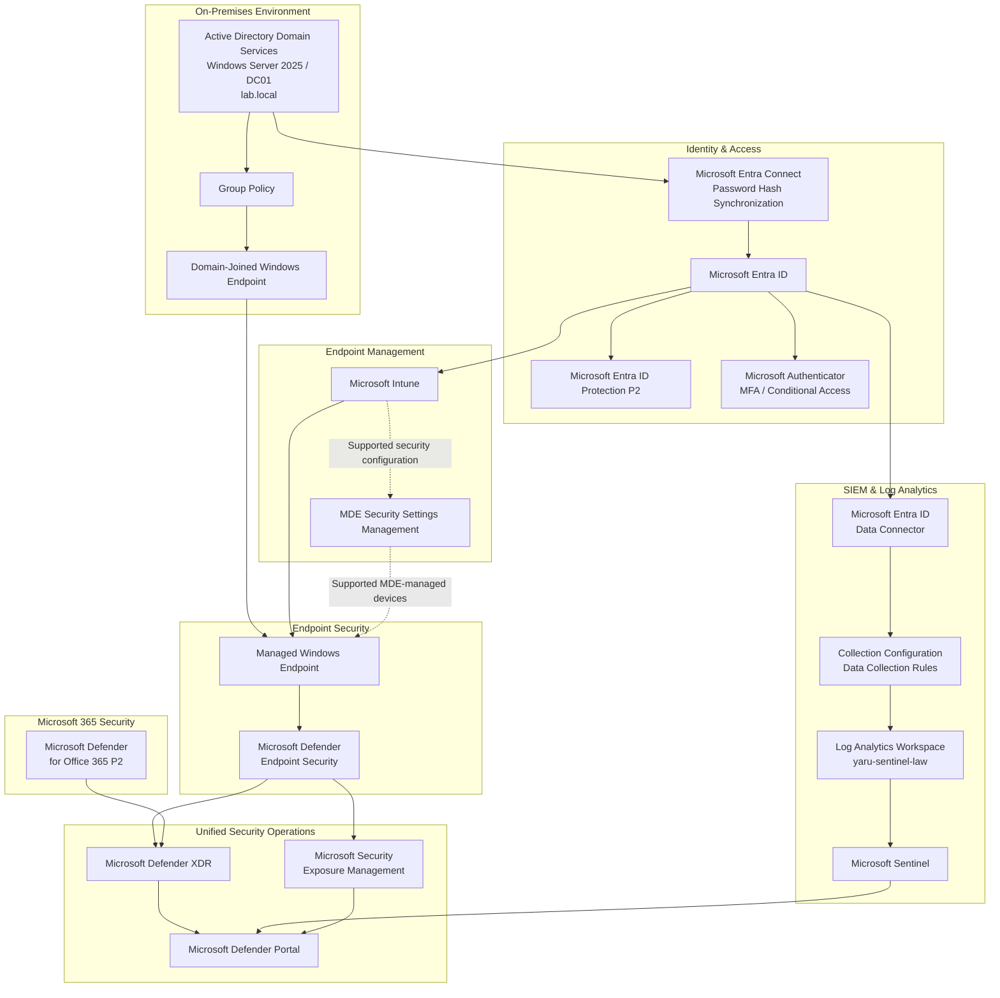

# Technical Architecture

## Architecture Purpose

The Microsoft Hybrid Security Platform is a hands-on portfolio implementation of a hybrid Microsoft security environment.

It demonstrates how an organization with existing on-premises Active Directory and Windows infrastructure can extend that environment with cloud identity, endpoint management, identity protection, endpoint security, Microsoft 365 security, exposure management, XDR, and SIEM capabilities.

The architecture intentionally preserves necessary on-premises dependencies while introducing modern Microsoft security services around them.

---

## Core Architecture



This diagram represents several different architectural relationships.

The arrows must not all be interpreted as the same type of data flow.

The architecture contains four distinct flow types:

1. Identity flow
2. Management and control flow
3. Security telemetry flow
4. Security operations integration

---

# 1. On-Premises Foundation

The on-premises environment is based on:

- Windows Server 2025
- Active Directory Domain Services
- domain `lab.local`
- domain controller `DC01`
- Organizational Units
- users
- security groups
- computer identities
- domain-joined Windows workstation
- Group Policy

The Active Directory structure includes:

```text
Company
├── Users
│   ├── Finance
│   ├── HR
│   ├── IT
│   └── Sales
├── Groups
├── Servers
└── Workstations
```

A Windows 11 endpoint is joined to the Active Directory domain.

A workstation security Group Policy was configured, linked to the Workstations OU, and validated on the endpoint.

Group Policy Results troubleshooting was also performed when RPC/WMI communication initially prevented remote policy reporting.

The required WMI firewall access was enabled and Group Policy Results subsequently worked successfully.

### Architectural purpose

The on-premises layer represents infrastructure that continues to require traditional Windows domain services while modernization takes place around it.

---

# 2. Hybrid Identity

Microsoft Entra Connect integrates Active Directory with Microsoft Entra ID.

The implemented synchronization method is Password Hash Synchronization.

```text
Active Directory
      ↓
Microsoft Entra Connect
      ↓
Password Hash Synchronization
      ↓
Microsoft Entra ID
```

A synchronized on-premises user was successfully represented in Microsoft Entra ID.

The architecture also includes hybrid Windows device identity.

### Architectural purpose

Existing identities can participate in Microsoft 365, Intune, Entra security, Microsoft Defender, and other cloud services without creating an independent cloud-only identity population.

---

# 3. Microsoft Entra ID

Microsoft Entra ID provides the cloud identity and access layer.

The implemented environment includes:

- synchronized identities
- Microsoft Authenticator
- authentication methods
- multifactor authentication capabilities
- Conditional Access
- Microsoft Entra device identity
- Microsoft Entra ID P2
- Microsoft Entra ID Protection P2

Microsoft Entra ID Protection P2 provides identity and sign-in risk context.

Conditional Access provides the access-policy decision layer.

Microsoft Authenticator and MFA strengthen authentication.

These are separate controls with different responsibilities.

```text
Microsoft Authenticator / MFA
        ↓
Authentication assurance


Conditional Access
        ↓
Access policy decision


Entra ID Protection P2
        ↓
Identity and sign-in risk context
```

---

# 4. Endpoint Management

Microsoft Intune provides the cloud endpoint-management layer.

The normal management path is:

```text
Microsoft Entra ID
        ↓
Device identity
        ↓
Microsoft Intune
        ↓
Managed endpoint
```

Group Policy remains available for required on-premises Windows configuration.

The architecture therefore deliberately supports both:

```text
Active Directory / GPO
        ↓
Domain-based management
```

and:

```text
Microsoft Entra ID / Intune
        ↓
Cloud-based management
```

These management planes are not treated as interchangeable.

Care must be taken to avoid conflicting ownership of the same endpoint setting.

---

# 5. MDE Security Settings Management

Microsoft Defender for Endpoint Security Settings Management is enabled.

The configured enforcement scope includes:

- Windows Client
- Windows Server
- Linux
- macOS

Windows Server Domain Controllers are excluded.

Security Settings Management provides an additional path for supported Intune Endpoint Security configuration to reach supported MDE-managed devices that are not using the normal Intune enrollment path.

It does not mean that all Intune policy delivery passes through Microsoft Defender.

```text
Normal Intune-managed device:

Intune
  ↓
Managed endpoint


Additional supported security-management path:

Intune Endpoint Security
        ↓
MDE Security Settings Management
        ↓
Supported MDE-managed device
```

---

# 6. Endpoint Security

The Windows endpoint was successfully onboarded to Microsoft Defender endpoint security.

Validated security state included:

- Microsoft Defender Antivirus running in Normal mode
- real-time protection enabled
- behavior monitoring enabled
- IOAV protection enabled
- tamper protection enabled
- Defender endpoint sensor operational
- device visible in Microsoft Defender inventory

Endpoint security capabilities demonstrated include:

- malware prevention
- endpoint telemetry
- EDR
- investigation
- remote Quick Scan
- device isolation
- Live Response
- Action Center
- recovery and incident closure

The tenant has Microsoft Defender for Business entitlement through Microsoft 365 Business Premium.

Microsoft Defender for Endpoint Plan 2 trial licensing was also activated and evaluated.

These are not represented as two independent endpoint protection engines.

---

# 7. Microsoft Defender XDR

Microsoft Defender XDR provides the XDR investigation and correlation layer.

Implemented operational capabilities include:

- alerts
- incidents
- Attack Story
- evidence
- device context
- identity context
- email security context
- Advanced Hunting
- investigation
- response actions
- Action Center
- Threat Intelligence
- cross-workload security operations

Conceptually:

```text
Defender endpoint signals --------\\
                                   \\
Defender for Office 365 signals ----> Microsoft Defender XDR
                                   /
Microsoft identity signals -------/
```

Microsoft Defender XDR correlates supported Microsoft security signals into a common investigation model.

---

# 8. Validated Endpoint Incident

A controlled security scenario was generated using the standard EICAR test file.

Microsoft Defender:

- detected the test file
- prevented it
- quarantined it
- generated a security alert
- created a Defender XDR incident

The investigation included:

- incident triage
- alert analysis
- Attack Story
- evidence review
- process-tree analysis
- PowerShell activity analysis
- endpoint context
- malware verdict

The observed process chain included:

```text
smss.exe
   ↓
winlogon.exe
   ↓
userinit.exe
   ↓
explorer.exe
   ↓
powershell.exe
```

Response actions included:

- remote Quick Scan
- Action Center validation
- device isolation
- validation of restricted network connectivity
- Live Response
- release from isolation
- investigation comments
- incident closure

The validated lifecycle was:

```text
Detection
   ↓
Alert
   ↓
Incident
   ↓
Evidence
   ↓
Investigation
   ↓
Containment
   ↓
Remote response
   ↓
Validation
   ↓
Recovery
   ↓
Closure
```

---

# 9. Microsoft Defender for Office 365 P2

Microsoft Defender for Office 365 Plan 2 provides the email and collaboration security layer.

The environment includes configured or investigated capabilities around:

- anti-phishing
- anti-spam
- anti-malware
- Safe Attachments
- Safe Links
- quarantine
- Threat Explorer
- Automated Investigation and Response
- Zero-hour Auto Purge
- Campaigns
- Threat Tracker
- Action Center
- submissions
- Microsoft Teams protection

Mail-security work also included:

- external email warning rule
- Message Trace
- SPF analysis
- DKIM analysis
- DMARC analysis
- composite authentication analysis

Microsoft Defender for Office 365 contributes email and collaboration security signals to Microsoft Defender XDR.

---

# 10. Microsoft Security Exposure Management

Microsoft Security Exposure Management provides the preventive security and risk-reduction layer.

The environment includes work with:

- Exposure Management
- Exposure Score
- Secure Score
- Defender Vulnerability Management
- vulnerabilities
- security recommendations
- configuration weaknesses
- asset criticality
- Critical Asset Management
- attack-surface visibility
- remediation prioritization

The preventive workflow is:

```text
Assets
   ↓
Exposure / vulnerabilities
   ↓
Criticality and context
   ↓
Security recommendations
   ↓
Prioritization
   ↓
Remediation decision
   ↓
Reduced attack surface
```

Exposure Management must not be described as simply a child component of Defender XDR.

It is a distinct preventive-security capability used through the wider Microsoft Defender security ecosystem.

---

# 11. Microsoft Sentinel

Microsoft Sentinel provides the SIEM layer.

The implemented Log Analytics workspace is:

`yaru-sentinel-law`

Microsoft Sentinel is enabled and operational.

Microsoft Entra ID telemetry is successfully connected.

The implementation includes:

- Microsoft Entra ID data connector
- sign-in-related telemetry
- audit telemetry
- non-interactive sign-in telemetry
- data collection configuration
- Data Collection Rules created as part of the implemented collection architecture
- Log Analytics
- Microsoft Sentinel
- KQL-capable security telemetry

The logical path is:

```text
Microsoft Entra ID
        ↓
Entra data connector
        ↓
Configured collection
        ↓
Log Analytics Workspace
yaru-sentinel-law
        ↓
Microsoft Sentinel
```

Data Collection Rules are part of the implemented collection configuration.

They must not be described as a universal mandatory transport mechanism for every Microsoft Entra log category.

---

# 12. Sentinel and Defender XDR Boundary

Microsoft Sentinel and Microsoft Defender XDR are complementary platforms.

They are not the same product, data store, or backend.

```text
MICROSOFT DEFENDER XDR

Native Microsoft security telemetry
Cross-workload detections
Alerts
Incidents
Evidence
Attack Story
Response


MICROSOFT SENTINEL

Log Analytics telemetry
SIEM
KQL
Analytics
Additional log sources
Broader investigation context
```

Microsoft Sentinel has been connected to the Microsoft Defender security operations experience.

Sentinel data remains associated with Sentinel and Log Analytics.

Connecting Sentinel to the Defender portal does not mean that all Sentinel telemetry becomes native Defender XDR telemetry.

---

# 13. Unified Security Operations

The Microsoft Defender portal provides the operational layer through which multiple security capabilities are used together.

```text
                Microsoft Defender Portal
                         |
          +--------------+--------------+
          |              |              |
          ↓              ↓              ↓
   Defender XDR      Microsoft      Security Exposure
                    Sentinel         Management
```

The platforms retain their distinct responsibilities:

### Microsoft Defender XDR

- XDR detections
- alerts
- incidents
- evidence
- Attack Story
- hunting
- investigation
- response

### Microsoft Sentinel

- SIEM
- broader log ingestion
- Log Analytics
- KQL
- analytics
- additional investigation context

### Microsoft Security Exposure Management

- exposure
- vulnerabilities
- asset criticality
- attack surface
- recommendations
- prioritization

The common portal creates a unified analyst experience without erasing these technical boundaries.

---

# 14. Identity Flow

```text
Active Directory
      ↓
Microsoft Entra Connect
      ↓
Password Hash Synchronization
      ↓
Microsoft Entra ID
      ↓
Microsoft cloud identity services
```

This is the identity synchronization and cloud-identity path.

Microsoft Defender for Identity sensors are not deployed on the domain controller and are therefore not represented as part of the implemented architecture.

---

# 15. Management and Control Flow

```text
Active Directory
      ↓
Group Policy
      ↓
Domain-managed Windows configuration
```

and:

```text
Microsoft Entra ID
      ↓
Microsoft Intune
      ↓
Cloud-managed endpoint configuration
```

plus the additional supported security-management path:

```text
Intune Endpoint Security
        ↓
MDE Security Settings Management
        ↓
Supported MDE-managed endpoints
```

These are separate management mechanisms.

---

# 16. Security Telemetry Flow

Native Microsoft security telemetry follows paths such as:

```text
Endpoint activity
      ↓
Microsoft Defender endpoint security
      ↓
Microsoft Defender XDR
```

and:

```text
Microsoft 365 activity
      ↓
Defender for Office 365
      ↓
Microsoft Defender XDR
```

SIEM identity telemetry follows a separate path:

```text
Microsoft Entra ID
      ↓
Entra logs
      ↓
Log Analytics
      ↓
Microsoft Sentinel
```

---

# 17. Security Operations Flow

```text
Defender XDR --------\\
                      \\
Microsoft Sentinel ----> Microsoft Defender portal
                      /
Exposure Management -/
```

This represents operational integration.

It does not represent a single shared security database.

---

# 18. Preventive and Reactive Security

The architecture intentionally includes both pre-breach and post-detection security operations.

```text
PREVENTIVE SECURITY

Assets
↓
Exposure
↓
Vulnerabilities
↓
Recommendations
↓
Prioritization
↓
Remediation


DETECTION & RESPONSE

Telemetry
↓
Detection
↓
Alert
↓
Incident
↓
Investigation
↓
Containment
↓
Response
↓
Recovery
```

The platform therefore aims both to reduce the probability of successful compromise and to improve response when security events occur.

---

# 19. Security Lifecycle

The complete architecture follows:

```text
BUILD
  ↓
Hybrid identity and endpoint integration

PROTECT
  ↓
Identity, endpoint, access and Microsoft 365 security

REDUCE EXPOSURE
  ↓
Vulnerability and configuration risk reduction

DETECT
  ↓
Defender signals and Sentinel telemetry

INVESTIGATE
  ↓
Incidents, evidence, Advanced Hunting and KQL

RESPOND
  ↓
Containment, remediation, validation and recovery
```

---

# 20. Architectural Principles

## Hybrid-first modernization

Preserve necessary Active Directory dependencies while extending identity, management, and security into Microsoft cloud services.

## Centralized management

Reduce inconsistent manual administration through Group Policy, Intune, and centralized Microsoft security management according to each platform's responsibility.

## Separate management from protection

Intune manages and configures supported endpoints.

Microsoft Defender protects, monitors, detects, investigates, and responds.

## Identity and device context

Security decisions should consider identity, authentication, device state, and risk rather than relying only on passwords.

## Prevention before incident response

Use Exposure Management and Vulnerability Management to reduce weaknesses before an active incident occurs.

## Evidence-driven investigation

Use incidents, process activity, identity telemetry, email information, hunting, and KQL to understand security events before taking disruptive response actions.

## XDR and SIEM remain complementary

Microsoft Defender XDR and Microsoft Sentinel solve related but different security problems.

The unified Defender experience improves analyst operations without making them the same platform.

---

# 21. Business Value

The architecture demonstrates how an organization can evolve from a traditional Windows and Active Directory environment into a modern Microsoft security operating model while retaining infrastructure that still has a valid business purpose.

The platform provides:

- hybrid identity
- stronger authentication
- contextual access control
- identity-risk visibility
- centralized endpoint management
- centralized endpoint security
- endpoint detection and response
- Microsoft 365 threat protection
- proactive exposure and vulnerability management
- SIEM telemetry
- KQL-based investigation
- cross-domain XDR investigation
- remote endpoint containment
- response validation
- unified security operations

The value of the Microsoft Hybrid Security Platform is not the number of Microsoft products connected to it.

The value is the integration of identity, endpoint management, preventive security, threat detection, SIEM telemetry, investigation, and response into one coherent hybrid security architecture.
