# Case Study: Endpoint Detection, Investigation & Response

## Scenario

A controlled endpoint-security event was generated to validate the complete Microsoft Defender incident-response workflow.

The objective was not simply to confirm that antivirus was enabled.

The objective was to validate that the security platform could:

- detect malicious content
- prevent and quarantine the artifact
- generate an actionable alert
- create an incident
- provide process and file evidence
- support remote containment
- provide remote investigation
- track response actions
- safely restore endpoint connectivity
- document and close the incident

The standard EICAR antivirus test file was used to generate the controlled detection.

---

## Security Environment

The affected system was a Windows 11 endpoint integrated into the Microsoft Hybrid Security Platform.

The endpoint was:

- joined to the on-premises Active Directory domain
- represented in Microsoft Entra ID
- integrated with Microsoft endpoint management
- onboarded to Microsoft Defender endpoint security
- visible in Microsoft Defender device inventory
- reporting endpoint security telemetry

Validated protection included:

- Microsoft Defender Antivirus
- real-time protection
- behavior monitoring
- IOAV protection
- tamper protection
- Microsoft Defender endpoint sensor

---

## Incident Flow

```mermaid
flowchart LR

    TEST["Controlled EICAR Activity"]

    DETECT["Microsoft Defender Detection"]

    PREVENT["Prevented & Quarantined"]

    ALERT["Security Alert"]

    INCIDENT["Defender XDR Incident"]

    INVESTIGATE["Evidence Investigation"]

    TREE["Process Tree Analysis"]

    CONTAIN["Device Isolation"]

    RESPONSE["Quick Scan & Live Response"]

    VALIDATE["Action Validation"]

    RECOVER["Release from Isolation"]

    CLOSE["Document & Close"]

    TEST --> DETECT
    DETECT --> PREVENT
    DETECT --> ALERT
    ALERT --> INCIDENT
    INCIDENT --> INVESTIGATE
    INVESTIGATE --> TREE
    TREE --> CONTAIN
    CONTAIN --> RESPONSE
    RESPONSE --> VALIDATE
    VALIDATE --> RECOVER
    RECOVER --> CLOSE
```



---

# 1. Detection

The EICAR test file was created on the protected Windows endpoint.

Microsoft Defender identified the artifact as:

`Virus:DOS/EICAR_Test_File`

Defender prevented and quarantined the test artifact.

The activity generated the alert:

`'EICAR_Test_File' malware was prevented`

The alert became part of a Microsoft Defender XDR incident.

### Security outcome

The preventive control successfully blocked the artifact while also producing centralized evidence for investigation.

Prevention and visibility are separate requirements.

Blocking the artifact protects the endpoint.

Generating security evidence allows the SOC to understand what happened.

---

# 2. Incident Triage

The incident was opened in Microsoft Defender XDR.

Initial triage focused on:

- detection type
- affected endpoint
- user context
- prevention status
- associated evidence
- process activity
- whether additional containment was required

The test artifact had already been prevented.

However, prevention alone was not treated as sufficient reason to immediately close the incident.

The surrounding activity was investigated first.

### Investigation question

The investigation needed to answer:

> What created the file, which process and user context were involved, and was there evidence requiring additional response?

---


*Defender XDR incident created from the controlled EICAR detection, showing the affected endpoint and security evidence.*

# 3. Attack Story and Evidence

The investigation used Microsoft Defender XDR incident evidence and Attack Story.

Evidence reviewed included:

- alert details
- affected endpoint
- user context
- file evidence
- Defender malware verdict
- process activity
- timestamps
- endpoint context

The EICAR file was approximately 70 bytes and was quarantined by Microsoft Defender.

The investigation confirmed that the evidence matched the expected controlled test activity.

---

# 4. Process Tree Investigation

The process tree provided execution context around the detection.

The relevant process chain was:

```text
smss.exe
   ↓
winlogon.exe
   ↓
userinit.exe
   ↓
explorer.exe
   ↓
powershell.exe
```

PowerShell activity was associated with creation of the EICAR test file.

The PowerShell process ran in an elevated user context.

This was important because the malware verdict alone did not explain how the artifact appeared on the endpoint.

### Security value

Process-level investigation moves analysis from:

> Defender detected a malicious file

to:

> This process, running in this user context, created or interacted with the detected artifact.

---


*Process-level investigation showing PowerShell activity associated with the controlled EICAR detection.*

# 5. Scope Assessment

The investigation considered whether the activity represented a broader compromise.

Questions included:

- Was additional suspicious process activity present?
- Were other files involved?
- Was suspicious network activity visible?
- Was the user context expected?
- Did the evidence match the controlled scenario?
- Was the artifact successfully prevented?
- Was there reason to believe the endpoint remained at risk?

The available evidence was consistent with the intentionally generated EICAR scenario.

Containment and response capabilities were nevertheless tested to validate the wider operational workflow.

---

# 6. Device Isolation

The Windows endpoint was remotely isolated through Microsoft Defender.

After isolation, network connectivity was tested.

External connectivity was confirmed to be restricted.

The containment flow was therefore validated:

```text
Potentially compromised endpoint
             ↓
      Isolation request
             ↓
    Defender response action
             ↓
 Restricted communication
```

### Business value

Security operations can remotely contain a suspected compromised endpoint without waiting for physical access to the device.

In a real incident this can reduce the opportunity for additional attacker communication or lateral activity.

---

# 7. Remote Quick Scan

A Microsoft Defender Quick Scan was initiated remotely.

The response action was tracked through Microsoft Defender Action Center.

The action reached:

`Completed`

This validated both:

- remote initiation of a security action
- centralized tracking of execution status

### Important distinction

Action Center confirming that the scan completed does not itself provide a separate certificate that the device is clean.

Any findings must be evaluated through Defender evidence, alerts, endpoint state, and investigation context.

---

# 8. Live Response

Microsoft Defender Live Response was used against the endpoint.

Live Response provided a remote security-response session to the workstation.

The relevant filesystem location associated with the controlled event was inspected.

### Business value

A security analyst can perform targeted remote investigation without requiring physical access or a normal user desktop session.

---

# 9. Release from Isolation

After the investigation and response validation were complete, the endpoint was released from isolation.

Network connectivity was restored.

```text
Detect
  ↓
Investigate
  ↓
Contain
  ↓
Validate
  ↓
Recover
```

Containment is therefore not the final operational step.

A response process also requires a controlled path back to normal service.

---


*Action Center history showing endpoint isolation, Live Response activity, release from isolation, and remotely initiated antivirus scans.*

# 10. Incident Documentation and Closure

The incident was reviewed after the investigation and response actions were completed.

Investigation comments were added and the incident was closed.

The complete workflow was:

```text
Controlled security activity
          ↓
Detection
          ↓
Prevention
          ↓
Alert
          ↓
Incident
          ↓
Evidence investigation
          ↓
Process analysis
          ↓
Scope assessment
          ↓
Containment
          ↓
Remote response
          ↓
Validation
          ↓
Recovery
          ↓
Documentation
          ↓
Closure
```

---

# Investigation Decisions

## Detection does not automatically mean compromise

The EICAR artifact produced a legitimate security detection, but the surrounding context still required investigation.

## Prevention does not eliminate investigation

The artifact was prevented, but the analyst still needs to understand how it appeared and whether related activity exists.

## Isolation has business impact

Isolation can disrupt legitimate work.

In a real incident, the decision should consider evidence, potential spread, asset criticality, and business impact.

## Response actions require validation

Submitting a response action does not prove that it executed successfully.

Action Center was used to verify completion.

## Recovery is part of response

A contained endpoint eventually requires remediation and restoration, rebuilding, replacement, or continued isolation.

In this controlled scenario, the endpoint was released after investigation.

---

# Security Controls Demonstrated

| Security Need | Implemented Capability |
|---|---|
| Malware prevention | Microsoft Defender Antivirus |
| Endpoint telemetry | Microsoft Defender endpoint sensor |
| Security detection | Microsoft Defender endpoint security |
| Central alerting | Microsoft Defender XDR |
| Incident correlation | Defender XDR incident |
| Process investigation | Attack Story / process tree |
| Evidence analysis | Defender evidence |
| Remote containment | Device isolation |
| Remote investigation | Live Response |
| Endpoint verification | Remote Quick Scan |
| Action tracking | Action Center |
| Recovery | Release from isolation |
| Operational documentation | Incident comments and closure |

---

# Evidence Plan

Public screenshots should be used as technical evidence, not as click-by-click instructions.

Recommended evidence:

## Defender Incident

Show the incident title, affected endpoint, and detection state.

**Purpose:** Prove that the controlled activity generated a real Defender XDR incident.

## Process Tree

Show the relevant execution chain ending in PowerShell and the associated file activity.

**Purpose:** Demonstrate process-level investigation.

## Device Isolation

Show the endpoint isolation state or completed isolation action.

**Purpose:** Demonstrate remote containment.

## Action Center

Show the remotely initiated Quick Scan with completed status.

**Purpose:** Demonstrate centrally tracked security-response actions.

## Incident Closure

Show the completed incident state after investigation.

**Purpose:** Demonstrate the complete operational lifecycle.

Before publication, remove or obscure unrelated sensitive information such as tenant identifiers, subscription identifiers, personal email addresses, public IP addresses, or authentication information.

---

# Business Outcome

The scenario validates that endpoint security does more than prevent malware.

The implemented platform supports the complete endpoint incident-response lifecycle:

**detect → investigate → scope → contain → respond → validate → recover → document.**

The security team can identify endpoint activity, understand process context, remotely restrict communication, perform additional investigation and security actions, track execution status, and return the endpoint to normal operation.

The business value is therefore not simply that Defender blocked a test artifact.

The value is the operational path from detection through controlled containment and recovery.

============================================================
