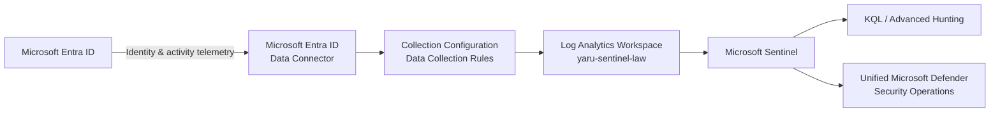

# Case Study: Entra ID Security Telemetry Pipeline with Microsoft Sentinel

## Scenario

Identity activity is a critical source of security context in a Microsoft environment.

Microsoft Entra ID provides administrative views for sign-ins and audit activity, but a security-operations environment also needs identity telemetry to become:

- centrally collected
- searchable
- available for KQL investigation
- usable in SIEM analytics
- available alongside broader security context
- integrated into the organization's security-operations workflow

The objective was to build and validate an end-to-end Microsoft Entra ID telemetry path into Microsoft Sentinel and integrate Sentinel with the Microsoft Defender security-operations experience.

The implementation was not considered complete simply because a connector reported that it was configured.

It was considered complete after actual Entra telemetry was successfully ingested and available for investigation.

---

## Implemented Architecture



Data Collection Rules were created as part of the implemented collection configuration.

They should not be interpreted as a statement that every Microsoft Entra ID log type universally requires a DCR as its transport mechanism.

---

# 1. Security Requirement

Without centralized SIEM ingestion, identity investigation can remain fragmented across product-specific interfaces.

The requirement was:

> Make Microsoft Entra identity telemetry part of the centralized security-operations environment rather than leaving it isolated inside identity administration.

The desired flow was:

```text
Identity activity
       ↓
Central collection
       ↓
Searchable telemetry
       ↓
KQL investigation
       ↓
SIEM analytics
       ↓
Wider security investigation
```

---

# 2. Log Analytics and Sentinel Foundation

The Log Analytics workspace used by the implementation is:

`yaru-sentinel-law`

Microsoft Sentinel was enabled and connected to the environment.

This established the SIEM layer:

```text
Security telemetry
        ↓
Log Analytics Workspace
        ↓
Microsoft Sentinel
```

Log Analytics provides the queryable log-data foundation.

Microsoft Sentinel provides the SIEM security-operations layer around that telemetry.

### Business value

Identity and security telemetry can be centrally queried rather than remaining distributed across separate administrative views.

---

# 3. Microsoft Entra ID Data Connector

Microsoft Entra ID was connected as a Sentinel identity-data source.

The implemented environment successfully provided telemetry including:

- interactive sign-in activity
- non-interactive user sign-in activity
- audit activity
- other enabled Entra log categories

Relevant tables observed include:

```text
SigninLogs

AuditLogs

AADNonInteractiveUserSignInLogs
```

The implemented logical path is:

```text
Microsoft Entra ID
        ↓
Microsoft Entra ID Data Connector
        ↓
Configured collection
        ↓
Log Analytics
        ↓
Microsoft Sentinel
```

The connector is operational and Entra telemetry is successfully arriving.

### Business value

Identity activity becomes part of centralized security operations rather than remaining only in Entra administrative log views.

---


*Connected Microsoft Entra ID telemetry source with recent data receipt and identity log tables available in Microsoft Sentinel.*

# 4. Collection Configuration

Data Collection Rules were created as part of the implemented telemetry-collection architecture.

The project treats collection configuration as a separate engineering responsibility.

```text
Source
  ↓
Connector
  ↓
Collection configuration
  ↓
Destination
  ↓
Usable telemetry
```

The goal was not simply:

> Enable the connector.

The goal was:

> Ensure the required identity telemetry reaches the intended Log Analytics workspace and becomes operationally useful.

---

# 5. Understanding the Destination

The telemetry is directed to:

`yaru-sentinel-law`

The architectural distinction is:

```text
Microsoft Entra ID
       ↓
Produces identity activity


Log Analytics
       ↓
Stores and exposes collected SIEM telemetry


Microsoft Sentinel
       ↓
Uses the telemetry for security operations
```

The workspace is therefore part of the actual security-data architecture, not merely a configuration object.

---

# 6. Interactive Sign-In Telemetry

Interactive sign-ins represent authentication activity in which a user actively participates.

Conceptually:

```text
User
  ↓
Authentication request
  ↓
Interactive authentication
  ↓
Microsoft Entra ID
  ↓
SigninLogs
```

Investigation context can include:

- identity
- application
- resource
- authentication result
- IP address
- device context
- location context
- Conditional Access context
- timestamp

### Security value

Interactive sign-in telemetry allows the SOC to investigate user access without depending only on generated risk alerts.

---

# 7. Non-Interactive Sign-In Telemetry

One of the important telemetry types observed during implementation was:

`AADNonInteractiveUserSignInLogs`

Non-interactive activity does not necessarily mean that a person manually authenticated again.

It can represent client, token, or session activity occurring without a new interactive user prompt.

Conceptually:

```text
INTERACTIVE

User
 ↓
actively authenticates
 ↓
SigninLogs


NON-INTERACTIVE

Existing session / client / token activity
 ↓
authentication occurs without new user interaction
 ↓
AADNonInteractiveUserSignInLogs
```

### Security value

High non-interactive authentication volume should not automatically be interpreted as repeated manual sign-in attempts.

Understanding authentication type is necessary before deciding whether behavior is suspicious.

---

# 8. Audit Telemetry

Sign-in logs and audit logs answer different questions.

```text
SIGN-IN

Who attempted access?
From where?
To what?
Did it succeed?


AUDIT

Who changed something?
What object changed?
What operation occurred?
When did it occur?
```

Audit activity is available through:

`AuditLogs`

It can provide context around directory and administrative changes.

For example:

```text
Suspicious sign-in
       ↓
Identity established
       ↓
Administrative change
       ↓
Affected object
       ↓
Potential security impact
```

### Business value

The SOC can investigate both access activity and what changed afterward.

---

# 9. Ingestion Validation

The integration was not accepted based only on connector status.

Actual telemetry was used to validate the pipeline.

```text
Configure source
      ↓
Configure collection
      ↓
Generate / observe Entra activity
      ↓
Check destination
      ↓
Confirm tables populate
      ↓
Query telemetry
      ↓
Confirm operational ingestion
```

The distinction is important:

```text
Connector configured

≠

Security data confirmed
```

### Result

Entra telemetry successfully arrived in the Sentinel / Log Analytics environment and became available for investigation.

---

# 10. KQL Investigation Capability

Once the data was available in Log Analytics and Sentinel, it became queryable using KQL.

The investigation model is:

```text
Security question
      ↓
Choose relevant table
      ↓
Define time window
      ↓
Filter identity / IP / application
      ↓
Review result
      ↓
Correlate related events
      ↓
Build timeline
      ↓
Determine scope
```

Example investigation questions include:

- Which sign-ins were associated with this user?
- Which authentication attempts failed?
- Was authentication interactive or non-interactive?
- Did the same IP appear for additional identities?
- Which applications were involved?
- What directory changes occurred after authentication?
- Was similar activity present elsewhere?

### Business value

Analysts can query underlying telemetry according to the security question rather than relying exclusively on dashboards.

---


*Microsoft Entra sign-in telemetry queried with KQL from the connected Sentinel workspace in the unified Microsoft Defender hunting experience.*

# 11. Sentinel Integration with the Defender Portal

Microsoft Sentinel was connected to the Microsoft Defender portal.

This created a unified security-operations experience across Sentinel and Defender capabilities.

The operational model is:

```text
Microsoft Sentinel
SIEM / Log Analytics
            \
             \
              > Microsoft Defender portal
             /
            /
Microsoft Defender XDR
XDR detections / evidence / response
```

### Important technical boundary

This does not mean:

```text
Sentinel logs
    ↓
converted into native Defender XDR telemetry
```

Sentinel remains the SIEM platform and Log Analytics remains its log-data foundation.

Defender XDR retains its native XDR telemetry and correlation responsibilities.

The Defender portal provides the shared operational experience.

---

# 12. Unified Hunting and Investigation

The integration allows Sentinel and Defender information to participate in a more coordinated hunting and investigation workflow.

Conceptually:

```text
DEFENDER XDR DATA                    SENTINEL DATA

Endpoint                             Sign-ins
Email                                Audit
Security detections                  Other collected logs
      \                               /
       \                             /
        └────── Hunting / KQL ──────┘
```

### Business value

An analyst can move from a Defender detection into supporting SIEM telemetry without treating both environments as completely disconnected.

---

# 13. Detection-First and Telemetry-First Investigation

The architecture supports two investigation directions.

## Detection-first

```text
Defender alert
      ↓
Incident
      ↓
User / device / IP
      ↓
Search Sentinel telemetry
      ↓
Expand timeline and scope
```

## Telemetry-first

```text
Suspicious log pattern
      ↓
KQL investigation
      ↓
Identify identity / IP / application
      ↓
Look for related Defender context
      ↓
Determine security significance
```

### Business value

The SOC is not dependent on one starting point for investigation.

---

# 14. Identity Protection and SIEM Have Different Responsibilities

Microsoft Entra ID Protection P2 and Microsoft Sentinel solve different identity-security problems.

```text
MICROSOFT ENTRA ID PROTECTION P2

Microsoft identity-risk analysis
User risk
Sign-in risk
Risk context


MICROSOFT SENTINEL

Collected identity telemetry
KQL
SIEM analytics
Investigation
Correlation
```

Identity Protection provides Microsoft-generated identity-risk context.

Sentinel provides telemetry and analytical flexibility for deeper investigation.

---

# 15. UEBA Context

User and Entity Behavior Analytics is part of the Sentinel identity-security architecture.

Conceptually:

```text
Identity telemetry
       ↓
Entity context
       ↓
Observed behavior
       ↓
Behavioral analytics
       ↓
Additional investigation context
```

Behavioral context is another analytical signal.

It should not be interpreted as:

> unusual activity = confirmed compromise.

---

# 16. Why This Is More Than Enabling a Connector

The implementation contains several distinct engineering responsibilities:

```text
IDENTIFY
Which telemetry is needed?
       ↓

CONNECT
How does Entra provide it?
       ↓

COLLECT
How is collection configured?
       ↓

ROUTE
Where does the data go?
       ↓

STORE
Which Log Analytics workspace receives it?
       ↓

VALIDATE
Is data actually arriving?
       ↓

QUERY
Can analysts use it?
       ↓

INTEGRATE
Can it support wider security operations?
```

A successful SIEM integration requires the full path to work.

---

# 17. Cost and Data-Collection Design

SIEM ingestion has operational and financial impact.

The architectural principle is:

> Collect telemetry because it supports a security requirement, not merely because it is available.

```text
Potential log source
       ↓
Security use case
       ↓
Required telemetry
       ↓
Expected volume
       ↓
Retention / cost
       ↓
Investigation value
       ↓
Collection decision
```

### Business value

Security visibility remains aligned with operational value and cost.

---

# 18. Engineering Decisions

## Use Sentinel as a SIEM

Microsoft Sentinel was added for log analytics, KQL, SIEM investigation, and future telemetry extensibility.

## Start with identity telemetry

Identity activity has high security value across Microsoft 365 and hybrid environments.

## Separate authentication types

Interactive and non-interactive sign-ins are treated as different telemetry with different analytical meaning.

## Build an explicit collection path

Source, connector, collection configuration, destination, and security usage are treated as separate responsibilities.

## Validate actual ingestion

A configured connector is not enough.

The integration was accepted only when real data became queryable.

## Preserve the Sentinel / Defender boundary

The unified portal improves analyst workflow without making Sentinel and Defender XDR one underlying platform.

## Design around value and cost

Additional telemetry should be connected only when it supports a real security, compliance, investigation, or operational need.

---

# 19. Risk to Control Mapping

| Security Problem | Implemented Control | Purpose |
|---|---|---|
| Identity activity isolated in Entra | Entra ID Data Connector | Feed identity activity into SIEM |
| Logs distributed across interfaces | Log Analytics | Centralize searchable telemetry |
| Authentication types misunderstood | Separate Entra log schemas | Preserve event meaning |
| Administrative activity requires analysis | AuditLogs | Track directory changes |
| Background authentication misunderstood | AADNonInteractiveUserSignInLogs | Separate non-interactive activity |
| Connector appears configured but no data flows | Ingestion validation | Confirm operational pipeline |
| Predefined detections do not answer every question | KQL | Enable direct investigation |
| XDR needs broader log context | Microsoft Sentinel | Add SIEM visibility |
| SIEM and XDR workflows are fragmented | Defender portal integration | Coordinate analyst workflows |
| Excessive SIEM ingestion | Use-case-driven collection | Control noise and cost |

---

# 20. Validation

The telemetry pipeline was validated end to end.

Validation included:

- Log Analytics workspace `yaru-sentinel-law`
- Microsoft Sentinel enabled and operational
- Microsoft Entra ID data connector configured
- Entra log collection configured
- Data Collection Rules created as part of the collection architecture
- real Microsoft Entra activity observed
- interactive sign-in telemetry available
- audit telemetry available
- non-interactive sign-in telemetry available
- Sentinel / Log Analytics tables populated
- KQL-capable telemetry confirmed
- Microsoft Sentinel connected to the Microsoft Defender portal
- Sentinel data available through the unified security-operations investigation experience

The implementation therefore validates:

```text
SOURCE
  ↓
COLLECTION
  ↓
INGESTION
  ↓
STORAGE
  ↓
QUERY
  ↓
SECURITY OPERATIONS INTEGRATION
```

---

# Evidence Plan

Recommended public evidence:

## Sentinel Workspace

Show the active Sentinel / Log Analytics workspace.

**Purpose:** Demonstrate the SIEM foundation.

## Microsoft Entra Data Connector

Show the configured Microsoft Entra ID connector and relevant connected data categories.

**Purpose:** Demonstrate the identity telemetry source.

## Collection Configuration / DCR

Show the relevant collection configuration or Data Collection Rule.

**Purpose:** Demonstrate deliberate telemetry collection and routing.

## Populated Sentinel Tables

Show a simple query or schema evidence for:

```text
SigninLogs
AuditLogs
AADNonInteractiveUserSignInLogs
```

**Purpose:** Prove actual data ingestion.

## Unified Defender Investigation

Show Sentinel telemetry accessible through the Microsoft Defender security-operations experience.

**Purpose:** Demonstrate final operational integration.

Before publication, obscure unrelated tenant IDs, subscription IDs, resource IDs, personal email addresses, public IP addresses, authentication material, or unnecessary personally identifying information.

---

# Business Outcome

The implementation transforms Microsoft Entra identity activity from product-specific administrative logs into operational SIEM telemetry.

The validated pipeline is:

**Microsoft Entra ID → data connector → collection configuration → Log Analytics → Microsoft Sentinel → KQL / investigation → unified Microsoft Defender security operations.**

The business value is not simply storing identity logs in another system.

The organization gains centrally searchable identity telemetry that can support timelines, authentication investigation, audit analysis, custom detection logic, and correlation with wider security activity.

Combined with Microsoft Defender XDR, the security team gains:

**XDR detection and response depth + SIEM telemetry and analytical breadth.**

============================================================
