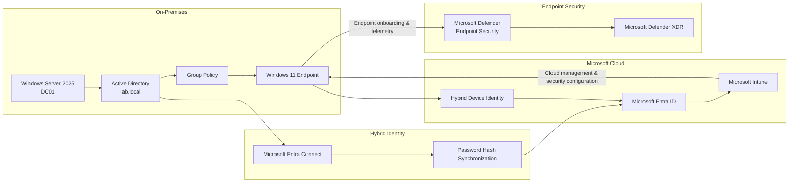

# Case Study: Building a Hybrid Identity & Endpoint Security Foundation

## Scenario

The organization has an existing Windows Server and Active Directory environment that cannot immediately be replaced with a cloud-only architecture.

At the same time, users and endpoints need access to Microsoft cloud services, centralized endpoint management, modern identity controls, and endpoint security monitoring.

The objective was to extend the existing Windows environment into Microsoft cloud management and security without removing the on-premises identity foundation.

The implementation created an end-to-end path connecting:

**Active Directory → Microsoft Entra ID → Hybrid Device Identity → Microsoft Intune → Microsoft Defender**

The implementation was validated through identity synchronization, device integration, policy application, cloud management, and endpoint security visibility.

---

## Implemented Architecture



The architecture contains several distinct responsibilities:

- Active Directory provides the existing on-premises identity and domain foundation.
- Group Policy manages required domain-based Windows configuration.
- Microsoft Entra Connect extends identity into Microsoft Entra ID.
- Microsoft Entra ID provides cloud identity and device context.
- Microsoft Intune provides centralized cloud endpoint management.
- Microsoft Defender provides endpoint protection, telemetry, investigation, and response.

---

# 1. Existing Active Directory Foundation

The implementation began with:

- Windows Server 2025
- domain controller `DC01`
- Active Directory domain `lab.local`

The directory was structured using Organizational Units:

```text
Company
├── Users
│   ├── Finance
│   ├── HR
│   ├── IT
│   └── Sales
├── Groups
├── Servers
└── Workstations
```

The environment includes:

- user accounts
- security groups
- computer objects
- Organizational Units
- domain-joined workstation
- Group Policy

### Business requirement

The organization needs to retain Windows-domain functionality while introducing cloud security and management.

---

# 2. Domain-Joined Windows Endpoint

A Windows 11 workstation was joined to the `lab.local` domain.

```text
Active Directory
      ↓
Computer identity
      ↓
Domain membership
      ↓
Windows endpoint
```

The workstation remained capable of receiving domain-based configuration through Group Policy.

### Business value

Existing Windows administration and domain dependencies can continue during cloud modernization.

---

# 3. Group Policy Implementation

A workstation security policy was implemented through Group Policy.

The policy was linked to the Workstations OU and validated on the Windows endpoint.

The control path was:

```text
Active Directory
      ↓
Organizational Unit
      ↓
GPO link
      ↓
Computer policy processing
      ↓
Windows endpoint
```

The policy included a Windows logon security notice used to confirm that the intended configuration had applied.

---


*Group Policy linked to the Workstations OU, demonstrating centralized domain-based endpoint configuration.*

# 4. Group Policy Troubleshooting

Group Policy Results initially could not retrieve workstation policy information because required RPC/WMI communication was unavailable.

The issue was investigated and the necessary Windows Management Instrumentation firewall access was enabled.

Group Policy Results then completed successfully.

```text
Policy configured
      ↓
Policy applies locally
      ↓
Administrative validation fails
      ↓
Investigate RPC / WMI
      ↓
Enable required access
      ↓
Re-run Group Policy Results
      ↓
Validation succeeds
```

### Engineering value

Policy deployment, local policy processing, and remote administrative validation are separate technical concerns.

---

# 5. Extending Identity to Microsoft Entra ID

Microsoft Entra Connect was configured to integrate Active Directory with Microsoft Entra ID.

Password Hash Synchronization was used.

```text
Active Directory
      ↓
Microsoft Entra Connect
      ↓
Password Hash Synchronization
      ↓
Microsoft Entra ID
```

An on-premises user successfully appeared in Microsoft Entra ID.

This validated the hybrid identity path.

### Business value

Existing identities can be reused for Microsoft cloud services instead of maintaining disconnected identity populations.

---


*Microsoft Entra Connect operating with synchronization and Password Hash Synchronization enabled.*

# 6. Hybrid Identity Model

The architecture connects:

```text
ON-PREMISES

Active Directory identity
        ↓
Windows / domain services


CLOUD

Microsoft Entra identity
        ↓
Microsoft 365
Intune
Cloud security services
```

Microsoft Entra Connect creates continuity between the two environments.

---

# 7. Hybrid Device Identity

The Windows endpoint was represented in Microsoft Entra ID while retaining its on-premises domain relationship.

Conceptually:

```text
Windows Endpoint
      |
      +---- Active Directory identity
      |
      +---- Microsoft Entra device identity
```

### Business value

The endpoint can participate in modern Microsoft cloud-management and security workflows without immediately abandoning domain membership.

---

# 8. Microsoft Intune Integration

Microsoft Intune was introduced as the centralized cloud endpoint-management layer.

```text
Microsoft Entra ID
        ↓
Device identity
        ↓
Microsoft Intune
        ↓
Managed Windows endpoint
```

The device therefore participates in both:

```text
Active Directory / GPO
          ↓
Required domain-based management
```

and:

```text
Microsoft Entra ID / Intune
          ↓
Modern cloud-based management
```

### Business value

Endpoints can be centrally and remotely managed while required Group Policy functionality remains available.

---


*Managed Windows endpoint showing compliant corporate state and successful centralized policy application in Microsoft Intune.*

# 9. Avoiding Management-Plane Conflicts

Introducing Intune does not mean Group Policy automatically disappears.

The same endpoint setting should not be configured blindly from multiple management systems.

The architecture therefore uses deliberate management ownership.

```text
Traditional domain requirement
        ↓
GPO where appropriate


Modern cloud requirement
        ↓
Intune where appropriate
```

### Business value

Modernization can occur without unnecessary policy conflicts.

---

# 10. Connecting Management to Security

The next stage integrated the Windows endpoint with Microsoft Defender.

```text
Device identity
      ↓
Centralized management
      ↓
Security configuration
      ↓
Defender onboarding
      ↓
Endpoint telemetry
      ↓
Centralized security operations
```

Intune and Defender have different responsibilities:

```text
Microsoft Intune
      ↓
Manage / configure


Microsoft Defender
      ↓
Protect / detect / investigate / respond
```

### Business value

Endpoint management and endpoint security become connected parts of the same operational architecture.

---

# 11. Microsoft Defender Endpoint Onboarding

The Windows workstation was successfully onboarded to Microsoft Defender endpoint security.

The endpoint became visible in Microsoft Defender device inventory.

Validated security state included:

- Microsoft Defender Antivirus enabled
- Normal running mode
- real-time protection enabled
- behavior monitoring enabled
- IOAV protection enabled
- tamper protection enabled
- Defender endpoint sensor operational
- centralized device visibility

The flow became:

```text
Windows endpoint
      ↓
Defender onboarding
      ↓
Security sensor
      ↓
Endpoint telemetry
      ↓
Microsoft Defender
      ↓
Microsoft Defender XDR
```

### Business value

The workstation moves from a locally protected computer to a centrally visible security asset that can be investigated and responded to remotely.

---

# 12. MDE Security Settings Management

Microsoft Defender for Endpoint Security Settings Management was enabled.

Configured enforcement scope includes:

- Windows Client
- Windows Server
- Linux
- macOS

Domain Controllers are excluded.

Security Settings Management provides an additional supported route for Endpoint Security configuration to supported Defender-managed devices that are not using the normal Intune enrollment path.

```text
Normal managed client

Intune
  ↓
Endpoint


Additional supported path

Intune Endpoint Security
        ↓
MDE Security Settings Management
        ↓
Supported MDE-managed endpoint
```

It does not mean all Intune management is routed through Microsoft Defender.

---

# 13. Domain Controller Boundary

The domain controller was excluded from the MDE Security Settings Management enforcement scope.

```text
Windows Client       ✓
Windows Server       ✓
Linux                ✓
macOS                ✓
Domain Controller    ✗
```

### Engineering decision

Critical identity infrastructure should have a deliberate management boundary and should not automatically inherit every endpoint-security configuration designed for general devices.

---

# 14. End-to-End Validation

The complete integration chain was validated:

```text
Active Directory
      ↓
User & computer identities
      ↓
Group Policy
      ↓
Domain-managed Windows endpoint
      ↓
Microsoft Entra Connect
      ↓
Identity synchronization
      ↓
Microsoft Entra ID
      ↓
Cloud identity / device identity
      ↓
Microsoft Intune
      ↓
Centralized endpoint management
      ↓
Microsoft Defender onboarding
      ↓
Security telemetry
      ↓
Microsoft Defender XDR
```

Validation included:

- working Windows Server domain controller
- Active Directory domain
- OU structure
- users and security groups
- Windows 11 domain membership
- Group Policy assignment
- successful GPO application
- successful Group Policy Results validation
- RPC/WMI troubleshooting
- Microsoft Entra Connect
- Password Hash Synchronization
- synchronized Entra identity
- hybrid device identity
- Microsoft Intune integration
- Microsoft Defender onboarding
- operational Defender sensor
- active endpoint protection
- endpoint visible in Defender inventory
- centralized security telemetry

---

# 15. Architecture Before and After

## Initial Environment

```text
Windows Server
      ↓
Active Directory
      ↓
Group Policy
      ↓
Domain Windows endpoint
```

This provides traditional centralized Windows management but limited modern cloud identity, remote management, and security-operations capability.

## Extended Environment

```text
                 Active Directory
                  /           \
                 /             \
               GPO          Entra Connect
                ↓               ↓
          Windows device   Microsoft Entra ID
                |               ↓
                |             Intune
                |               ↓
                +----------> Windows endpoint
                                ↓
                         Microsoft Defender
                                ↓
                         Defender XDR
```

The existing environment is preserved and extended with:

- hybrid identity
- cloud device identity
- centralized cloud endpoint management
- endpoint protection
- security telemetry
- XDR investigation capability

---

# 16. Risk to Control Mapping

| Business Problem | Implemented Control | Outcome |
|---|---|---|
| Existing Active Directory dependencies | AD DS retained | Existing domain workloads remain supported |
| Separate cloud and local identities | Entra Connect + PHS | Connected hybrid identity |
| Domain endpoints require centralized configuration | Group Policy | Consistent domain management |
| GPO administrative validation fails | RPC/WMI troubleshooting | Working management visibility |
| Endpoint lacks cloud identity | Microsoft Entra device identity | Cloud device context |
| Devices require remote management | Microsoft Intune | Centralized cloud management |
| Multiple management platforms can conflict | Defined management ownership | Reduced overlap risk |
| Endpoint lacks centralized security telemetry | Defender onboarding | Centralized security visibility |
| Security requires remote response | Microsoft Defender | EDR and response capabilities |
| Additional supported devices require security policy | MDE Security Settings Management | Extended security-management coverage |
| Critical identity infrastructure requires separate control | DC exclusion | Deliberate management boundary |

---

# 17. Engineering Decisions

## Extend the existing environment instead of replacing it

The architecture assumes Active Directory still has valid technical and business dependencies.

## Synchronize identity instead of duplicating it

Microsoft Entra Connect provides continuity between existing identities and cloud identity.

## Keep Group Policy where appropriate

Cloud management does not automatically invalidate all existing GPO requirements.

## Introduce cloud device identity

Modern identity and security include devices as well as users.

## Separate management from protection

Intune manages and configures supported endpoints.

Defender protects, monitors, detects, investigates, and responds.

## Validate every integration layer

A successful configuration page was not considered sufficient proof.

Identity synchronization, policy application, endpoint management, Defender onboarding, and telemetry were validated through the working environment.

## Maintain deliberate scope around critical infrastructure

Domain Controllers remain outside the broad MDE Security Settings Management enforcement scope.

---

# 18. Security Lifecycle Enabled by the Integration

The integration provides the foundation for the wider operating model.

```text
BUILD
Active Directory
Hybrid identity
Device integration
      ↓

MANAGE
Group Policy
Intune
      ↓

PROTECT
Microsoft Defender
Identity controls
      ↓

MONITOR
Endpoint and identity telemetry
      ↓

DETECT
Defender detections
      ↓

INVESTIGATE
Defender XDR / Sentinel
      ↓

RESPOND
Isolation / Live Response / remediation
```

The integration therefore exists to support security operations, not simply to connect Microsoft products.

---

# Evidence Plan

Recommended public evidence:

## Active Directory Structure

Show the Company OU structure.

**Purpose:** Demonstrate the on-premises identity and management foundation.

## Group Policy Validation

Show the linked workstation GPO or successful Group Policy Results.

**Purpose:** Demonstrate working centralized domain policy.

## Entra Identity Synchronization

Show a synchronized user in Microsoft Entra ID.

**Purpose:** Prove the AD-to-Entra hybrid identity path.

## Hybrid Device / Intune

Show the Windows endpoint represented in Entra ID or Intune with relevant management state.

**Purpose:** Demonstrate cloud device integration.

## Defender Device Inventory

Show the endpoint as onboarded and visible in Microsoft Defender.

**Purpose:** Prove final endpoint-security integration.

Before publication, obscure unnecessary tenant IDs, subscription IDs, public IP addresses, personal email addresses, tokens, or irrelevant identifying information.

---

# Business Outcome

The implementation demonstrates a practical modernization path from traditional Windows infrastructure to a centrally managed Microsoft security platform.

The organization does not need to choose between maintaining Active Directory and adopting modern cloud security.

Instead, the architecture extends the existing environment through:

**Active Directory → hybrid identity → cloud device identity → Intune management → Defender endpoint security → centralized security operations.**

Existing domain services and Group Policy remain available where required, while Microsoft Entra ID introduces cloud identity, Intune adds centralized management, and Microsoft Defender adds endpoint telemetry, detection, investigation, and response.

The business outcome is therefore not simply a synchronized user or a connected device.

It is the identity and endpoint foundation required for a modern hybrid Microsoft security operating model.

============================================================
