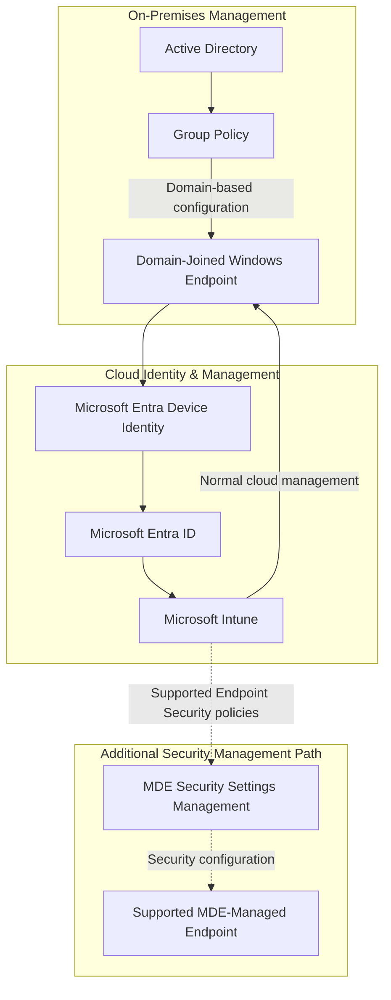

# Endpoint Management Architecture

## Business Requirement

The organization already manages Windows devices through Active Directory and Group Policy, but this model alone is not sufficient for modern cloud-based security and remote endpoint administration.

The endpoint architecture therefore needed to:

- preserve existing domain-based management where required
- introduce cloud device identity
- provide centralized endpoint management
- support security configuration from Microsoft Intune
- integrate endpoint management with Microsoft Defender
- reduce dependence on manual per-device administration
- support hybrid environments during modernization

The resulting design combines Active Directory, Group Policy, Microsoft Entra device identity, Microsoft Intune, and Microsoft Defender for Endpoint Security Settings Management.

---

## Endpoint Management Architecture



The architecture intentionally contains more than one management path.

This reflects a hybrid organization where traditional Windows management and modern cloud management coexist.

---

# 1. Traditional Windows Management

The existing Windows management model is based on:

- Active Directory
- Organizational Units
- computer objects
- Group Policy
- domain-joined Windows endpoints

The workstation is joined to the `lab.local` domain.

The Active Directory structure separates workstation objects from users, servers, and groups.

A dedicated security baseline Group Policy was created for the workstation scope.

The GPO was linked to the Workstations Organizational Unit and its application was validated on the Windows endpoint.

The implementation also included troubleshooting Group Policy Results collection when RPC/WMI communication initially prevented successful reporting.

After the required Windows Management Instrumentation firewall access was enabled, Group Policy Results could be collected successfully.

### Business value

Group Policy provides centralized control for devices that remain dependent on the traditional Active Directory management model.

This allows existing Windows administration to continue while cloud management is introduced gradually.

---

# 2. Cloud Device Identity

The Windows endpoint is represented in Microsoft Entra ID in addition to its on-premises domain identity.

This creates an important bridge between traditional Windows management and Microsoft cloud services.

Conceptually:

```text
Windows Endpoint
      |
      +---- Active Directory computer identity
      |
      +---- Microsoft Entra device identity
```

The device identity allows the endpoint to participate in cloud-based management and security workflows.

### Business value

A workstation is no longer visible only inside the local Active Directory environment.

It can participate in Microsoft cloud management, access control, endpoint security, and security investigation while retaining required domain functionality.

---

# 3. Microsoft Intune

Microsoft Intune provides the centralized cloud endpoint-management layer.

The management path is:

```text
Microsoft Entra ID
        ↓
Device identity
        ↓
Microsoft Intune
        ↓
Endpoint configuration
        ↓
Managed Windows device
```

Intune separates endpoint administration from physical access to the device.

Security and management configuration can be assigned centrally rather than configured individually on each workstation.

The project uses Intune as part of the broader Microsoft security architecture rather than as an isolated device-management product.

### Business value

Centralized cloud management reduces the operational cost and inconsistency associated with configuring endpoints manually.

It also creates a management foundation for remote and hybrid users who may not always be connected directly to the corporate network.

---


*Intune management overview showing endpoint enrollment, compliance, and configuration health.*

# 4. Group Policy and Intune Coexistence

The architecture does not assume that Group Policy disappears immediately when Intune is introduced.

Instead, the two management mechanisms have different roles.

```text
Active Directory / Group Policy
            ↓
Existing domain-based requirements


Microsoft Entra ID / Intune
            ↓
Modern cloud-based management
```

This reflects a realistic modernization path.

Some settings and dependencies may remain tied to Active Directory, while other security and management responsibilities move to Intune.

The project intentionally keeps these management planes conceptually separate.

### Engineering principle

A hybrid environment should not blindly configure the same setting from multiple management systems.

When Group Policy and Intune coexist, policy ownership should be understood so conflicting configuration is avoided.

### Business value

The organization can modernize endpoint management incrementally instead of requiring a disruptive all-at-once migration.

---

# 5. Endpoint Security Configuration

Endpoint management is also connected to Microsoft security configuration.

Microsoft Intune provides Endpoint Security capabilities for centrally managing supported security settings.

The architecture separates general device management from endpoint-security controls.

Conceptually:

```text
Microsoft Intune
      |
      +---- Device management
      |
      +---- Endpoint Security configuration
```

This provides a centralized location for applying supported security controls to managed devices.

The project also connects this management model with Microsoft Defender endpoint security.

---


*Centralized endpoint-security policies covering firewall, Defender Antivirus, BitLocker, and endpoint onboarding.*

# 6. MDE Security Settings Management

Microsoft Defender for Endpoint Security Settings Management is enabled in the environment.

This provides an additional management path for supported Microsoft Defender-onboarded devices.

The configured enforcement scope includes:

- Windows Client
- Windows Server
- Linux
- macOS

Windows Server Domain Controllers are excluded from this scope.

The distinction is important.

Normal Intune-managed endpoints receive their supported configuration through the regular Intune management path.

Security Settings Management provides another route for supported Endpoint Security policies to reach supported devices managed through Microsoft Defender when they are not using the normal Intune enrollment model.

```text
                    Microsoft Intune
                         /       \
                        /         \
                       v           v

Normal Intune-managed        Endpoint Security
endpoint                     policies
      |                           |
      v                           v
Intune management       MDE Security Settings
                              Management
                                  |
                                  v
                          Supported MDE-managed
                               endpoint
```

MDE Security Settings Management does not mean that all Intune configuration passes through Microsoft Defender.

It is a specific security-management capability.

### Business value

Security teams can extend centralized security configuration to additional supported endpoint types without requiring every device to use exactly the same management architecture.

This is especially relevant for servers or other systems that may be onboarded to Defender but are not managed as standard Intune client devices.

---

# 7. Domain Controller Boundary

Domain Controllers were intentionally excluded from the configured MDE Security Settings Management enforcement scope.

This creates a clear administrative boundary between general endpoint security management and critical Active Directory infrastructure.

```text
MDE Security Settings Management

Windows Client     ✓
Windows Server     ✓
Linux              ✓
macOS              ✓
Domain Controllers ✗
```

### Business value

Critical identity infrastructure can be managed through a deliberately separate change and policy process rather than automatically inheriting the same configuration used for general endpoints.

---

# 8. Connection to Microsoft Defender

Endpoint management and endpoint protection are related but have different responsibilities.

```text
Microsoft Intune
      ↓
Configure and manage the endpoint


Microsoft Defender
      ↓
Protect, monitor, detect,
investigate and respond
```

Intune answers questions such as:

- What configuration should the device receive?
- Which security settings should be enforced?
- How should the endpoint be centrally managed?

Microsoft Defender answers different questions:

- Is suspicious activity occurring?
- Is malware present?
- What security weaknesses exist?
- What happened on the endpoint?
- Should the device be investigated or contained?

The integration between these platforms creates a stronger endpoint operating model than either management or protection alone.

---

# 9. Endpoint Management Lifecycle

The endpoint-management lifecycle can be represented as:

```text
Device joins existing environment
        ↓
Active Directory identity
        ↓
Group Policy where required
        ↓
Microsoft Entra device identity
        ↓
Microsoft Intune management
        ↓
Centralized security configuration
        ↓
Microsoft Defender protection
        ↓
Continuous security visibility
```

This is not a migration from one tool directly to another.

It is an architecture that allows traditional and modern management to coexist while responsibilities are progressively centralized.

---

# 10. Risk to Control Mapping

| Business Risk | Control | Purpose |
|---|---|---|
| Inconsistent endpoint configuration | Intune | Centralize device configuration |
| Existing domain dependencies | Active Directory + GPO | Preserve required Windows management |
| Limited cloud visibility of devices | Microsoft Entra device identity | Establish cloud device context |
| Manual endpoint administration | Intune | Manage devices remotely and centrally |
| Different endpoint management models | MDE Security Settings Management | Extend supported security configuration |
| Policy conflicts | Clear management ownership | Prevent overlapping configuration |
| Critical server misconfiguration | Separate DC management boundary | Protect sensitive identity infrastructure |
| Disconnected management and security | Intune + Microsoft Defender integration | Connect configuration with protection |

---

# 11. Engineering Decisions

## Keep Group Policy where it still has a purpose

The architecture does not remove Group Policy simply because Intune exists.

Existing domain requirements remain supported while modern management is introduced alongside them.

## Introduce cloud device identity

A cloud device identity allows Windows endpoints to participate in Microsoft cloud security and management services without immediately abandoning their domain relationship.

## Centralize modern endpoint management

Intune becomes the central cloud endpoint-management platform and reduces dependence on manual endpoint administration.

## Keep management and protection responsibilities separate

Intune is primarily responsible for endpoint management and security configuration.

Microsoft Defender is primarily responsible for protection, telemetry, detection, investigation, and response.

Integration does not make the two products interchangeable.

## Use Security Settings Management selectively

MDE Security Settings Management extends supported security-policy management to additional Defender-managed devices.

It is treated as an additional security-management channel rather than as a replacement for normal Intune enrollment.

## Protect critical infrastructure separately

Domain Controllers are excluded from the configured Security Settings Management scope.

This maintains a deliberate boundary around core Active Directory infrastructure.

---

# 12. Validation

The endpoint-management architecture was validated through the implemented environment.

Validation included:

- functioning Active Directory computer management
- Windows workstation joined to the domain
- Organizational Unit placement
- Group Policy linked to the workstation scope
- security policy successfully applied
- Group Policy Results successfully collected
- WMI/RPC troubleshooting performed when policy reporting initially failed
- Microsoft Entra device representation
- Microsoft Intune management integration
- Microsoft Defender endpoint integration
- MDE Security Settings Management enabled
- enforcement scope configured for supported operating systems
- Domain Controllers excluded from that enforcement scope

This demonstrates both traditional and cloud-based endpoint management operating as part of the same hybrid architecture.

---

# Business Outcome

The endpoint architecture allows an organization to modernize Windows management without forcing an immediate removal of its existing Active Directory infrastructure.

Group Policy continues to support required domain-based configuration, Microsoft Entra ID introduces cloud device identity, Microsoft Intune centralizes modern endpoint management, and Microsoft Defender Security Settings Management extends supported security configuration to additional Defender-managed systems.

The result is a layered endpoint-management model:

**domain management → cloud identity → centralized management → security configuration → endpoint protection.**

============================================================
