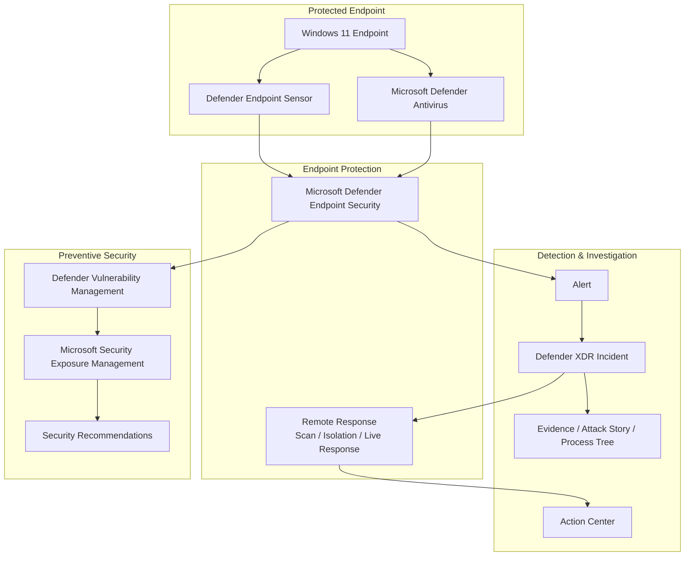

# Endpoint Security & Incident Response

## Business Requirement

Centralized endpoint management alone does not provide sufficient protection against malware, malicious processes, compromised credentials, or attacker activity on a workstation.

The organization therefore needs an endpoint-security layer capable of:

- preventing malicious activity
- collecting endpoint security telemetry
- detecting suspicious behavior
- correlating endpoint alerts into incidents
- providing investigation evidence
- remotely containing affected devices
- performing remote response actions
- validating remediation
- supporting vulnerability and exposure reduction

The implemented endpoint-security architecture combines Microsoft Defender endpoint capabilities with Microsoft Defender XDR and Microsoft Security Exposure Management.

---

## Endpoint Security Architecture



The architecture supports two complementary security models:

```text
PRE-BREACH
Exposure
Vulnerabilities
Configuration weaknesses
Recommendations
        ↓
Reduce likelihood and impact of compromise


POST-DETECTION
Detection
Alert
Incident
Investigation
Containment
Response
        ↓
Limit and remediate active security events
```

Endpoint security therefore includes both preventive risk reduction and operational incident response.

---

# 1. Endpoint Onboarding

The Windows 11 endpoint was successfully onboarded to Microsoft Defender endpoint security.

The device became visible in Microsoft Defender device inventory and started reporting security state and endpoint telemetry.

Validated Defender state included:

- Microsoft Defender Antivirus enabled
- antivirus running in Normal mode
- real-time protection enabled
- behavior monitoring enabled
- IOAV protection enabled
- tamper protection enabled
- Microsoft Defender endpoint sensor operational
- device visible in Defender inventory

This validates that the endpoint is not only locally protected but connected to the centralized Microsoft security platform.

### Business value

Security teams gain centralized visibility into endpoint security state without relying only on local administration or physical access to the workstation.

---

# 2. Endpoint Prevention

Microsoft Defender Antivirus provides the preventive malware-protection layer.

Validated protection capabilities included:

- real-time protection
- malware prevention
- behavior monitoring
- downloaded-file protection
- quarantine
- cloud-connected Defender protection capabilities

The protection model begins before an incident is created.

```text
File / process activity
        ↓
Endpoint protection
        ↓
Security evaluation
        ↓
Allow / Prevent / Quarantine
```

### Business value

Known malicious content can be prevented at the endpoint before the security operations team needs to perform manual remediation.

---

# 3. Endpoint Detection and Response

Endpoint Detection and Response extends protection beyond traditional antivirus.

The Defender endpoint sensor contributes security telemetry used for investigation and detection.

The operational model is:

```text
Endpoint activity
      ↓
Security telemetry
      ↓
Detection logic
      ↓
Alert
      ↓
Defender XDR
```

This provides security teams with context around suspicious activity instead of presenting only a simple malware notification.

Relevant investigation context can include:

- device
- user
- processes
- files
- alerts
- evidence
- security actions
- related activity

### Business value

Analysts can investigate how suspicious activity occurred and determine its scope instead of responding only to the final malware verdict.

---

# 4. Endpoint Security Configuration

The environment includes centralized Microsoft Defender endpoint-security configuration.

Observed Defender device configuration included default Windows policies for:

- Next-generation protection
- Microsoft Defender Firewall

The environment also uses Microsoft Defender security capabilities including:

- EDR in block mode
- file allow/block capabilities
- custom network indicators
- tamper protection
- device and user investigation context

Security settings can also be managed through Microsoft Intune and, for supported scenarios, Microsoft Defender for Endpoint Security Settings Management.

### Architectural distinction

Endpoint management and endpoint protection are related but different responsibilities.

```text
Microsoft Intune
      ↓
Configuration and management


Microsoft Defender
      ↓
Protection, telemetry,
detection, investigation,
and response
```

The architecture integrates the two without treating them as interchangeable products.

---

# 5. Tamper Protection

Tamper Protection was enabled and validated on the endpoint.

Its role is to help prevent unauthorized changes to important Microsoft Defender security settings.

This becomes especially important during an endpoint compromise because disabling endpoint protection is a common attacker objective.

### Business value

Security configuration is harder to weaken locally after a device has been compromised or accessed by an unauthorized user.

---

# 6. EDR in Block Mode

EDR in block mode was enabled in the Defender endpoint configuration.

This capability adds another layer of endpoint protection by allowing Microsoft Defender for Endpoint detection capabilities to block malicious artifacts or activity in supported scenarios.

It complements antivirus protection rather than replacing it.

### Business value

The endpoint-security architecture is not dependent on a single preventive control.

Multiple protection layers can contribute to blocking malicious activity.

---

# 7. Device Inventory and Security Context

The onboarded workstation is visible through Microsoft Defender device inventory.

This provides centralized security context around the device instead of treating an alert as an isolated event.

Device-level context can support investigation of:

- security alerts
- exposure
- vulnerabilities
- endpoint status
- logged-on users
- response actions
- security recommendations

### Business value

Security operations can make response decisions using the wider context of the affected asset.

A security alert on a critical or highly exposed system can require a different response than the same signal on a lower-risk asset.

---

# 8. Validated Detection Scenario

A controlled endpoint-detection scenario was generated using the standard EICAR antivirus test file.

The test was used to validate the operational security chain rather than only verifying that Defender was enabled.

The activity resulted in:

- Microsoft Defender detection
- malware prevention
- file quarantine
- security alert
- Defender XDR incident
- endpoint evidence
- process-level investigation context

The detected threat was identified as:

`Virus:DOS/EICAR_Test_File`

The file was prevented and quarantined by Microsoft Defender.

---

# 9. Incident Investigation

The generated alert was investigated as a Defender XDR incident.

The investigation used:

- incident overview
- alert details
- Attack Story
- evidence
- affected assets
- process tree
- file context
- device context

The process chain showed the activity leading to PowerShell:

```text
smss.exe
   ↓
winlogon.exe
   ↓
userinit.exe
   ↓
explorer.exe
   ↓
powershell.exe
```

The investigation identified elevated PowerShell activity associated with creation of the EICAR test file.

The relevant file evidence and Defender malware verdict were reviewed.

### Business value

The incident could be investigated as a sequence of related activity rather than as an isolated antivirus message.

This helps an analyst answer:

- What happened?
- Which device was involved?
- Which user context was involved?
- Which process created or accessed the file?
- Was the malicious artifact prevented?
- Does the device need containment?
- What response actions are appropriate?

---

# 10. Containment

The affected Windows endpoint was remotely isolated through Microsoft Defender.

After isolation, network access was tested and confirmed to be restricted.

The purpose of isolation is to reduce the ability of a potentially compromised device to communicate with other systems while investigation continues.

The operational model is:

```text
Suspicious endpoint
        ↓
Investigation
        ↓
Containment decision
        ↓
Device isolation
        ↓
Restricted network communication
```

### Business value

A security team can contain a suspected compromised endpoint remotely without waiting for the device to be physically disconnected from the network.

This reduces the opportunity for continued attacker activity while the incident is investigated.

---

# 11. Live Response

Live Response was used against the onboarded endpoint.

This provides a remote security-response channel to the device for investigation and remediation activities.

Live Response was used to access the endpoint and inspect the relevant location associated with the test scenario.

### Business value

Security analysts can perform targeted investigation and response against a remote endpoint without requiring direct interactive access from the user or physical access to the workstation.

---

# 12. Remote Antivirus Scan

A Quick Scan was initiated remotely from Microsoft Defender.

The action was tracked through Action Center and reached a completed state.

This demonstrates the separation between:

```text
Requesting a response action
        ↓
Action execution
        ↓
Action Center status
        ↓
Investigation of resulting security state
```

Action Center confirms the status of security actions.

It should not be treated as a separate clean report proving that no threat exists.

Any detected threats would instead contribute to Defender evidence, alerts, endpoint security history, or related investigation data.

### Business value

Endpoint response actions can be initiated and centrally tracked without requiring the analyst to operate directly on the workstation.

---

# 13. Release from Isolation

After the controlled investigation was completed, the endpoint was released from isolation.

Network connectivity was restored.

This completes an important part of the response lifecycle:

```text
Detect
  ↓
Investigate
  ↓
Contain
  ↓
Validate
  ↓
Release
```

Containment should not be considered the final step.

The system also needs a controlled way to return a device to normal operation after the investigation no longer requires isolation.

---

# 14. Incident Closure

The incident was reviewed and closed with investigation comments.

The complete workflow therefore included:

```text
Controlled threat activity
          ↓
Defender prevention
          ↓
Alert
          ↓
XDR incident
          ↓
Attack Story
          ↓
Process investigation
          ↓
Evidence review
          ↓
Remote scan
          ↓
Device isolation
          ↓
Live Response
          ↓
Release from isolation
          ↓
Validation
          ↓
Incident documentation
          ↓
Closure
```

### Business value

The implementation validates not just detection but the full SOC endpoint-response lifecycle.

---

# 15. Action Center

Microsoft Defender Action Center was used to track endpoint response activity.

This provides centralized visibility into actions initiated against protected devices.

For example:

```text
Remote scan requested
       ↓
Action Center
       ↓
Execution status
       ↓
Completed
```

This is important operationally because response actions need to be auditable and their execution status needs to be visible to the security team.

---

# 16. Isolation Exclusion Architecture

Microsoft Defender includes isolation-exclusion capabilities for scenarios where selected communication needs to remain possible while a device is isolated.

The environment reviewed both legacy selective-isolation behavior and the newer isolation-exclusion model.

Possible exclusions can include selected:

- IP addresses
- processes
- services

The security principle is:

```text
Device isolated
      ↓
Default communication restricted
      ↓
Only explicitly required exceptions remain
```

No unnecessary exclusions should be introduced because every exception reduces the strength of containment.

### Business value

Organizations can preserve specifically required management or business communication during containment while keeping the overall isolation boundary restrictive.

---

# 17. Indicators and Network Protection

The Defender endpoint architecture also includes centralized security controls for known indicators.

Relevant capabilities include:

- file allow/block
- network indicators
- web content filtering
- centralized Defender rules

Indicators and web filtering solve different problems.

```text
Indicator
   ↓
Specific known object
Domain / URL / IP / file


Web content filtering
   ↓
Category-based browsing control
```

### Business value

Security teams can centrally restrict known malicious infrastructure or unwanted web categories without manually configuring every endpoint.

---

# 18. Preventive Endpoint Security

The project deliberately connects endpoint incident response with preventive security.

Endpoint security does not start when an alert appears.

The wider model is:

```text
Device inventory
      ↓
Exposure visibility
      ↓
Vulnerability / configuration weakness
      ↓
Security recommendation
      ↓
Prioritization
      ↓
Remediation
      ↓
Reduced endpoint risk
```

Microsoft Security Exposure Management and Defender Vulnerability Management provide this preventive view.

This is documented in more detail in the dedicated Exposure Management section of the project.

---

# 19. Relationship with Microsoft Defender XDR

Microsoft Defender endpoint security provides endpoint protection and telemetry.

Microsoft Defender XDR provides the broader cross-domain investigation layer.

```text
Endpoint activity
      ↓
Defender endpoint security
      ↓
Security signal
      ↓
Microsoft Defender XDR
      ↓
Alert / Incident
      ↓
Cross-domain investigation
```

An endpoint alert can therefore become part of a wider incident involving identity, email, or other supported Microsoft security signals.

### Business value

A workstation compromise does not need to be investigated independently from the rest of the organization's security environment.

---

# 20. Endpoint Security Operating Model

The implemented endpoint-security model can be summarized as:

```text
MANAGE
Centralized endpoint configuration
        ↓

PROTECT
Antivirus / security controls / tamper protection
        ↓

MONITOR
Endpoint telemetry
        ↓

DETECT
Security alert
        ↓

INVESTIGATE
Incident / evidence / process activity
        ↓

CONTAIN
Device isolation
        ↓

RESPOND
Scan / Live Response
        ↓

VALIDATE
Action Center / endpoint state
        ↓

RECOVER
Release from isolation
        ↓

DOCUMENT
Incident closure
```

This creates an operational security lifecycle rather than a collection of isolated endpoint-security features.

---

# 21. Risk to Control Mapping

| Business Risk | Security Control | Operational Purpose |
|---|---|---|
| Malware execution | Defender Antivirus | Prevent and quarantine malicious content |
| Suspicious endpoint behavior | EDR | Detect activity beyond simple malware signatures |
| Security controls being disabled | Tamper Protection | Protect Defender configuration |
| Compromised endpoint communicating externally | Device Isolation | Restrict network communication |
| Remote endpoint investigation required | Live Response | Investigate and respond remotely |
| Potential remaining malware | Remote Quick Scan | Trigger centralized endpoint scanning |
| Unknown response status | Action Center | Track security actions |
| Known malicious infrastructure | Indicators | Centrally block known objects |
| Security weaknesses before compromise | Vulnerability / Exposure Management | Identify and prioritize preventive remediation |
| Isolated endpoint alert | Defender XDR | Correlate activity into broader incidents |

---

# 22. Engineering Decisions

## Onboard the endpoint into centralized security

Local antivirus status alone is insufficient for a centrally operated security environment.

Defender onboarding provides telemetry, investigation, centralized response, and security-posture information.

## Separate prevention from detection

Antivirus prevention and EDR investigation are complementary controls.

The architecture does not assume that one defensive layer can stop every type of malicious activity.

## Validate response capabilities

Security configuration was not considered complete simply because Defender reported that the device was onboarded.

The implementation generated controlled security activity and validated detection, investigation, containment, remote response, and recovery.

## Use containment carefully

Device isolation is treated as a security-response decision, not as an automatic action for every alert.

Containment affects business availability and should be based on incident context.

## Track response actions centrally

Remote actions are validated through Action Center rather than assumed to have executed successfully.

## Connect reactive and preventive security

Endpoint incidents and vulnerability management are treated as parts of the same security lifecycle.

The goal is both to respond to compromise and to reduce the probability that compromise succeeds in the first place.

---

# 23. Validation

The endpoint-security architecture was validated through the operational environment.

Validation included:

- successful Defender endpoint onboarding
- active Defender endpoint sensor
- active Microsoft Defender Antivirus
- real-time protection enabled
- behavior monitoring enabled
- tamper protection enabled
- device visible in Defender inventory
- controlled EICAR detection
- malware prevention and quarantine
- Defender alert creation
- Defender XDR incident creation
- Attack Story investigation
- evidence review
- process-tree analysis
- PowerShell activity investigation
- remote Quick Scan
- Action Center completion tracking
- device isolation
- network restriction validation
- Live Response
- release from isolation
- incident comments
- incident closure

The endpoint-security component was therefore validated across prevention, detection, investigation, response, and recovery.

---

# Business Outcome

The endpoint architecture transforms endpoint security from a locally managed antivirus function into a centrally operated detection and response capability.

Microsoft Defender provides prevention, telemetry, EDR, investigation, containment, remote response, and security-posture context, while Microsoft Defender XDR provides a broader incident and investigation layer.

The result is a complete endpoint security model:

**protect → detect → investigate → contain → respond → validate → recover.**

This gives security operations the ability to respond to endpoint threats remotely while also using vulnerability and exposure information to reduce risk before future incidents occur.

============================================================
