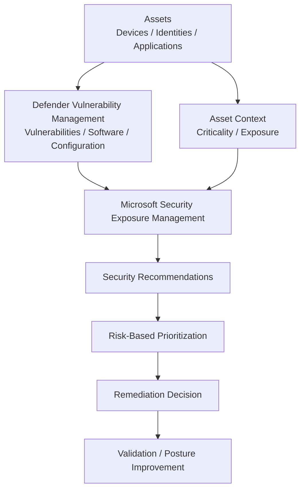

# Exposure & Vulnerability Management

## Business Requirement

Security operations should not begin only after an attacker is detected.

An organization also needs to understand:

- which assets are exposed
- which vulnerabilities exist
- which security configurations are weak
- which assets are business-critical
- which weaknesses should be remediated first
- how security posture changes over time

The Microsoft Hybrid Security Platform therefore includes Microsoft Security Exposure Management and Defender Vulnerability Management as preventive security layers.

The objective is to reduce the likelihood and potential impact of compromise before an incident occurs.

---

## Preventive Security Architecture



The architecture separates two closely related concepts:

**Defender Vulnerability Management** focuses on technical weaknesses such as vulnerable software, endpoint security recommendations, and configuration weaknesses.

**Microsoft Security Exposure Management** provides a broader risk view across assets, exposure, criticality, attack surface, security initiatives, and recommendations.

The value comes from using these views together.

---

# 1. Asset Visibility

Preventive security begins with understanding what needs to be protected.

The environment provides security visibility into assets such as:

- Windows endpoints
- identities
- applications
- other connected asset types where available

Security decisions should not treat every asset as equally important.

The same technical weakness can represent very different business risk depending on:

- the affected asset
- asset criticality
- exposure
- user or identity context
- attack-path relationships
- exploitability
- surrounding security controls

### Business value

Security teams can prioritize work based on the importance and exposure of the affected asset rather than using vulnerability severity alone.

---

# 2. Microsoft Security Exposure Management

Microsoft Security Exposure Management provides the broader preventive-security layer of the platform.

It brings together information about:

- security posture
- asset exposure
- critical assets
- vulnerabilities
- configuration weaknesses
- attack surface
- security recommendations
- security initiatives

The operational model is:

```text
Assets
  ↓
Exposure context
  ↓
Weaknesses
  ↓
Business / asset importance
  ↓
Prioritized security action
```

Exposure Management is not an incident-response system.

Its primary purpose is to identify and reduce conditions that make successful compromise more likely or more damaging.

### Business value

The organization can work proactively on reducing attack opportunities instead of waiting for weaknesses to be used in an active incident.

---

# 3. Defender Vulnerability Management

Defender Vulnerability Management provides the more technical endpoint-vulnerability view.

Relevant capabilities include:

- software inventory
- known vulnerabilities
- CVE visibility
- affected devices
- security configuration weaknesses
- security recommendations
- remediation context

The basic workflow is:

```text
Endpoint inventory
      ↓
Software and configuration assessment
      ↓
Vulnerability identified
      ↓
Affected assets
      ↓
Security recommendation
      ↓
Remediation decision
```

### Important distinction

A vulnerability is not the same as an active compromise.

For example:

```text
Vulnerable software
      ↓
Potential security weakness


Active malicious process
      ↓
Security incident
```

The first belongs primarily to exposure and vulnerability management.

The second belongs to detection and incident response.

Both are required for a complete security operating model.

---

# 4. Security Recommendations

Microsoft Defender provides security recommendations based on the observed state of protected assets.

Recommendations can relate to areas such as:

- endpoint protection
- attack surface reduction
- operating system security
- software updates
- antivirus configuration
- application weaknesses
- other security configuration improvements

A recommendation should not automatically be treated as an instruction to change business systems immediately.

The correct decision model is:

```text
Recommendation
      ↓
Affected assets
      ↓
Security impact
      ↓
Business impact
      ↓
Existing controls
      ↓
Implementation risk
      ↓
Prioritization
      ↓
Remediation decision
```

### Business value

Security teams gain a structured backlog of security improvements that can be reviewed and prioritized instead of relying only on manual configuration audits.

---

# 5. Risk-Based Prioritization

Not every security recommendation has the same urgency.

A useful prioritization model considers several factors together:

```text
Technical severity
        +
Asset criticality
        +
Exposure
        +
Exploitability
        +
Number of affected assets
        +
Existing controls
        +
Business impact
        ↓
Remediation priority
```

This prevents the security team from simply working through the largest number of findings or highest severity scores without understanding context.

### Example decision logic

A severe vulnerability affecting critical identity infrastructure may require faster action than the same weakness on a lower-impact isolated endpoint.

Likewise, a moderate weakness affecting many highly exposed assets can sometimes represent more practical risk than an isolated higher-severity finding.

### Business value

Limited remediation resources can be directed toward weaknesses that represent the greatest practical risk to the organization.

---

# 6. Critical Asset Management

The project includes Critical Asset Management as part of the exposure model.

Critical assets represent systems or identities whose compromise would have disproportionate business or security impact.

Examples can include:

- domain controllers
- privileged identities
- critical servers
- sensitive business applications
- high-value infrastructure

The on-premises domain controller is naturally treated as a high-value identity-infrastructure asset.

The security model becomes:

```text
Security finding
      ↓
Which asset?
      ↓
How critical is the asset?
      ↓
How exposed is it?
      ↓
What is the likely impact?
      ↓
Prioritized response
```

### Business value

Security posture is evaluated with business context rather than treating all devices and identities as interchangeable objects.

---


*Asset inventory and criticality context used to distinguish high-value identity infrastructure from general endpoints.*

# 7. Secure Score

Secure Score provides a high-level indicator of security posture and recommended improvements.

It is useful for:

- identifying improvement areas
- tracking security posture
- reviewing recommended controls
- communicating security posture at a higher level

It should not be treated as the only security objective.

The goal is not simply:

```text
Increase score
```

The correct objective is:

```text
Reduce meaningful security risk
        ↓
Improve important controls
        ↓
Secure Score may improve as a consequence
```

### Business value

Secure Score provides a useful management-level view of improvement opportunities while technical teams retain responsibility for evaluating the actual risk and operational impact of each recommendation.

---

# 8. Exposure Score

Exposure Score provides a broader view of organizational security exposure.

It complements Secure Score.

The conceptual distinction is:

```text
Secure Score
      ↓
How well recommended security controls
are implemented


Exposure Score
      ↓
How exposed the environment is
based on assets, weaknesses,
risk and attack surface
```

The two measurements answer different questions and should not be treated as interchangeable.

### Business value

Management and security teams gain both:

- a view of security-control maturity
- a view of broader practical exposure

This provides more context than either measurement alone.

---

# 9. Attack Surface and Attack Paths

Exposure Management can provide broader visibility into relationships between assets and potential paths an attacker could use.

The underlying security principle is:

```text
Initial weakness
      ↓
Accessible asset
      ↓
Identity / permission / infrastructure relationship
      ↓
More valuable target
```

A weakness becomes more important when it can contribute to movement toward a critical asset.

The portfolio project does not claim that every available attack-path scenario was validated.

The capability is included as part of the broader exposure-management architecture.

### Business value

Security teams can think beyond individual vulnerabilities and consider how combinations of weaknesses and relationships may increase overall business risk.

---


*Exposure Management view connecting security posture with devices, identities, cloud assets, and attack-surface context.*

# 10. Exposure Management vs Incident Management

The project deliberately separates preventive security from reactive security.

```text
PRE-BREACH                              POST-DETECTION

Assets                                  Security signal
  ↓                                           ↓
Exposure                                  Detection
  ↓                                           ↓
Vulnerability                                Alert
  ↓                                           ↓
Recommendation                              Incident
  ↓                                           ↓
Prioritization                           Investigation
  ↓                                           ↓
Remediation                              Containment
  ↓                                           ↓
Reduced attack surface                    Response
```

These are complementary operating models.

Exposure Management asks:

- Where are we weak?
- What is exposed?
- What should we fix first?
- Which assets matter most?

Incident Response asks:

- What happened?
- Is an attack occurring?
- What assets are affected?
- How do we contain and remediate it?

### Business value

The security program can reduce risk before incidents while still maintaining strong detection and response capabilities when compromise occurs.

---

# 11. Integration with Endpoint Security

Endpoint security telemetry contributes to the vulnerability and exposure view.

Conceptually:

```text
Windows Endpoint
      ↓
Microsoft Defender endpoint security
      ↓
Device / software / security state
      ↓
Defender Vulnerability Management
      ↓
Microsoft Security Exposure Management
      ↓
Prioritized security action
```

This connects endpoint operations with preventive security.

The endpoint team is therefore not working independently from the security team.

Configuration state, vulnerabilities, and endpoint exposure can inform security priorities.

---

# 12. Remediation Workflow

A mature vulnerability-management process should connect finding a weakness with actually resolving it.

The project uses the following operational model:

```text
Finding
   ↓
Validate
   ↓
Determine affected assets
   ↓
Assess risk and criticality
   ↓
Choose remediation
   ↓
Deploy through the appropriate management channel
   ↓
Validate resulting state
```

Possible management channels can include:

- Microsoft Intune
- Group Policy
- application deployment
- operating system update mechanisms
- manual change for specifically controlled infrastructure

The correct remediation channel depends on the affected asset and existing management architecture.

### Important project boundary

The project does not claim that every security recommendation identified in Exposure Management was remediated.

The focus is on understanding and implementing the complete assessment and remediation decision process.

---

# 13. Relationship with Microsoft Intune

Exposure and vulnerability findings can lead to endpoint-management changes.

This creates an important operational bridge:

```text
Security finding
      ↓
Recommendation
      ↓
Remediation decision
      ↓
Microsoft Intune / other management plane
      ↓
Endpoint configuration or software change
      ↓
Defender reassessment
```

This demonstrates why security posture and endpoint management should not operate as isolated teams or technologies.

### Business value

Security findings can be translated into centrally managed configuration or remediation actions instead of remaining as passive reports.

---

# 14. Relationship with Microsoft Defender XDR

Exposure Management and Defender XDR address different stages of the security lifecycle.

```text
Microsoft Security Exposure Management
                ↓
     Reduce security risk


Microsoft Defender XDR
                ↓
Detect and investigate security activity
```

They are complementary but technically distinct.

An important architectural principle of the project is not to describe Exposure Management as simply another Defender XDR detection module.

### Business value

The organization gains both preventive security-posture management and operational detection-and-response capability.

---

# 15. Preventive Security Operating Model

The implemented preventive-security model can be summarized as:

```text
DISCOVER
Assets and software
     ↓

ASSESS
Vulnerabilities and configuration
     ↓

UNDERSTAND
Exposure and asset criticality
     ↓

PRIORITIZE
Security recommendations
     ↓

REMEDIATE
Appropriate management channel
     ↓

VALIDATE
Reassess resulting security state
     ↓

IMPROVE
Reduce attack surface
```

This operating model complements the endpoint incident-response lifecycle documented elsewhere in the project.

---

# 16. Risk to Control Mapping

| Business Risk | Control | Operational Purpose |
|---|---|---|
| Unknown asset security state | Asset inventory | Establish security visibility |
| Vulnerable software | Defender Vulnerability Management | Identify affected software and devices |
| Weak security configuration | Security recommendations | Identify configuration improvements |
| Too many findings | Risk-based prioritization | Focus remediation resources |
| Critical systems treated like ordinary assets | Critical Asset Management | Add business context |
| Unclear control posture | Secure Score | Provide security-control improvement visibility |
| Broader attack exposure | Exposure Score | Evaluate organizational exposure |
| Weaknesses leading toward valuable assets | Attack-path analysis | Understand potential attack progression |
| Findings not converted into action | Remediation workflow | Connect security assessment with management |
| Reactive-only security | Exposure Management | Reduce risk before incidents |

---

# 17. Engineering Decisions

## Treat prevention and incident response as separate disciplines

Detecting an attack and reducing the probability of an attack are different security functions.

Both are part of the architecture.

## Prioritize by risk rather than count

The objective is not to eliminate the highest number of recommendations.

Security work should focus first on findings with the greatest potential impact.

## Include asset importance

A vulnerability cannot be evaluated correctly without understanding which asset is affected.

Asset criticality is therefore part of the decision model.

## Avoid score-driven security

Secure Score and Exposure Score are useful indicators but are not treated as business objectives by themselves.

The actual objective is reduction of meaningful organizational risk.

## Connect findings to endpoint management

Security recommendations should be capable of becoming endpoint configuration or software-remediation tasks through the appropriate management platform.

## Validate after remediation

A security change should not be considered complete until the resulting endpoint or security state can be reassessed.

---

# 18. Validation

The preventive-security architecture was validated through the configured Microsoft security environment.

The implementation included working with:

- Microsoft Security Exposure Management
- Defender Vulnerability Management
- asset inventory
- vulnerability visibility
- security recommendations
- Secure Score
- Exposure Score
- asset criticality
- Critical Asset Management
- attack-surface information
- remediation-oriented security recommendations

The project demonstrates how these capabilities fit into a practical preventive-security workflow rather than presenting them only as dashboard metrics.

---

# Business Outcome

Microsoft Security Exposure Management and Defender Vulnerability Management extend the platform from reactive threat response into proactive risk reduction.

The organization gains visibility into assets, vulnerabilities, configuration weaknesses, criticality, exposure, and prioritized security recommendations.

The resulting model is:

**discover → assess → understand exposure → prioritize → remediate → validate.**

This allows security teams to focus limited remediation effort on the weaknesses most likely to contribute to meaningful business risk, while Microsoft Defender XDR remains available for detection and response when active security events occur.

============================================================
