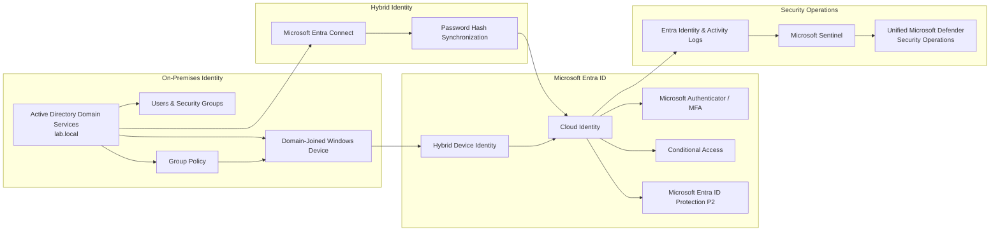

# Hybrid Identity & Access Security

## Business Requirement

The organization already depends on on-premises Active Directory for Windows authentication, computer identities, Organizational Units, groups, and Group Policy.

Replacing this environment with cloud-only identity was not assumed to be immediately practical.

The identity architecture therefore needed to:

- preserve existing Active Directory dependencies
- extend on-premises identities into Microsoft cloud services
- support Microsoft 365 and cloud security platforms
- establish cloud device identity
- strengthen authentication beyond passwords
- introduce policy-based access control
- add identity-risk visibility
- provide identity telemetry for security investigation

The resulting design combines Active Directory, Microsoft Entra Connect, Microsoft Entra ID, Microsoft Authenticator, Conditional Access, Microsoft Entra ID Protection P2, and Microsoft Sentinel.

---

## Identity Architecture



The architecture separates several different functions that are often incorrectly treated as one system:

- Active Directory remains the on-premises identity foundation.
- Microsoft Entra Connect synchronizes selected identity information into Microsoft Entra ID.
- Microsoft Entra ID provides cloud identity and access capabilities.
- Microsoft Authenticator and MFA strengthen authentication.
- Conditional Access evaluates access conditions and applies access controls.
- Microsoft Entra ID Protection P2 provides identity and sign-in risk context.
- Microsoft Sentinel provides additional identity log analytics and investigation capabilities.

---

# 1. On-Premises Identity Foundation

The on-premises identity environment is based on:

- Windows Server 2025
- Active Directory Domain Services
- domain `lab.local`
- domain controller `DC01`
- users
- security groups
- Organizational Units
- Windows computer identities
- Group Policy

The Active Directory structure was organized to represent functional separation within an organization:

```text
Company
├── Users
│   ├── Finance
│   ├── HR
│   ├── IT
│   └── Sales
├── Groups
├── Servers
└── Workstations
```

A Windows 11 endpoint was joined to the domain and placed under centralized Active Directory management.

Group Policy was configured and its application to the workstation was validated.

### Business value

The organization can retain existing Windows domain capabilities while modern security services are introduced around the existing infrastructure.

This avoids treating cloud adoption as an all-or-nothing migration.

---

# 2. Extending Identity to Microsoft Entra ID

Microsoft Entra Connect was configured to connect the Active Directory environment with Microsoft Entra ID.

The implemented authentication synchronization method is:

**Password Hash Synchronization**

The logical identity path is:

```text
On-Premises Active Directory
          |
          | Microsoft Entra Connect
          |
          | Password Hash Synchronization
          v
Microsoft Entra ID
```

A synchronized on-premises identity was successfully represented in Microsoft Entra ID, validating the hybrid identity path.

Password Hash Synchronization does not copy the user's plaintext password into Microsoft Entra ID.

### Why this architecture was selected

Password Hash Synchronization provides a relatively simple hybrid authentication architecture and avoids introducing a separate federation infrastructure solely for authentication.

It allows existing Active Directory users to use Microsoft cloud services while the organization retains its on-premises directory.

### Business value

Existing identities can be extended into:

- Microsoft 365
- Microsoft Entra security
- Microsoft Intune
- Microsoft Defender security services
- Microsoft Sentinel-related identity investigations

without recreating an independent cloud identity environment.

---

# 3. Hybrid Device Identity

The Windows environment also includes hybrid device identity.

The endpoint remains joined to on-premises Active Directory while also having a Microsoft Entra device identity.

Conceptually:

```text
Windows Device
     |
     +---- Joined to Active Directory
     |
     +---- Represented in Microsoft Entra ID
```

This provides the identity bridge required for modern device-aware security and management capabilities.

### Business value

The device is no longer known only to the local domain.

Its cloud identity can participate in Microsoft cloud management and security workflows while the workstation continues to support existing domain requirements.

---

# 4. Authentication Security

Microsoft Authenticator was configured as an authentication method in Microsoft Entra ID.

The environment includes multifactor authentication capabilities so authentication security does not depend exclusively on possession of a password.

The security model becomes:

```text
Identity
   +
Password
   +
Additional authentication factor
   +
Access context
```

rather than:

```text
Username + Password = Access
```

Authentication methods are centrally controlled through Microsoft Entra ID.

### Business value

Compromise of a password alone should not automatically provide an attacker with unrestricted access to cloud services.

This reduces the security dependency on a single credential.

---

# 5. Conditional Access

Conditional Access adds a policy layer between authentication and access to protected resources.

The conceptual access flow is:

```text
Sign-in request
      |
      v
Identity
      |
      v
Authentication
      |
      v
Conditional Access evaluation
      |
      +---- User / group context
      |
      +---- Authentication context
      |
      +---- Device context
      |
      +---- Risk context where configured
      |
      v
Access control decision
```

Conditional Access therefore separates two questions:

**Is the user able to authenticate?**

from:

**Should this sign-in be allowed under the current conditions?**

### Business value

Access decisions can be based on organizational security requirements rather than treating every successful password authentication as equally trusted.

---

# 6. Microsoft Entra ID Protection P2

Microsoft Entra ID Protection P2 adds identity-risk analysis to the architecture.

Identity Protection provides two especially important types of risk context:

- **Sign-in risk** — risk associated with a specific authentication attempt.
- **User risk** — risk associated with the identity itself.

The conceptual relationship is:

```text
Microsoft Entra ID Protection
          |
          +---- Sign-in risk
          |
          +---- User risk
          |
          v
Conditional Access
          |
          v
Access / remediation decision
```

Risk context can support stronger authentication, remediation, password change, or access restriction depending on policy design.

### Important architectural distinction

Identity Protection does not replace MFA or Conditional Access.

Each component has a different role:

```text
Microsoft Authenticator
        ↓
Authentication factor

Conditional Access
        ↓
Policy decision engine

Entra ID Protection P2
        ↓
Identity and sign-in risk context
```

Together they create a stronger identity-control model.

### Project scope

Entra ID Protection P2 is configured as part of the identity security architecture.

The project does not claim that every Microsoft Identity Protection risk-detection type was artificially triggered or validated.

### Business value

Identity security can react not only to static configuration but also to changing risk associated with users and authentication events.

---

# 7. Identity Telemetry and Microsoft Sentinel

Identity protection also requires investigation visibility.

Microsoft Entra telemetry is collected into the security operations environment.

The implemented path is:

```text
Microsoft Entra ID
        |
        | Sign-in / audit /
        | related identity telemetry
        v
Microsoft Entra data collection
        |
        v
Log Analytics Workspace
yaru-sentinel-law
        |
        v
Microsoft Sentinel
        |
        v
Unified Microsoft Defender
security operations experience
```

The Microsoft Entra connector and associated collection configuration are operational.

Data Collection Rules were configured as part of the implemented collection architecture.

The resulting telemetry is available for Sentinel-based investigation and KQL analysis within the unified security operations environment.

### Important boundary

This does not mean that Sentinel and Microsoft Defender XDR become the same data platform.

Microsoft Sentinel remains the SIEM layer using Log Analytics data, while Defender XDR retains its native XDR security telemetry and correlation capabilities.

The unified Microsoft Defender experience allows analysts to work with these capabilities together.

### Business value

Authentication activity is not limited to an administrative sign-in-history screen.

Identity telemetry becomes part of the organization's wider detection, hunting, analytics, and incident-investigation capability.

---

# 8. Identity Security Layers

The complete identity security model can be represented as several defensive layers:

```text
                IDENTITY SECURITY

        On-Premises Active Directory
                    |
                    v
             Hybrid Identity
                    |
                    v
           Microsoft Entra ID
                    |
       +------------+-------------+
       |            |             |
       v            v             v
Authentication  Access Policy  Identity Risk
     MFA          CA        Entra ID Protection
       \            |             /
        \           |            /
         +----------+-----------+
                    |
                    v
              Access Decision
                    |
                    v
          Identity Telemetry
                    |
                    v
            Microsoft Sentinel
                    |
                    v
        Security Investigation
```

No single component provides the complete identity security model.

The value comes from combining:

**identity synchronization + strong authentication + policy enforcement + risk evaluation + security telemetry.**

---

# 9. Engineering Decisions

## Retain Active Directory

The architecture intentionally preserves Active Directory instead of redesigning the organization as cloud-only.

This reflects environments where legacy applications, domain authentication, servers, Group Policy, or other dependencies still require AD DS.

## Extend rather than duplicate identity

Microsoft Entra Connect allows the existing identity to participate in cloud services instead of maintaining disconnected on-premises and cloud user populations.

## Use Password Hash Synchronization

Password Hash Synchronization provides cloud authentication without requiring a separate federation service for the implemented scenario.

## Maintain hybrid device identity

Hybrid device identity allows the workstation to remain compatible with the existing domain environment while participating in Microsoft cloud management and security.

## Separate authentication from access policy

MFA strengthens authentication, while Conditional Access determines whether authenticated access satisfies organizational requirements.

These are intentionally treated as different controls.

## Add risk to the access model

Entra ID Protection P2 provides dynamic identity-risk context that can complement authentication and Conditional Access decisions.

## Send identity telemetry to SIEM

Entra logs are collected into Sentinel so identity events can participate in security analytics and investigations rather than remaining isolated from the SOC workflow.

---

# 10. Security Risk to Control Mapping

| Business Risk | Security Control | Purpose |
|---|---|---|
| Stolen password | MFA / Microsoft Authenticator | Reduce password-only access risk |
| Existing on-premises dependencies | AD DS + Entra Connect | Preserve hybrid identity |
| Separate cloud and local identities | Identity synchronization | Maintain a connected identity model |
| Untrusted access conditions | Conditional Access | Apply contextual access controls |
| Compromised user identity | Entra ID Protection P2 | Add user-risk context |
| Suspicious authentication | Entra ID Protection P2 | Add sign-in-risk context |
| Limited cloud device context | Hybrid device identity | Establish device identity in Entra |
| Fragmented identity visibility | Sentinel + Log Analytics | Centralize identity telemetry for investigation |

---

# 11. Validation

The hybrid identity implementation was validated through the working environment rather than documented only as an architectural design.

Validation included:

- functioning Active Directory domain
- domain-joined Windows endpoint
- validated Group Policy application
- Microsoft Entra Connect synchronization
- synchronized identity visible in Microsoft Entra ID
- hybrid device identity
- Microsoft Authenticator configuration
- Conditional Access configuration
- Microsoft Entra ID Protection P2 availability
- successful Microsoft Entra log ingestion into Sentinel
- identity telemetry visible within the security operations environment

This demonstrates the complete path from an on-premises identity foundation to cloud identity, access protection, risk context, and SIEM visibility.

---

# Business Outcome

The identity architecture allows an organization to modernize security without immediately abandoning its existing Active Directory environment.

Existing identities and Windows devices are extended into Microsoft cloud services, authentication is strengthened beyond passwords, Conditional Access introduces policy-based access decisions, Entra ID Protection P2 adds identity-risk context, and Entra telemetry becomes available to Microsoft Sentinel for security investigation.

The result is not simply identity synchronization.

It is a layered hybrid identity security model covering:

**identity continuity → authentication → access control → risk → telemetry → investigation.**

============================================================
