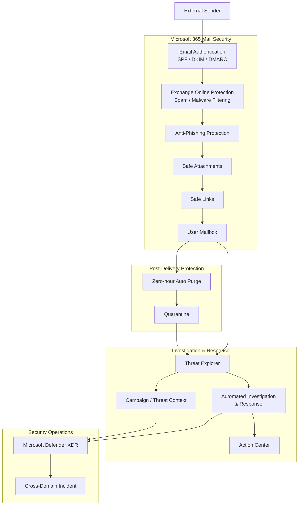

# Microsoft 365 Email & Collaboration Security

## Business Requirement

Email and collaboration services represent a major attack surface because users routinely interact with external senders, links, attachments, and shared content.

Preventing malicious content before delivery is important, but prevention alone is not sufficient.

The organization also needs to:

- evaluate sender authenticity
- identify phishing and impersonation attempts
- inspect malicious attachments and URLs
- detect threats after delivery
- investigate suspicious messages
- determine the scope of related email activity
- quarantine or remove malicious content
- automate appropriate remediation
- correlate Microsoft 365 security activity with broader security incidents

The Microsoft Hybrid Security Platform therefore uses Microsoft Defender for Office 365 Plan 2 as the email and collaboration security layer.

---

## Security Architecture



The architecture provides protection and investigation at several stages:

```text
BEFORE DELIVERY

Authentication
Filtering
Phishing protection
Attachment analysis
URL protection

        ↓

DELIVERY

        ↓

AFTER DELIVERY

Updated threat verdicts
ZAP
Investigation
Campaign analysis
AIR
Remediation

        ↓

SECURITY OPERATIONS

Defender XDR
Incidents
Cross-domain investigation
```

A message that was initially delivered can still require security action later if the security verdict changes.

---

# 1. Email Authentication

The environment included analysis of sender authentication using:

- SPF
- DKIM
- DMARC
- composite authentication

Message headers were inspected to understand how Microsoft 365 evaluates sender authenticity.

The security model is:

```text
Incoming message
      ↓
Sender identity claims
      ↓
SPF / DKIM / DMARC evaluation
      ↓
Authentication context
      ↓
Spam / phishing evaluation
```

These controls solve related but different problems.

**SPF** provides information about whether sending infrastructure is authorized for a domain.

**DKIM** provides cryptographic domain-signing validation for signed message content.

**DMARC** uses alignment with SPF and/or DKIM to support domain-owner policy and authentication decisions.

Microsoft 365 can also use composite authentication as additional context.

### Validation

Real message headers were inspected for email flowing between an external Gmail account and Microsoft 365.

SPF, DKIM, DMARC, and composite authentication results were reviewed.

### Business value

Sender authentication reduces dependence on the visible From address alone when evaluating whether a message should be trusted.

---

# 2. External Email Identification

An Exchange Online mail-flow rule was implemented and validated to identify messages originating outside the organization.

External messages receive a visible warning banner.

The control does not determine whether a message is malicious.

Its purpose is user awareness:

```text
External message
      ↓
Mail-flow rule
      ↓
Visible external warning
      ↓
Additional user context
```

### Business value

Users receive an immediate visual indication that a message originated outside the organizational boundary.

This provides an additional human-layer control against impersonation and social engineering.

---

# 3. Anti-Spam, Anti-Malware and Anti-Phishing Protection

The Microsoft 365 security architecture includes several layers of message filtering.

Relevant protection areas include:

- anti-spam
- anti-malware
- anti-phishing
- spoof intelligence
- mailbox intelligence
- impersonation-related controls
- quarantine handling

These protections should not be treated as one single filter.

Each contributes different signals and controls to the overall message verdict.

```text
Message
   ↓
Spam / malware evaluation
   ↓
Sender and phishing evaluation
   ↓
Advanced Defender protection
   ↓
Delivery decision
```

### Business value

Layered filtering reduces dependence on any single detection technique when evaluating potentially malicious messages.

---

# 4. Safe Attachments

Safe Attachments provides additional protection for supported files delivered through Microsoft 365.

The conceptual security model is:

```text
Email attachment
      ↓
Initial malware inspection
      ↓
Safe Attachments analysis
      ↓
Security verdict
      ↓
Delivery / block / quarantine behavior
```

### Business value

Potentially malicious attachments receive additional security analysis before users are allowed to interact with them.

This helps reduce risk from malware and payloads delivered through email.

---

# 5. Safe Links

Safe Links provides additional protection around URLs in supported Microsoft 365 workloads.

A URL that appears harmless when a message is received may later lead to malicious infrastructure.

The protection model therefore includes security evaluation around user interaction.

```text
Email / Teams URL
      ↓
Safe Links protection
      ↓
User interaction
      ↓
URL security evaluation
      ↓
Allow or warning/block decision
```

### Business value

URL protection is not limited to a one-time decision made when an email first enters the organization.

This provides additional protection against links whose destination or security verdict changes.

---

# 6. Delivery Is Not the End of Security Processing

A central principle of the architecture is:

**Delivered does not mean permanently trusted.**

Threat intelligence and security verdicts can change after a message reaches a mailbox.

The post-delivery security model is:

```text
Message delivered
       ↓
New threat intelligence /
updated security verdict
       ↓
Message reassessed
       ↓
Post-delivery remediation
```

This is where Zero-hour Auto Purge becomes important.

---

# 7. Zero-hour Auto Purge

Zero-hour Auto Purge provides post-delivery protection for content that is later determined to require remediation.

Conceptually:

```text
Message initially delivered
       ↓
Security verdict changes
       ↓
ZAP reevaluates message
       ↓
Malicious content remediated
```

ZAP therefore differs from initial mail filtering.

Initial protection attempts to prevent malicious content from being delivered.

ZAP provides an additional response when the threat becomes known after delivery.

### Microsoft Teams Protection

Teams protection was also reviewed and configured in the environment.

Zero-hour Auto Purge for Microsoft Teams was enabled.

Malware and high-confidence phishing quarantine handling used the configured administrative quarantine policy.

### Business value

The organization's security posture can adapt after delivery instead of assuming that the original content verdict remains correct forever.

---

# 8. Threat Explorer

Threat Explorer provides the operational investigation layer for Microsoft 365 email security.

It was validated using real messages in the tenant.

Search and filtering can be used to investigate message activity based on context such as:

- sender
- recipient
- subject
- threat type
- delivery action
- URLs
- message characteristics

The investigation model is:

```text
Suspicious message
       ↓
Threat Explorer
       ↓
Sender / recipient / subject
       ↓
Delivery status
       ↓
Threat verdict
       ↓
URL / message context
       ↓
Determine scope
```

### Validation

A new message was sent through the environment and successfully became visible in Explorer after telemetry processing.

The message was then searchable through the Defender investigation interface.

### Business value

Security staff can move beyond asking:

> Did one user receive this email?

and instead investigate:

> Who else received related messages, how were they classified, where were they delivered, and what action is required?

---

# 9. Scope Determination

One suspicious message should not automatically be treated as an isolated event.

The investigation should determine whether related content affected additional recipients.

```text
Suspicious message
       ↓
Identify sender / URL / attachment / attributes
       ↓
Search related messages
       ↓
Determine recipients
       ↓
Determine delivery state
       ↓
Assess organizational scope
```

This represents an important shift from mailbox administration to security operations.

### Business value

Security teams can determine whether a reported phishing message is an isolated event or part of broader activity against the organization.

---

# 10. Automated Investigation and Response

Microsoft Defender for Office 365 Plan 2 provides Automated Investigation and Response capabilities.

AIR can investigate supported security alerts and related entities and support remediation actions.

The environment included review and configuration of MDO automation behavior.

Message-cluster automation settings included related messages identified through:

- similar files
- similar URLs
- multiple similar attributes

The configured remediation model included soft-delete behavior for selected automated-remediation scenarios.

Conceptually:

```text
Security alert
      ↓
AIR investigation
      ↓
Related entities and messages
      ↓
Threat verdict
      ↓
Remediation action
      ↓
Action Center / investigation result
```

AIR and ZAP must not be treated as the same mechanism.

```text
ZAP
↓
Post-delivery remediation after
updated threat evaluation


AIR
↓
Automated investigation of
security activity, related entities,
and supported remediation actions
```

### Business value

Automation can reduce repetitive investigation and remediation work while preserving visibility into security actions.

---

# 11. Quarantine

Quarantine provides controlled handling for messages that should not remain freely accessible to users.

The security team can review quarantined content and determine the appropriate next action.

The operational model is:

```text
Suspicious / malicious message
       ↓
Quarantine
       ↓
Security review
       ↓
Release / retain / remove
```

Quarantine is therefore part of the message-response workflow rather than simply a storage location.

### Business value

Potentially harmful content can be separated from users while administrators retain controlled review and remediation capabilities.

---

# 12. Action Center

Action Center provides visibility into security remediation actions.

For Defender for Office 365 this can include actions resulting from investigation or remediation workflows.

The concept is:

```text
Security investigation
       ↓
Remediation action
       ↓
Action Center
       ↓
Review / status / approval
where applicable
```

### Business value

Security actions remain visible and operationally accountable instead of occurring as undocumented background changes.

---

# 13. Campaign Analysis

A phishing attack can involve many messages that belong to the same broader operation.

Campaign analysis helps security teams reason about related malicious activity at campaign level rather than investigating each message independently.

Conceptually:

```text
Message A
Message B
Message C
Message D
   \ | | /
     ↓
Related attack activity
     ↓
Campaign context
```

Relevant context can help analysts understand:

- scale
- targeted users
- malicious infrastructure
- message relationships
- threat patterns

### Business value

A security team can investigate related activity as an organizational security event instead of processing multiple related messages as independent tickets.

---

# 14. Threat Tracker

Threat Tracker provides another view of email-related threat activity.

The environment reviewed:

- saved queries
- tracked queries
- trending campaigns

This capability can support following email-threat patterns and investigation queries over time.

It is a supporting capability rather than the primary incident-investigation interface.

---

# 15. Microsoft Teams Protection

The collaboration security boundary extends beyond email.

Microsoft Defender for Office 365 also provides security capabilities for Microsoft Teams.

The environment included review of:

- Teams protection settings
- malicious URL protection concepts
- file protection concepts
- user-reported content
- Teams quarantine behavior
- Zero-hour Auto Purge
- post-delivery protection settings

The security principle is:

```text
Email
Teams
Other Microsoft 365 collaboration surfaces
        ↓
Shared user attack surface
        ↓
Microsoft 365 security controls
```

### Business value

Attackers cannot be assumed to use email only.

Collaboration services also require URL, file, reporting, and remediation capabilities.

---

# 16. Message Trace vs Security Investigation

The environment also used Exchange Online Message Trace.

Message Trace and Threat Explorer solve different problems.

```text
MESSAGE TRACE

Where did the message go?
Was it delivered?
What happened during mail flow?


THREAT EXPLORER

Is the message suspicious?
What threat verdict exists?
Who else received related content?
What should security operations investigate?
```

Both can contribute to troubleshooting, but they should not be treated as equivalent tools.

### Business value

Administrators can distinguish normal mail-delivery troubleshooting from security investigation.

---

# 17. Defender for Office 365 and Defender XDR

Microsoft Defender for Office 365 contributes email and collaboration security signals to Microsoft Defender XDR.

The conceptual relationship is:

```text
Microsoft 365 activity
        ↓
Defender for Office 365
        ↓
Security alerts and evidence
        ↓
Microsoft Defender XDR
        ↓
Incident correlation
```

This means an email attack does not need to remain an isolated email-security event.

For example, broader investigation could involve:

```text
Phishing message
       ↓
User interaction
       ↓
Identity activity
       ↓
Endpoint activity
       ↓
Defender XDR incident
```

The project does not claim that every possible cross-domain attack chain was generated.

The architecture demonstrates how the security platforms support cross-domain investigation.

### Business value

Security analysts can investigate related activity across Microsoft security domains instead of treating email, identity, and endpoint security as disconnected systems.

---

# 18. Email Security Operating Model

The complete Microsoft 365 security model can be summarized as:

```text
AUTHENTICATE
SPF / DKIM / DMARC
       ↓

FILTER
Spam / malware / phishing
       ↓

PROTECT
Safe Attachments / Safe Links
       ↓

DELIVER
Message reaches user
       ↓

REASSESS
New threat intelligence / ZAP
       ↓

INVESTIGATE
Explorer / incidents / campaigns
       ↓

DETERMINE SCOPE
Recipients / URLs / related messages
       ↓

REMEDIATE
Quarantine / AIR / security actions
       ↓

CORRELATE
Microsoft Defender XDR
```

This is the central operational model of the Microsoft 365 security component.

---

# 19. Risk to Control Mapping

| Business Risk | Security Control | Operational Purpose |
|---|---|---|
| Sender spoofing | SPF / DKIM / DMARC | Provide sender-authentication context |
| External impersonation | External message warning | Increase user awareness |
| Spam and commodity threats | EOP filtering | Filter unwanted or malicious mail |
| Phishing | Anti-phishing protection | Identify suspicious sender behavior and messages |
| Malicious attachments | Safe Attachments | Add advanced attachment analysis |
| Malicious URLs | Safe Links | Protect users interacting with links |
| Threat identified after delivery | ZAP | Perform post-delivery remediation |
| Suspicious email investigation | Threat Explorer | Investigate message and organizational scope |
| Multiple related malicious messages | Campaign analysis | Understand broader attack activity |
| Repetitive investigation work | AIR | Automate supported investigation and remediation |
| Harmful content requiring controlled access | Quarantine | Separate suspicious content from users |
| Cross-domain attack | Defender XDR | Correlate Microsoft 365 activity with wider security signals |

---

# 20. Engineering Decisions

## Use layered email protection

No single email-security mechanism is treated as sufficient.

Authentication, filtering, attachment protection, URL protection, post-delivery remediation, and investigation provide complementary layers.

## Treat delivery as a temporary security verdict

A message reaching a mailbox does not mean that it can never later be identified as malicious.

Post-delivery protection remains part of the security architecture.

## Separate mail troubleshooting from threat investigation

Message Trace is used for mail-flow questions.

Threat Explorer is used for security investigation.

This prevents operational troubleshooting and security response from being treated as the same problem.

## Investigate scope, not only the reported message

A phishing investigation should determine whether other users received related content.

The organizational scope matters more than the single initial report.

## Use automation with visibility

AIR and automated remediation can reduce repetitive SOC work, but remediation activity should remain visible through investigation and Action Center workflows.

## Connect Microsoft 365 to wider security operations

Email and collaboration security should contribute to Defender XDR investigation instead of operating as an isolated mail-security platform.

---

# 21. Validation

The Microsoft 365 security component was validated through the configured environment.

Validation and hands-on work included:

- Defender for Office 365 Plan 2 enabled in the tenant
- anti-phishing policy review
- anti-spam and anti-malware protection review
- Safe Links architecture and policy review
- Safe Attachments architecture and policy review
- quarantine workflow
- Threat Explorer
- real message discovery in Explorer
- sender and recipient investigation
- message delivery context
- Message Trace
- external email warning rule
- successful external-warning validation
- SPF inspection
- DKIM inspection
- DMARC inspection
- composite authentication inspection
- Action Center
- MDO automation settings
- message-cluster remediation configuration
- ZAP configuration
- Microsoft Teams protection
- Campaigns
- Threat Tracker
- Defender XDR integration

The project does not claim that every Defender for Office 365 capability was triggered through a live malicious campaign.

Configured controls, observed telemetry, and validated investigation workflows are distinguished from capabilities reviewed as part of the security architecture.

---

# Business Outcome

Microsoft Defender for Office 365 P2 extends the Microsoft Hybrid Security Platform beyond endpoint and identity security into the Microsoft 365 communication layer.

The environment combines sender authentication, pre-delivery protection, attachment and URL security, post-delivery remediation, threat investigation, automation, quarantine, and cross-domain XDR correlation.

The resulting security model is:

**authenticate → filter → protect → deliver → reassess → investigate → determine scope → remediate → correlate.**

This provides both preventive protection and operational investigation capability against phishing, malware, malicious links, and other threats targeting Microsoft 365 users.

============================================================
