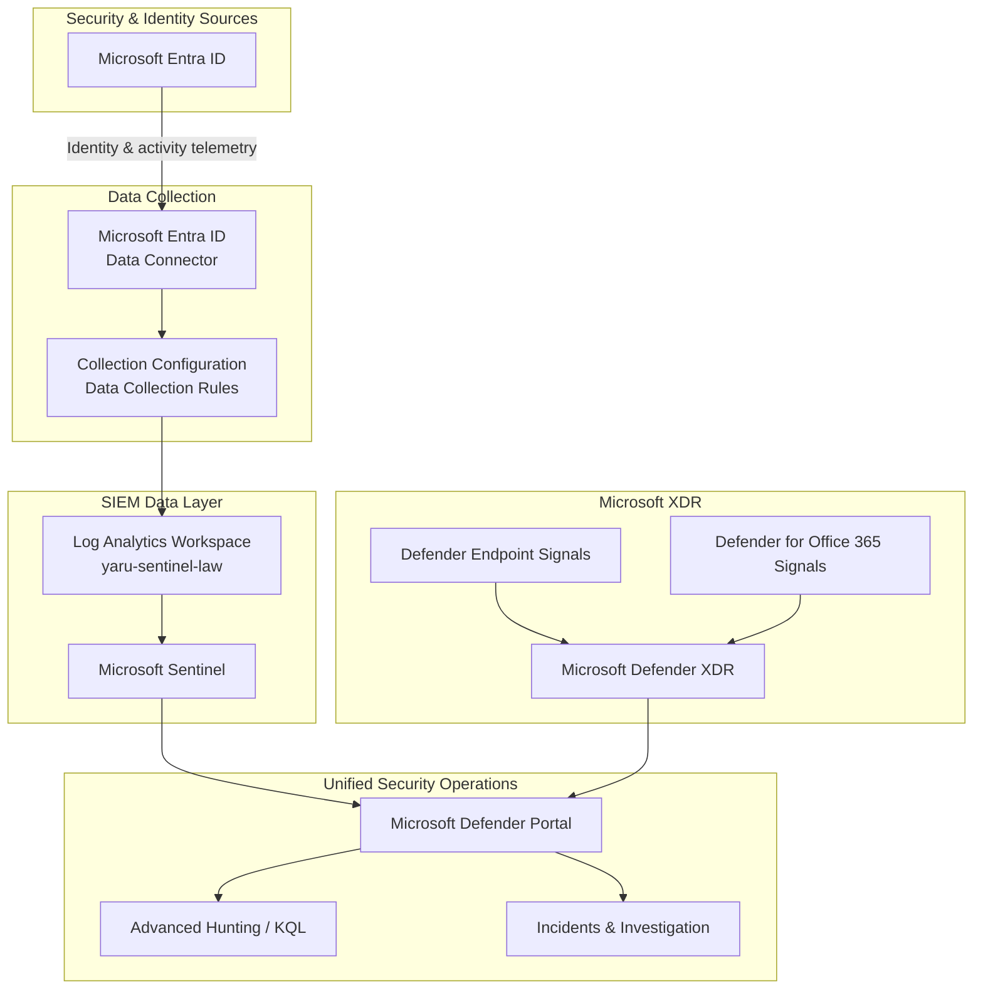

# Microsoft Sentinel & SIEM Integration

## Business Requirement

Microsoft Defender provides native security telemetry and XDR capabilities across Microsoft security workloads, but an organization also needs a SIEM layer capable of collecting broader operational and security logs, retaining searchable telemetry, performing KQL-based analysis, and extending investigations beyond native XDR signals.

The security-operations architecture therefore combines Microsoft Defender XDR with Microsoft Sentinel.

The objective is not to duplicate the same functionality in two products.

The architecture assigns them complementary responsibilities:

- Microsoft Defender XDR provides native Microsoft security correlation, incidents, evidence, investigation, and response.
- Microsoft Sentinel provides SIEM log ingestion, Log Analytics, KQL, analytics, and additional investigation context.
- The Microsoft Defender portal provides the unified operational experience through which these capabilities can be used together.

---

## SIEM Architecture



The diagram represents logical responsibilities and the implemented collection architecture.

Data Collection Rules are part of the implemented configuration in this project.

They must not be interpreted as a universal mandatory transport mechanism for every Microsoft Entra ID log category.

---

# 1. Why Microsoft Sentinel Is Part of the Architecture

Defender XDR already provides substantial security-investigation capabilities.

Microsoft Sentinel is therefore not included simply to add another security portal.

It solves a different business problem.

```text
Microsoft Defender XDR
        ↓
Native Microsoft security signals
Cross-workload correlation
Alerts and incidents
Attack Story
Evidence
Endpoint response


Microsoft Sentinel
        ↓
SIEM data collection
Log Analytics
KQL
Additional telemetry
Analytics
Broader investigation context
```

The combination gives the organization both:

**XDR depth + SIEM breadth**

### Business value

Security analysts are not limited to security alerts produced by individual Microsoft Defender products.

They can also investigate underlying operational and identity telemetry collected through the SIEM.

---

# 2. Log Analytics Workspace

The SIEM data layer is based on the Log Analytics workspace:

`yaru-sentinel-law`

Microsoft Sentinel is enabled for this workspace.

The workspace provides the queryable log-data foundation used by Sentinel for connected telemetry.

Conceptually:

```text
Security data
      ↓
Log Analytics Workspace
      ↓
Tables
      ↓
KQL
      ↓
Microsoft Sentinel
```

This distinction is important.

Microsoft Sentinel provides SIEM security capabilities around the collected data, while Log Analytics provides the workspace and queryable telemetry foundation.

### Business value

Security telemetry can be centrally collected and queried instead of remaining distributed across separate administrative interfaces.

---

# 3. Microsoft Entra ID Data Integration

Microsoft Entra ID is connected to Microsoft Sentinel as an identity-telemetry source.

The implemented environment successfully provides Entra telemetry including:

- interactive sign-in activity
- non-interactive user sign-in activity
- audit activity
- other enabled Entra log categories

Relevant tables observed in the environment include:

```text
SigninLogs

AuditLogs

AADNonInteractiveUserSignInLogs
```

Additional Entra tables can exist when their corresponding log categories are enabled.

The implemented logical path is:

```text
Microsoft Entra ID
        ↓
Microsoft Entra ID Data Connector
        ↓
Configured collection
        ↓
Log Analytics
        ↓
Microsoft Sentinel
```

The connector is operational and Entra telemetry is successfully arriving in the Sentinel environment.

### Business value

Identity activity becomes part of centralized security operations instead of remaining available only through Entra administrative log views.

---

# 4. Data Collection Configuration

Data Collection Rules were created as part of the implemented telemetry-collection architecture.

The project treats collection configuration as its own engineering responsibility.

```text
DATA SOURCE

What system produces the information?


CONNECTOR

How is the source connected?


COLLECTION CONFIGURATION

How is relevant collection configured?


LOG ANALYTICS

Where is SIEM telemetry stored and queried?


SENTINEL

How does the telemetry participate in security operations?
```

### Important architectural boundary

The project does not claim that every Microsoft Entra ID log category universally requires a DCR between Entra ID and Microsoft Sentinel.

DCRs are documented because they are part of the collection configuration actually implemented in this environment.

### Business value

Log collection is treated as an intentional architecture rather than simply enabling every available source without considering how telemetry enters the SIEM.

---

# 5. Identity Telemetry

One of the principal uses of Sentinel in this project is deeper identity visibility.

Identity telemetry can help answer questions such as:

- Who authenticated?
- Was the activity interactive or non-interactive?
- When did the activity occur?
- Which application or resource was involved?
- Which IP or location context was associated with the event?
- Did authentication succeed or fail?
- Were there repeated related attempts?
- What administrative changes occurred in Entra ID?
- Is the activity related to other security events?

This creates an investigation path such as:

```text
Security question
      ↓
Identify relevant telemetry
      ↓
Query Entra data
      ↓
Establish timeline
      ↓
Identify entities
      ↓
Correlate related activity
      ↓
Determine investigation scope
```

### Business value

Analysts can reconstruct identity activity using raw event context rather than depending only on a generated security alert.

---

# 6. Interactive and Non-Interactive Sign-Ins

Identity investigations require understanding that not all sign-in activity represents a user manually entering credentials.

The environment exposes different forms of authentication activity.

Conceptually:

```text
Interactive sign-in
        ↓
User actively participates
in authentication


Non-interactive sign-in
        ↓
Client / token / session activity occurs
without a new interactive user prompt
```

This distinction matters because large volumes of non-interactive activity can represent normal cloud application behavior.

A non-interactive sign-in should therefore not automatically be interpreted as suspicious.

### Business value

Security analysts can interpret authentication telemetry correctly instead of treating every cloud authentication event as a new manual user login.

---

# 7. Audit Activity

Authentication logs answer questions about access.

Audit telemetry answers different questions about changes inside the identity environment.

Conceptually:

```text
SIGN-IN TELEMETRY

Who attempted to authenticate?
From where?
To what?
Did it succeed?


AUDIT TELEMETRY

What configuration changed?
Who initiated the change?
What object was affected?
When did it happen?
```

Both forms of information are important during an identity investigation.

For example, suspicious authentication followed by changes to an account, application, group, or security configuration can require a different response than an isolated failed authentication event.

### Business value

The SOC can investigate both access activity and administrative changes when reconstructing a security event.

---

# 8. Verifying Data Ingestion

Connecting a data source should not be considered complete merely because a connector shows a configured state.

The implementation was validated by confirming that Entra telemetry was actually arriving and becoming queryable.

The validation principle is:

```text
Configure connector
      ↓
Generate / observe source activity
      ↓
Verify table data
      ↓
Query telemetry
      ↓
Confirm operational ingestion
```

This distinction is important:

**Configured does not automatically mean data is flowing.**

The implementation was considered complete after the resulting identity data became visible in the security operations environment.

### Business value

Monitoring gaps can be identified before analysts assume that a configured connector provides working security visibility.

---

# 9. KQL-Based Investigation

Microsoft Sentinel makes collected telemetry queryable through Kusto Query Language.

KQL allows analysts to move from dashboards and predefined alerts into direct investigation of the underlying data.

The investigation process can be:

```text
Question
   ↓
Select relevant table
   ↓
Filter time range
   ↓
Filter identity / IP / application
   ↓
Project relevant fields
   ↓
Correlate events
   ↓
Build timeline
   ↓
Determine scope
```

KQL is therefore not treated as a separate programming exercise.

It is an investigation tool.

### Example investigation questions

The SIEM data can be used to investigate questions such as:

- Which failed authentication attempts occurred for a specific identity?
- Did the same IP address interact with multiple users?
- What happened immediately before or after a suspicious sign-in?
- Which applications were accessed?
- What administrative changes followed authentication activity?
- Is similar activity visible elsewhere in the selected period?

### Business value

Security analysts can ask questions of the underlying security data that may not be covered by a predefined dashboard or detection rule.

---

# 10. Advanced Hunting in the Unified Security Experience

Microsoft Sentinel is connected to the Microsoft Defender security operations experience.

This allows Sentinel data and Defender XDR data to participate in a more unified investigation workflow through supported Defender portal experiences.

Conceptually:

```text
Defender XDR telemetry
          \
           \
            > Unified hunting / investigation
           /
Sentinel data
```

This does not mean both sources become the same physical data store.

The important benefit is the analyst experience:

security data from different platforms can be investigated through a more coordinated workflow.

### Business value

Analysts reduce unnecessary switching between disconnected investigation environments when an incident spans XDR and SIEM telemetry.

---

# 11. Defender XDR and Sentinel Data Boundary

This is one of the most important architectural distinctions in the project.

The following description is incorrect:

```text
Sentinel
   ↓
Data copied into Defender XDR
```

The correct conceptual model is:

```text
DEFENDER XDR

Native Microsoft security telemetry
Alerts
Incidents
Evidence
Response
       \
        \
         > Unified Microsoft Defender experience
        /
       /
MICROSOFT SENTINEL

Log Analytics telemetry
SIEM
KQL
Analytics
Additional data sources
```

Sentinel data remains associated with Sentinel and Log Analytics.

Defender XDR retains its native security data and XDR responsibilities.

The Microsoft Defender portal provides the operational layer through which these technologies can work together.

### Business value

The organization gains a coordinated analyst experience without losing the specialized capabilities of either SIEM or XDR.

---

# 12. Incidents and Correlation

Security telemetry becomes most valuable when analysts can move from individual events toward understanding complete incidents.

The desired security workflow is:

```text
Raw telemetry
      ↓
Detection logic
      ↓
Alert
      ↓
Incident
      ↓
Entities
      ↓
Related activity
      ↓
Investigation
      ↓
Response
```

Microsoft Sentinel adds SIEM telemetry and analytics to the wider security-operations model.

Microsoft Defender XDR contributes native Microsoft security detections, cross-workload correlation, evidence, and response.

When used through unified security operations, these capabilities provide additional context for investigation.

### Business value

The analyst can investigate the broader security story instead of processing every log event or security alert independently.

---

# 13. SIEM and XDR Are Complementary

The project deliberately demonstrates both technologies because they solve related but different problems.

| Capability | Microsoft Defender XDR | Microsoft Sentinel |
|---|---|---|
| Native Microsoft security telemetry | Primary | Can consume or correlate relevant security information |
| Cross-product XDR correlation | Primary | Complements through SIEM analytics |
| Endpoint response | Primary | Can participate in broader automation workflows |
| Evidence / Attack Story | Primary | Provides additional investigation context |
| Broad log ingestion | Limited to product scope | Primary |
| Log Analytics | Not its core data store | Primary |
| KQL investigation | Advanced Hunting | SIEM / Log Analytics investigation |
| Additional data-source extensibility | Product dependent | Major capability |
| SIEM analytics | No | Yes |
| Unified SOC experience | Yes | Yes through Defender portal integration |

The objective is not to determine which product replaces the other.

The objective is to use each platform for the security responsibility it is designed to handle.

---

# 14. UEBA and Identity Context

Microsoft Sentinel includes User and Entity Behavior Analytics capabilities that can enrich security investigations with behavioral and entity context.

UEBA is part of the wider identity-security and SIEM architecture.

Conceptually:

```text
Identity activity
      ↓
Historical behavior / entity context
      ↓
Behavioral analysis
      ↓
Additional investigation context
```

UEBA should not be described as proving that an attack occurred merely because activity appears unusual.

Its value is providing behavioral and entity context that can support detections and investigations.

The project does not claim that every available UEBA detection or anomaly scenario was artificially generated.

### Business value

Identity and entity activity can be evaluated with behavioral context rather than viewed only as isolated log records.

---

# 15. Sentinel as an Extensible Security Layer

The current implementation focuses primarily on Microsoft Entra identity telemetry.

However, the architecture is intentionally extensible.

Conceptually, Microsoft Sentinel can support additional sources such as:

```text
Identity logs
       \
Windows events
        \
Firewall / network logs
          > Microsoft Sentinel
Cloud platforms
        /
Applications
       /
Third-party security products
```

These additional sources are shown only as architectural extensibility.

They must not be presented as currently implemented integrations unless they are actually added to the project.

### Business value

The organization is not restricted to security telemetry produced by one product family.

---

# 16. Cost-Aware Data Collection

SIEM ingestion has operational and financial implications.

The architecture therefore follows the principle:

**Collect data because it supports a security use case, not simply because a connector exists.**

A useful decision model is:

```text
Potential data source
        ↓
Security use case
        ↓
Required telemetry
        ↓
Expected volume
        ↓
Retention requirement
        ↓
Investigation / detection value
        ↓
Collection decision
```

This is particularly important for high-volume sources.

### Business value

Security visibility is balanced against ingestion volume, storage, retention, and operational cost.

---

# 17. Detection Architecture

The SIEM provides the foundation for custom detection logic.

The architectural detection path is:

```text
Collected telemetry
       ↓
KQL logic
       ↓
Analytics rule
       ↓
Alert
       ↓
Incident
       ↓
Investigation
```

At the current stage of the portfolio project, Sentinel collection and investigation architecture is implemented.

Custom detection scenarios can be added as separate evidence-driven use cases after they have been created and validated.

They must not be documented as already implemented until that work is complete.

### Business value

The security team is not limited to vendor-generated detections.

Organization-specific security logic can be created from telemetry available in the SIEM.

---

# 18. Integration with Identity Security

Sentinel extends the Microsoft Entra security architecture.

```text
Active Directory
      ↓
Microsoft Entra ID
      ↓
Authentication / access activity
      ↓
Entra telemetry
      ↓
Microsoft Sentinel
      ↓
KQL / analytics / investigation
```

Entra ID Protection and Microsoft Sentinel have different responsibilities.

```text
Entra ID Protection P2
        ↓
Microsoft identity-risk detections
and risk context


Microsoft Sentinel
        ↓
SIEM telemetry
Custom analytics
Correlation
Investigation
```

One does not replace the other.

### Business value

Microsoft-generated identity-risk information can coexist with deeper investigation of the underlying identity telemetry.

---

# 19. Integration with Defender XDR

Sentinel complements Defender XDR by adding a SIEM layer.

The operational model is:

```text
             MICROSOFT DEFENDER XDR
        Endpoint / Email / Identity signals
                      |
                      v
               XDR investigation
                      |
                      +-----------+
                                  |
                                  v
                      Unified Security Operations
                                  ^
                                  |
                      +-----------+
                      |
               SIEM investigation
                      ^
                      |
               MICROSOFT SENTINEL
            Entra / Log Analytics data
```

The analyst can therefore move between native security detections and deeper log-based investigation as the security question changes.

---

# 20. Security Operations Workflow

The complete SIEM/XDR workflow can be represented as:

```text
COLLECT
Entra and security telemetry
      ↓

STORE
Log Analytics
      ↓

ANALYZE
KQL / Sentinel
      ↓

DETECT
Sentinel analytics + Defender detections
      ↓

CORRELATE
Incidents and related entities
      ↓

INVESTIGATE
Sentinel + Defender XDR context
      ↓

RESPOND
Appropriate security control
      ↓

VALIDATE
Review resulting security state
```

This connects raw telemetry with actual security operations.

---

# 21. Risk to Control Mapping

| Business Risk | Control | Operational Purpose |
|---|---|---|
| Identity logs isolated from SOC | Entra data connector | Centralize identity telemetry |
| Security data difficult to query | Log Analytics | Provide searchable telemetry |
| Investigation limited to predefined alerts | KQL | Investigate raw security data |
| XDR visibility limited to native signals | Microsoft Sentinel | Add SIEM context |
| Separate SIEM and XDR workflows | Unified Defender operations | Reduce investigation fragmentation |
| Authentication events misunderstood | Sign-in telemetry | Reconstruct access activity |
| Administrative changes missed | Audit telemetry | Investigate identity configuration changes |
| Unusual behavior lacks context | UEBA | Add behavioral and entity context |
| Excessive telemetry cost | Selective data collection | Balance visibility and cost |
| Vendor detections insufficient for a use case | Sentinel analytics | Support custom detection logic |

---

# 22. Engineering Decisions

## Use Sentinel alongside Defender XDR

Sentinel was not introduced to replace Defender XDR.

The two technologies are used because SIEM and XDR have complementary responsibilities.

## Centralize Entra telemetry

Identity activity was selected as an important SIEM source because identity is central to Microsoft 365 and hybrid-security investigations.

## Validate ingestion, not only configuration

The connector was not considered operational until actual Entra telemetry became available for investigation.

## Preserve the data-platform boundary

Sentinel / Log Analytics data and native Defender XDR telemetry are treated as technically distinct even when both are accessible through unified security operations.

## Use KQL as an investigation tool

KQL is used to answer security questions and build timelines rather than being treated as an isolated coding exercise.

## Avoid collecting data without a use case

SIEM collection decisions should consider security value, volume, retention, and cost.

## Keep the architecture extensible

The current Sentinel implementation focuses on Entra identity telemetry while preserving the ability to add additional infrastructure and third-party sources later.

---

# 23. Validation

The Microsoft Sentinel integration was validated through the implemented environment.

Validation included:

- Log Analytics workspace `yaru-sentinel-law`
- Microsoft Sentinel enabled and operational
- Sentinel connected to the Microsoft Defender portal
- Microsoft Entra ID data connector configured
- Data Collection Rules created as part of the collection configuration
- Entra identity telemetry successfully ingested
- interactive sign-in telemetry available
- audit telemetry available
- non-interactive sign-in telemetry available
- Sentinel data available through the unified Microsoft Defender security operations experience
- Sentinel and Defender capabilities accessible from the same operational portal
- identity data available for KQL-based investigation

The integration is therefore an implemented component of the platform, not a planned future capability.

---

# Business Outcome

Microsoft Sentinel extends the Microsoft Hybrid Security Platform from native Microsoft XDR protection into broader SIEM-driven security operations.

Microsoft Entra identity telemetry is collected into Log Analytics and Microsoft Sentinel, where it can be queried and analyzed using KQL and used as additional investigation context.

Microsoft Defender XDR continues to provide native Microsoft security correlation, incidents, evidence, and response, while Sentinel provides broader log analytics and SIEM capabilities.

Both are used through the unified Microsoft Defender security operations experience without treating them as the same underlying data platform.

The resulting operating model is:

**collect → store → analyze → detect → correlate → investigate → respond → validate.**

This gives the security team both the depth of XDR and the broader telemetry and analytical flexibility of SIEM.

