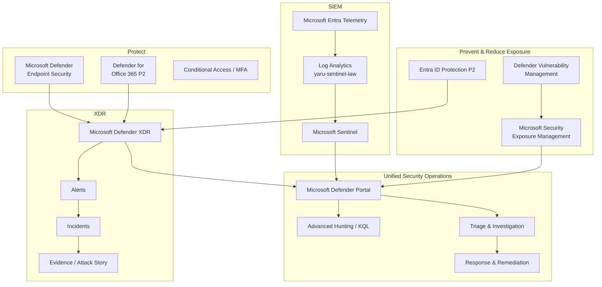

# Unified Security Operations

## Business Requirement

Identity protection, endpoint security, Microsoft 365 protection, exposure management, and SIEM telemetry provide limited value if security teams must investigate each domain independently.

A security event can begin in one area and become visible through several security controls.

For example:

```text
Phishing message
       ↓
User interaction
       ↓
Identity activity
       ↓
Endpoint execution
       ↓
Security detection
```

The security operating model therefore connects:

- identity security
- endpoint security
- Microsoft 365 protection
- exposure and vulnerability management
- Microsoft Defender XDR
- Microsoft Sentinel
- Advanced Hunting and KQL
- investigation
- containment
- remediation
- recovery

The Microsoft Defender portal provides the central operational experience while the underlying security platforms retain their distinct responsibilities.

---

## Security Operations Architecture



The diagram represents operational integration, not one shared backend.

Microsoft Defender XDR, Microsoft Sentinel, and Microsoft Security Exposure Management retain different technical responsibilities while contributing to a common security-operations experience.

---

# 1. Preventive Security

Preventive security focuses on reducing the likelihood and potential impact of compromise before an active incident occurs.

```text
Assets
  ↓
Exposure
  ↓
Vulnerabilities
  ↓
Identity risk
  ↓
Recommendations
  ↓
Risk reduction
```

Primary capabilities include:

- Microsoft Security Exposure Management
- Defender Vulnerability Management
- Microsoft Entra ID Protection P2
- Secure Score
- Exposure Score
- security recommendations
- asset criticality

### Business value

Security operations are not limited to reacting after a detection.

Weaknesses can be identified and prioritized before they become part of an attack.

---

# 2. Detection and Investigation

The detection and investigation layer turns security activity into actionable context.

```text
Security activity
       ↓
Telemetry
       ↓
Detection
       ↓
Alert
       ↓
Incident
       ↓
Investigation
```

Primary capabilities include:

- Microsoft Defender endpoint security
- Defender for Office 365
- Microsoft Defender XDR
- Microsoft Sentinel
- Advanced Hunting
- KQL
- incidents
- evidence
- Attack Story

### Business value

Security teams can determine what happened, which entities are affected, and whether the event requires containment or remediation.

---

# 3. Response

Response follows investigation and is based on evidence and business impact.

```text
Investigation conclusion
         ↓
Response decision
         ↓
Containment / remediation
         ↓
Validation
         ↓
Recovery
         ↓
Closure
```

Response capabilities demonstrated in the project include:

- endpoint isolation
- remote antivirus scanning
- Live Response
- Action Center
- release from isolation
- incident comments
- incident closure
- Microsoft 365 quarantine and remediation workflows

### Business value

Security teams can respond remotely while maintaining visibility into the execution and outcome of security actions.

---

# 4. Microsoft Defender Portal as the Operational Layer

The Microsoft Defender portal provides the central working experience for:

- Microsoft Defender XDR
- Microsoft Sentinel
- Microsoft Security Exposure Management
- endpoints
- identities
- email and collaboration
- incidents
- alerts
- Advanced Hunting
- Threat Intelligence
- response actions
- security posture

The portal should not be described as the underlying engine or database for every capability.

Conceptually:

```text
                 Microsoft Defender Portal
                           |
           +---------------+---------------+
           |               |               |
           ↓               ↓               ↓
    Defender XDR      Microsoft       Security Exposure
                      Sentinel          Management
           |               |               |
           ↓               ↓               ↓
      XDR signals       SIEM data       Risk posture
      incidents         analytics       recommendations
      response          KQL             exposure
```

### Business value

Analysts gain a coordinated working interface while the specialized platforms retain their individual technical responsibilities.

---


*Unified operations view combining Sentinel connectivity, security posture, identity risk, and endpoint compliance context in the Microsoft Defender portal.*

# 5. Microsoft Defender XDR Role

Microsoft Defender XDR provides the cross-domain XDR layer.

Its responsibilities include:

- alerts
- incident correlation
- evidence
- Attack Story
- endpoint context
- identity context
- Microsoft 365 security context
- Advanced Hunting
- investigation
- response actions

Conceptually:

```text
Defender endpoint signals --------\
                                   \
Defender for Office 365 signals ----> Microsoft Defender XDR
                                   /
Microsoft identity signals -------/
```

Defender XDR answers questions such as:

- Which detections are related?
- Which entities are involved?
- What sequence of activity occurred?
- Which Microsoft security workloads observed the activity?
- What response actions are available?

### Business value

Related security activity can be investigated as an incident instead of separate product-specific alerts.

---

# 6. Microsoft Sentinel Role

Microsoft Sentinel provides the SIEM layer.

The configured Log Analytics workspace is:

`yaru-sentinel-law`

Microsoft Entra telemetry is collected into Sentinel and available for investigation.

Sentinel contributes:

- Log Analytics telemetry
- KQL
- SIEM analytics
- identity event history
- broader investigation context
- extensibility to additional sources

Conceptually:

```text
Microsoft Entra ID
        ↓
Identity and activity telemetry
        ↓
Log Analytics
        ↓
Microsoft Sentinel
        ↓
KQL / Analytics / Investigation
```

### Business value

Analysts can investigate underlying event telemetry instead of depending exclusively on predefined security alerts.

---

# 7. XDR and SIEM Working Together

Microsoft Defender XDR and Microsoft Sentinel solve related but different security problems.

```text
DEFENDER XDR                       MICROSOFT SENTINEL

Security detections                Broader log telemetry
Cross-workload correlation         Log Analytics
Incidents                          KQL
Evidence                           SIEM analytics
Attack Story                       Additional sources
Response actions                   Investigation context
          \                           /
           \                         /
            +-----------------------+
                       ↓
             Unified investigation
```

The following description is incorrect:

```text
Sentinel data
      ↓
copied into Defender XDR
```

The correct conceptual model is:

```text
Defender XDR data --------\
                           \
                            > Unified security operations
                           /
Sentinel / Log Analytics -/
```

The products retain separate data and platform responsibilities.

### Business value

The SOC gains XDR correlation depth and SIEM analytical breadth without forcing one technology to replace the other.

---

# 8. Incident-Centric Operations

The primary SOC workflow is incident-centric rather than alert-centric.

An alert is an individual detection.

An incident provides a wider investigation container for related security activity.

```text
Security activity
       ↓
Detection
       ↓
Alert
       ↓
Correlation
       ↓
Incident
       ↓
Investigation
```

An incident can provide context around:

- alerts
- devices
- identities
- files
- processes
- email activity
- evidence
- response actions

### Operational principle

The objective is not simply to close alerts.

The objective is to understand:

**what happened → what is affected → how far activity spread → what needs to be contained → what needs to be remediated.**

---

# 9. Incident Triage

When an incident is opened, the first goal is to establish priority and determine what needs investigation.

A practical triage model is:

```text
Incident
   ↓
Severity
   ↓
Detection source
   ↓
Affected entities
   ↓
Asset criticality
   ↓
Evidence
   ↓
Known / expected activity?
   ↓
Investigation priority
```

Important questions include:

- What generated the incident?
- Which users or devices are involved?
- Was the activity prevented?
- Is the activity still active?
- Is the affected asset critical?
- Is there evidence of successful compromise?
- Could additional assets be affected?
- Is immediate containment justified?

### Business value

Response actions are based on context rather than applying disruptive actions automatically to every detection.

---

# 10. Evidence-Driven Investigation

Security decisions are based on evidence.

Relevant evidence can include:

- processes
- files
- endpoint information
- users
- authentication activity
- IP addresses
- email messages
- URLs
- timestamps
- threat verdicts
- response actions

The investigation model is:

```text
Initial alert
      ↓
Evidence
      ↓
Entity context
      ↓
Timeline
      ↓
Related activity
      ↓
Scope
      ↓
Conclusion
```

The validated endpoint incident demonstrated this approach using Attack Story, process-tree analysis, file evidence, PowerShell activity, device context, and Defender verdicts.

---

# 11. Advanced Hunting and KQL

Advanced Hunting and KQL provide investigation capabilities when predefined incident views are not sufficient.

The operational model is:

```text
Security question
       ↓
Select relevant telemetry
       ↓
KQL / hunting
       ↓
Filter time and entities
       ↓
Correlate activity
       ↓
Expand investigation
```

Typical questions include:

- What else did this identity do?
- Did the same IP appear elsewhere?
- Was similar activity observed on another device?
- What happened immediately before or after the detection?
- Are other entities related to the same indicator?

### Business value

Analysts can interrogate the available telemetry directly instead of relying only on predefined dashboards and detections.

---

# 12. Entity Context

Security incidents involve entities, not only alerts.

Important entity types include:

- identities
- endpoints
- IP addresses
- files
- applications
- email messages
- URLs

A useful investigation pattern is:

```text
Incident
   ↓
Entity
   ↓
Related telemetry
   ↓
Other entities
   ↓
Expanded scope
```

For example:

```text
Suspicious identity
      ↓
Sign-in IP
      ↓
Other activity from same IP
      ↓
Additional identities
      ↓
Potentially broader investigation
```

### Business value

Entity-based investigation can expose relationships that are not visible when reviewing isolated alerts.

---

# 13. Exposure Context During Incident Response

Exposure information can influence incident priority.

```text
Security alert
      +
Asset criticality
      +
Known vulnerabilities
      +
Exposure
      +
Identity privilege
      ↓
Response priority
```

The same technical detection can have different business significance depending on the affected asset.

### Business value

Security-response decisions can incorporate asset importance and exposure instead of relying only on alert severity.

---

# 14. Threat Intelligence

Threat Intelligence provides external security context around:

- current threats
- threat actors
- techniques
- vulnerabilities
- tools
- recommended actions
- potentially affected assets

Threat intelligence provides context and does not automatically prove that the environment is compromised.

The investigation model is:

```text
Threat information
      ↓
Is the environment exposed?
      ↓
Are relevant assets present?
      ↓
Are related incidents visible?
      ↓
What mitigation is appropriate?
```

### Business value

External threat knowledge can be connected to internal assets, exposure, and incidents.

---

# 15. Alert Tuning

The project includes Microsoft Defender XDR alert-tuning capabilities.

Alert tuning modifies how selected detections are handled.

It must not be confused with detection creation.

```text
DETECTION

Determines whether activity
generates a security detection.


ALERT TUNING

Changes how a matching
existing alert is handled.
```

### Engineering principle

Alert tuning should be narrow and evidence-based.

Overly broad tuning can hide meaningful security activity.

---

# 16. Alert Grouping and Correlation

Microsoft Defender XDR correlates related security signals into incidents.

Conceptually:

```text
Alert A
Alert B
Alert C
   \ | /
     ↓
Related activity
     ↓
Incident
```

Custom alert-grouping functionality was reviewed but is not claimed as an implemented custom rule.

---

# 17. Automated Investigation and Response

Automation is part of the security architecture but is not treated as a replacement for analyst judgement.

The environment includes automated investigation and response capabilities across supported Defender workloads.

Relevant areas include:

- Defender endpoint response
- Defender for Office 365 AIR
- automated remediation settings
- Action Center
- attack-disruption configuration areas

Conceptually:

```text
Detection
   ↓
Automated investigation
where supported
   ↓
Evidence / verdict
   ↓
Response action
   ↓
Action tracking
   ↓
Analyst review
```

The project does not claim that every automated attack-disruption scenario was triggered.

---

# 18. Action Center

Action Center provides centralized visibility into response actions.

It was used during the validated endpoint incident to confirm completion of a remotely initiated Quick Scan.

```text
Response requested
      ↓
Action initiated
      ↓
Action Center
      ↓
Execution state
      ↓
Validation
```

A requested action is not automatically considered a completed action.

### Business value

Response actions remain traceable and their completion can be verified.

---

# 19. Containment Decision

Containment protects the organization but can also interrupt legitimate business activity.

The decision model is:

```text
Potential compromise
       ↓
Evidence
       ↓
Asset importance
       ↓
Threat still active?
       ↓
Potential spread?
       ↓
Business impact
       ↓
Containment decision
```

The endpoint scenario validated device isolation and subsequent release from isolation.

---

# 20. Response and Recovery

Incident response does not end with containment.

The complete model is:

```text
Contain
   ↓
Investigate further
   ↓
Remediate
   ↓
Validate
   ↓
Restore required access
   ↓
Document
   ↓
Close
```

The controlled endpoint incident validated:

- isolation
- restricted network connectivity
- remote scan
- Live Response
- release from isolation
- investigation comments
- incident closure

### Business value

The platform supports both emergency containment and controlled return to normal operation.

---

# 21. Role-Based Security Operations

Security operations should not require every analyst to become a Global Administrator.

The project reviewed separation between:

```text
Microsoft Entra roles
        ↓
Identity / tenant administration


Defender Unified RBAC
        ↓
Defender security operations permissions


Microsoft Sentinel Azure RBAC
        ↓
SIEM access and administration
```

Relevant Sentinel roles include Reader, Responder, and Contributor depending on responsibilities.

The architectural principle is least privilege.

---

# 22. SOC Optimization

SOC Optimization is part of the Sentinel and Defender unified security-operations environment.

It should be distinguished from Exposure Management.

```text
EXPOSURE MANAGEMENT
        ↓
Where is the environment
technically exposed?


SOC OPTIMIZATION
        ↓
Where can monitoring and
detection coverage improve?
```

The capability was reviewed as part of the wider security-operations architecture.

It is not presented as a fully optimized production SOC deployment.

---

# 23. Security Operations Feedback Loop

Security incidents should feed back into prevention and configuration.

```text
Incident
   ↓
Investigation
   ↓
Weakness identified
   ↓
Recommendation / policy improvement
   ↓
Configuration or remediation
   ↓
Reduced exposure
   ↓
Improved future security
```

Possible lessons from an incident can include:

- weak authentication
- vulnerable software
- missing endpoint controls
- insufficient telemetry
- unnecessary privileges
- noisy alert handling

### Business value

Security operations become a continuous improvement process rather than unrelated incident tickets.

---

# 24. End-to-End SOC Workflow

The complete security-operations workflow is:

```text
PREVENT
Identity controls
Endpoint controls
Microsoft 365 protection
Exposure reduction
        ↓

MONITOR
Defender telemetry
Entra telemetry
Sentinel logs
        ↓

DETECT
Defender detections
Sentinel analytics
        ↓

CORRELATE
Alerts
Entities
Incidents
        ↓

TRIAGE
Severity
Criticality
Evidence
Potential impact
        ↓

INVESTIGATE
Attack Story
Process activity
Email context
Identity telemetry
KQL
Hunting
        ↓

SCOPE
Users
Devices
IPs
Files
Messages
Applications
        ↓

CONTAIN
Isolation
Quarantine
Access/security response
        ↓

REMEDIATE
Scan
Live Response
Security actions
Configuration changes
        ↓

VALIDATE
Action Center
Telemetry
Security state
        ↓

RECOVER
Restore required access
        ↓

DOCUMENT
Investigation comments
Incident status
        ↓

IMPROVE
Exposure reduction
Security recommendations
Policy improvement
Detection tuning
```

This is the central operating model of the Microsoft Hybrid Security Platform.

---

# 25. Validation

The unified security-operations model is supported by the implemented environment.

Validated or configured components include:

- Microsoft Defender portal
- Microsoft Defender XDR
- Microsoft Sentinel
- Log Analytics workspace `yaru-sentinel-law`
- Microsoft Entra telemetry ingestion
- Advanced Hunting
- Defender incidents and alerts
- Attack Story
- evidence investigation
- process-tree investigation
- endpoint security context
- Defender for Office 365 investigation capabilities
- Microsoft Security Exposure Management
- Defender Vulnerability Management
- Threat Intelligence
- Action Center
- alert tuning
- automated-response configuration areas
- Defender Unified RBAC
- Microsoft Sentinel RBAC architecture
- SOC Optimization integration
- endpoint isolation
- Live Response
- remote Quick Scan
- release from isolation
- incident documentation and closure

The project distinguishes operationally validated capabilities from platform areas that were configured or reviewed as part of the architecture.

---

# Business Outcome

The Microsoft Hybrid Security Platform brings identity, endpoint, Microsoft 365, exposure, XDR, and SIEM capabilities into a coordinated security operating model.

Microsoft Defender XDR provides cross-domain Microsoft security correlation, incidents, evidence, hunting, and response.

Microsoft Sentinel adds SIEM telemetry, Log Analytics, KQL, and broader investigation capabilities.

Microsoft Security Exposure Management adds preventive risk, vulnerability, and asset-criticality context.

The Microsoft Defender portal brings these capabilities together into a unified security-operations experience.

The resulting operating model is:

**prevent → monitor → detect → correlate → triage → investigate → scope → contain → remediate → validate → recover → improve.**

The business value is not a single security dashboard.

It is the ability to move from preventive risk reduction to investigation and response through one coherent security-operations process.

============================================================
